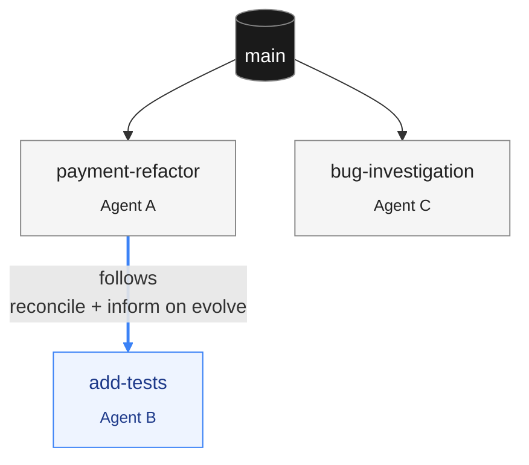
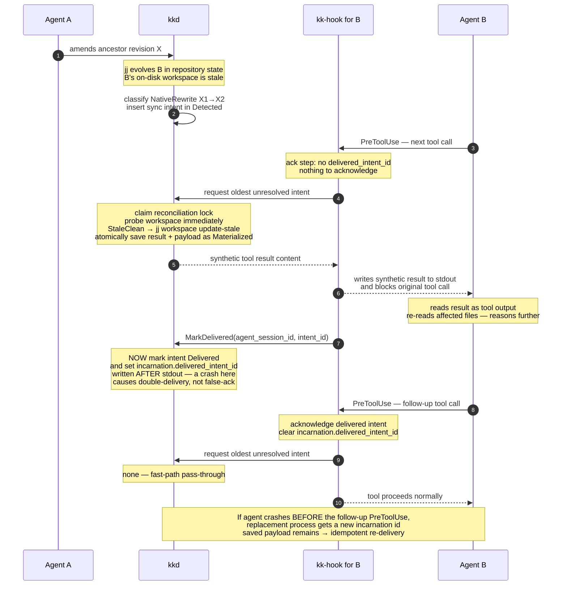
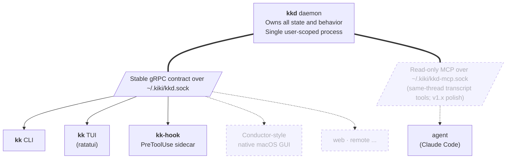

<div align="center">

<br />

<h1>
  💅🏾
  <br />
  kiki
</h1>

<h4>A daemon-backed coordinator for multi-threaded coding with AI agents</h4>

<p>
  <a href="LICENSE"></a>
  <a href="docs/reference/README.md"></a>
  <a href="https://github.com/jj-vcs/jj"></a>
  <a href="https://claude.com/claude-code"></a>
</p>

<br />

</div>

---



<p align="center"><sub><i>Each thread is its own jj workspace, tmux session, and agent. <code>add-tests</code> <b>follows</b> <code>payment-refactor</code> — when its parent evolves, jj updates repository history and kiki reconciles <code>add-tests</code>'s files and informs Agent B at the next safe boundary.</i></sub></p>

kiki is a single workflow for working on several pieces of code at once, with several AI agents at once. It ties together [jujutsu (jj)](https://github.com/jj-vcs/jj), [tmux](https://github.com/tmux/tmux), [Claude Code](https://claude.com/claude-code), and the GitHub CLI behind a single command, `kk`. Each thread — the atom of the system, sketched above — is isolated on disk so concurrent edits don't stomp on each other, and related in history so a refactor and the test-writing it implies can run alongside one another instead of one after the other. When the ground shifts under a thread, jj may evolve its history immediately; kiki waits for a safe boundary before materializing that state in the thread's files and telling its agent. That mechanism gets its own section below.

The complete reference book is at [`docs/reference/README.md`](docs/reference/README.md); what's actually built today is captured in the [Status](#status) section below.

## What problem is being solved

Working with an AI agent on a single piece of code is largely a solved problem. Working with an agent — or several — on several pieces of code at once is not. The friction is in the seams. You stash, you switch branches, you launch a fresh agent on a new prompt, and three minutes later the original branch is in a state you have to reconstruct, the new agent has lost the thread of what you set out to do, and the version-control history has accreted bookkeeping artifacts of the context-switch rather than the work. Multiply this by three or four lines of inquiry in flight and the cost of opening another one becomes prohibitive enough that you don't.

This is unsatisfying for a number of reasons, but the most important is that it forces a serial discipline on what is fundamentally a parallel activity. Refactoring a function and migrating its callers is not a sequential task; it is a tree of work. Investigating a bug while keeping a feature branch healthy is not a sequential task. The right tool would let those branches of inquiry exist in parallel, without their work-trees stomping on each other, without their agents losing context when an ancestor changes, and without requiring the human to manually rebase the world every time something underneath them moves.

kiki is an attempt to build that tool.

## The design, briefly

The unit of work is a **thread**: a themed sequence of jj revisions on a bookmark, materialized in its own jj workspace, attached to its own tmux session running an agent. Threads are isolated on disk (one workspace each, no shared working copy) and related in history (they share the underlying jj repository). A thread is the thing you spawn, switch between, publish, and close.

Threads can be related: `kk new add-tests --follows payment-refactor` records a follow-edge in kiki's state. When an ancestor is amended, jj itself evolves descendants in repository state and may leave their workspace files stale; kiki materializes each affected workspace and informs its agent at that agent's next safe boundary. When the parent instead gains a new tip, kiki explicitly rebases the child's stack onto that exact commit at the same boundary. The distinction is load-bearing, so it gets its own section below.

When the work is ready to leave the local machine, `kk publish` opens an editor with an AI-drafted PR title and body and creates a pull request against the parent thread's branch. If the parent itself has not been published yet, kiki publishes it first, walking up the stack and opening an editor for each, so that the human reviews each PR as it lands. When a parent merges, descendants reconcile onto the exact merged `main` commit at their safe boundaries, are force-pushed with `--force-with-lease`, and detach from the merged parent's follow-edge. Auto-archiving merged threads is useful, but it is v1.x polish, not acceptance slice.

`kk close` is non-destructive. It removes the thread's workspace and tmux session and hides it from default listings, but the bookmark and revisions stay in the repository; `kk reopen` restores the workspace, rebuilds the tmux session, and resumes the agent via its session-id. (A separate `kk thread destroy` exists for actually removing the bookmark, gated behind explicit confirmation.)

## How an agent learns its base just changed

Several of the harder design questions reduce to one: when an ancestor revision is amended while a descendant thread's agent is actively editing, how does the agent come to know that jj evolved its working-copy commit without changing the thread's files underneath it?

The honest answer is that current agent harnesses were not designed with this case in mind. Sending the agent a SIGINT and restarting it via `--resume` is reliable but disruptive — it loses the in-flight reasoning and forces a fresh framing of the work. What we want is something gentler: a mechanism that interrupts the agent at a moment when the interruption is cheap, hands it the new context in a form it already knows how to read, and lets it carry on.

Claude Code's `PreToolUse` hook supplies that boundary. Kiki first classifies the jj transition from before/after operation views. A `NativeRewrite` pins a **base transition**: jj already evolved the descendant's repository commits from `from_base_commit` onto `to_base_commit`, so kiki normally needs only to materialize the stale workspace. It deliberately does not pin the child's volatile working-copy commit, which may legitimately change again before the boundary. A `ParentAdvance` means the parent's new tip is outside the child's ancestry, so kiki must explicitly rebase the child's owned stack onto `to_base_commit`. Command names do not decide the case; exact base commits, current ancestry, and operation views do.

Each transition lives in one durable `sync_intents` row. That row is the protocol authority: it owns the ordered intent sequence, normalized trigger operation ids, state, planned and result operation ids, result workspace commit, recovery details, and the byte-stable payload and transcript anchor used for delivery. There are no shadow progress counters, context queue, or separate cascade-outbox table whose state can disagree with it.

On the agent's next tool call, `PreToolUse` claims the reconciliation lock and probes the workspace immediately before changing it. A provably clean stale workspace may be materialized with `jj workspace update-stale`; a stale workspace with dirty or indeterminate on-disk edits enters `RecoveryRequired` and hard-pauses the agent. Recovery runs outside the source workspace, preserves and enumerates jj's divergent successors, verifies where the edits landed, and resumes only when kiki can prove the visible result still contains them. A direct human `jj workspace update-stale` may change files without creating a new operation, which is why this boundary probe is required even when the watcher saw no new op.

After successful reconciliation, kiki atomically records the result, transcript anchor, payload, and `Materialized` state in the intent. The hook emits that saved payload and only then calls `MarkDelivered(intent_id)`, which changes the intent to `Delivered` and records the id on the current runtime agent incarnation. Writing the marker after stdout makes a crash cause idempotent redelivery rather than false acknowledgement.

The next `PreToolUse` acknowledges the process incarnation's delivered intent before considering the next unresolved intent. PostToolUse is deliberately not part of this state machine: Claude Code does not fire PostToolUse for tools that PreToolUse blocked. If the agent crashes before that follow-up call, its marker is retired without acknowledgement. The replacement process gets a new kiki incarnation id even when `--resume` reuses Claude Code's conversation id, so kiki re-emits the exact saved payload. The blast radius is at most one tool-call interval, and the agent neither silently misses a cascade nor receives a working tree that hides edits kiki has not recovered.

The resulting invariant is deliberately about the workspace, not the shared repository: kiki materializes evolved files or performs an explicit follows rebase only at the managed agent's boundary, never mid-edit. A direct human `jj` command in a stale child workspace is an explicit escape hatch and may materialize it earlier; kiki discovers the current file state at its next boundary rather than pretending every command was gated or observable in the op log. If reconciliation exposes a conflicted jj commit, kiki escalates: SIGINT the agent, restart with `--resume` and a framing message, and notify the human.



## kiki does not gatekeep

A design choice that pervades the rest of the system: kiki watches the jj op log and reacts to whatever it sees, regardless of who initiated the operation. An agent invoking `jj` via Bash and kkd advancing a child onto a parent's new tip both become before/after jj views that the same classifier interprets. A human updating a stale workspace directly is also supported, although the file materialization may produce no new op and is then discovered by the boundary probe. The daemon does not refuse direct jj or gh or tmux invocations and does not maintain a competing version-history model. The op log is the source of truth for repository evolution; the current filesystem and jj workspace metadata are the source of truth for materialization.

This is not a small choice. Building kiki as a gatekeeper — wrapping every jj invocation, intercepting every tmux command — would be a substantial undertaking and would degrade the user's existing relationship with those tools. Building it as an ambient coordinator that observes and reacts is harder in some ways (the daemon must distinguish its own operations from external ones to avoid self-triggered loops; it must coalesce rapid-fire op storms into single cascades) but produces a tool that is additive rather than invasive. The tmux-server analogy is exact: tmux does not refuse to let you `cd` somewhere weird in a pane, and it does not get upset if you launch a process outside a session. kiki holds the same posture.

## A durable record of what was said

Diffs are a record of what changed; they are not a record of what was _said_. That distinction matters more than it sounds. If you spent forty minutes investigating a bug, watched the agent trace through three dead ends, and finally landed on the right two-line change — the diff captures the two lines. The reasoning, the false starts, the user prompts that nudged the investigation, the moment the agent noticed that the test was wrong rather than the code: all of it lives in the agent's session and dies with the agent's session.

kiki keeps it.

For each thread, kkd captures the interleaved text exchange between the user and the agent — what the user typed, what the agent said back, the synthetic tool results kiki itself injected during cascade — and binds each message to the jj change-id that was `@` when the message was captured. The result is a log that travels with the work: change-ids are preserved by `jj rebase`, so when a descendant cascades onto a new base its message bindings come along for free, no re-anchoring required. When the agent crashes and `kk reopen` brings it back, kkd seeds the resumed session with a catch-up message synthesized from the log, so the resume is not a cold start.

Two things the log is _not_. It is not a published artifact: messages live in the per-repo runtime database under `~/.kiki/repos/<repo_id>/state.db`, never in the source repo, and never leave the local machine — agent prose contains dead ends, tool errors, and quoted file contents that should not surface in a PR description. And it is not a structured event log: it captures the narrative (`author: human | agent | kk`, `direction`, `text`), not the token-streaming deltas, the tool-call arguments, or the extended-thinking blocks. The diff still tells you _what_; the log tells you _why_.

The first reader is human: `kk thread transcript [<change>]`, with full-text search over the whole thread. A narrow same-thread MCP reader is v1.x polish that may ship after the human CLI proves stable. Cross-thread reads are deliberately a v2 concern: an agent in B reading agent A's transcript is a pleasing idea with a quiet failure mode (context pollution, prompt leakage between threads), and v1 is the wrong place to ship it without the v2 substrate's safety mechanisms.

The log feeds back into AI-driven kiki features only at _local_ boundaries — `kk reopen` catch-up in the acceptance slice, and same-thread agent self-query only if the later MCP surface ships. It is deliberately _not_ read by `kk publish`'s PR-drafter or by auto-describe / auto-rename. A boring PR description costs you nothing irreversible; a PR description that quotes "the user said their boss is being unreasonable about the deadline" costs you a hard-to-undo embarrassment. The local-only stance only holds if local-only-features is a discipline, not a default.

The capture path itself is abstracted behind a `TranscriptAdapter` trait — Claude Code is the v1 implementor, Codex slots in for v2 — so the schema and read API stay harness-neutral while the way bytes flow into the log can vary per harness.

## Architecture



Cleanly stated: `kkd` is a single user-scoped daemon (one process per user, opted into per-repository via `kk init`) that owns all state and behavior — thread lifecycle, the jj op-log watcher, the cascade orchestrator, the agent harness adapters, the thread-log capture path, the metadata ownership ledger, and the GitHub poller. `kk`, the TUI if it ships, and the small `kk-hook` PreToolUse sidecar are clients of a stable gRPC contract over a unix socket. A later same-thread MCP server may expose narrowly scoped transcript retrieval tools to the calling thread (broader cross-thread MCP is the v2 substrate). There is no privileged internal API. A native macOS GUI written next year will consume the same gRPC surface today's clients do; that is the property that makes the design durable.

State is partitioned into one per-user database and one database per registered repo. `~/.kiki/state.db` is the user-scoped registry of managed repositories and daemon metadata. Each registered repository gets its own runtime database at `~/.kiki/repos/<repo_id>/state.db`, keyed by the UUID minted at `kk init`; that database holds threads, workspaces, agent sessions, hook state, transcripts, cascades, the metadata-ownership ledger, and op-attribution state. The source repository's filesystem holds no kiki runtime state; the only kiki file that may live there is optional committed `.kiki.toml`. Removing `~/.kiki/repos/<repo_id>/` removes that repository's kiki runtime state without disturbing other registered repos; `kk repo unregister` is the intended command path.

The implementation language for `kkd` and its CLI clients, per the reference book, is Rust — driven by the long-term path to embedding [jj-lib](https://github.com/jj-vcs/jj) directly in the daemon, by the Send/Sync guarantees the cascade-coordination code wants, and by the maturity of `tonic`/`notify`/`rusqlite`/`ratatui`. The repository as it stands is a Bun+TypeScript scaffold for tooling experiments; the language decision is the first major implementation milestone, gated by the proof-of-concept described in [Build Sequencing](docs/reference/book/17-build-sequencing.md).

## A small worked example

```sh
# Opt a repository in
$ cd ~/code/my-project
$ kk init

# Spawn a thread off main
$ kk new auth-refactor

# Spawn a child off it
$ kk new add-tests --follows auth-refactor

# Inspect the world
$ kk ls
  STATUS    THREAD            FOLLOWS         AGENT
  running   auth-refactor     -               claude-code
  running   add-tests         auth-refactor   claude-code

# Move between sessions
$ kk switch auth-refactor

# Publish the stack, top-down
$ kk publish

# Close when done; the workspace is removed but revisions persist
$ kk close
```

When the v1.x UI polish ships, a persistent tmux status-line strip can surface threads needing attention and a tmux keybinding can overlay the TUI for fast switching and spawning. OS-native notifications fire for the core attention cases: agent permission prompts, cascade conflicts, parent lifecycle events, and failed PR checks.

## Roadmap

- **v1 — the acceptance slice.** The thread atom, the live-follow cascade with PreToolUse pause-propagate-resume, the change-id-aligned transcript with `kk reopen` catch-up, stacked `kk publish`, and the Claude Code adapter. Estimated 7-10 weeks of focused work.
- **v1.x — polish.** The overlay TUI and persistent sidebar, the AI auto-describe / auto-rename execution loop, PR-merge auto-archive, same-thread transcript MCP reads.
- **v2 — the substrate.** Cross-thread agent messaging with causal-chain auditing, the Codex adapter, a native macOS GUI, direct GitHub REST/GraphQL.
- **v3+.** jj-lib embedded directly in kkd, a web dashboard, cross-repository coordination.

The canonical scope ledger — which surface belongs to which tier — is the book's [Orientation chapter](docs/reference/book/01-orientation.md); the full spec, including v2's MCP design, lives in the [`docs/reference/`](docs/reference/README.md) reference book.

## On the name

There are two reasons the tool is called kiki, and they reinforce each other.

The first is a small ergonomic joke. The CLI binary is `kk`, which sits on the home row immediately to the right of `jj` — and `jj`, of course, is the version control system the entire design rests on. Typing `jj` and `kk` next to each other on the home row, day after day, is a quiet acknowledgement that one of these tools is working underneath the other.

The second reason is more important. A [_kiki_](<https://en.wikipedia.org/wiki/Kiki_(social_gathering)>) is a social gathering with roots in Black and Latin American queer ballroom culture: a flourishing space where people show up as themselves, with their own intent and their own style, and the gathering is richer for the multiplicity. That is the spirit the tool is reaching for. A development environment in which humans and agents — of varying capabilities, varying harnesses, varying purposes — can show up alongside one another, productively, without stepping on each other's work, and produce something that none of them would produce alone. The 💅🏾 is the logo for the same reason: a small reminder that craft, presence, and ease can coexist with seriousness of purpose.

## Status

Pre-alpha. Spec phase. The reference book has absorbed the original PRD and survived one Codex review pass; implementation has not begun. The repository's TypeScript scaffolding is provisional and exists to make tooling decisions easier; the production code is slated to be Rust per the spec, and the language decision will be revisited at the gating proof-of-concept.

If this looks like a tool that would change how you work, the most useful thing you can do today is read the reference book and file an issue on anything that strikes you as wrong, missing, or under-specified. The spec is durable enough that pre-implementation feedback is genuinely actionable.

## Building

```sh
mise install         # provision pinned tooling (Bun, currently)
bun install          # install dev dependencies (oxfmt, types)
bun run fmt          # format
```

Once the v1 build begins this section will gain `cargo build`, `cargo test`, and `kk` invocations.

## Design principles, explicit

A few principles, stated up front, because the reference book's coherence depends on them:

1. **Be additive, not invasive.** The user can keep using jj, gh, and tmux as they always have. kiki reacts to what they do; it does not refuse, intercept, or wrap.
2. **Trust human prose.** Auto-rename and auto-describe are useful, but the moment a human types their own description, kiki steps off permanently. There is no path where kiki silently overwrites human-authored content.
3. **One stable contract; many UIs.** The gRPC service is the product surface. The CLI and TUI are first clients, not privileged ones. A native GUI built later sees the same API.
4. **High cohesion, low coupling.** kkd owns state and behavior; UIs are pure views. Internally, per-thread controllers are isolated from cross-cutting concerns, so killing one thread never destabilizes the daemon.
5. **Fail loud, not silent.** Cycle detection, force-push reconciliation, parent-thread-abandoned prompts: when the system genuinely cannot determine the right action, it stops and asks rather than guessing.
6. **No resource policing.** kiki does not cap concurrent agents, model spend, or laptop CPU. Those are the user's decisions, made with the user's tools.
7. **Local recall, never silent leak.** The thread log is captured for human recall and local agent re-orientation and lives only on the local machine. It feeds back into AI features only at local boundaries (`kk reopen` catch-up in the acceptance slice, same-thread agent self-query if the MCP surface ships); it does not feed into features that produce externally-published artifacts (PR drafts, auto-described revisions). The local-only stance only holds if local-only-features is a discipline, not a default.

## Built on the shoulders of

- [**jujutsu (jj)**](https://github.com/jj-vcs/jj) — the version control system whose first-class workspaces, op log, and rebase semantics make the entire design viable. kiki is not possible without jj.
- [**tmux**](https://github.com/tmux/tmux) — both a runtime dependency and the architectural anchor for the system's shape. A single user-scoped daemon serving sessions across any directory, with thin clients over a stable IPC, is the model kiki imitates.
- [**Claude Code**](https://claude.com/claude-code) — the agent harness whose `PreToolUse` hook system makes the cascade-aware context-injection mechanism viable.
- [**GitHub CLI (`gh`)**](https://cli.github.com) — for publishing, PR state inspection, and review comments.

## Contributing

The reference book starts at [`docs/reference/README.md`](docs/reference/README.md). Some expectations for substantial changes:

1. Open an issue describing the change. Substantial work should update the reference book directly.
2. Spec changes in this repository are expected to survive a [Codex](https://github.com/openai/codex) review pass — the first PRD's review surfaced three v1-scope contradictions, all resolved before its contents were folded into the book. Keep neighboring chapters consistent with each other.
3. Commits follow a one-line imperative subject plus a multi-paragraph body; `jj log` has examples.
4. Future Claude Code instances reading the repository should consult [`CLAUDE.md`](CLAUDE.md) first.

## License

[MIT](LICENSE) © 2026 Sandile Keswa
