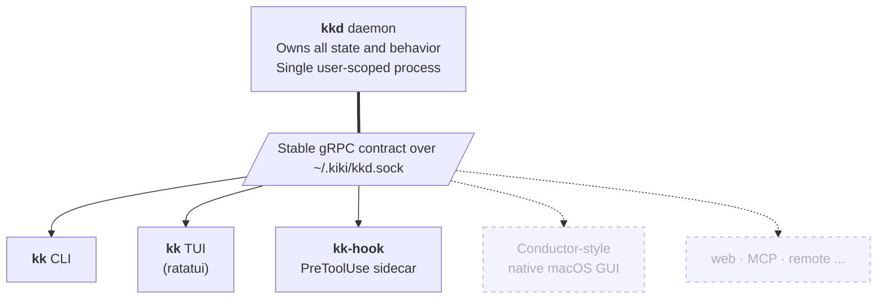

<div align="center">

<br />

<h1>
  💅🏾
  <br />
  kiki
</h1>

<h4>A daemon-backed coordinator for multi-threaded coding with AI agents</h4>

<p>
  Built on
  <a href="https://github.com/jj-vcs/jj"><b>jujutsu</b></a> ·
  <a href="https://github.com/tmux/tmux"><b>tmux</b></a> ·
  <a href="https://claude.com/claude-code"><b>Claude Code</b></a> ·
  <a href="https://cli.github.com"><b>GitHub CLI</b></a>
</p>

<p>
  <a href="LICENSE"></a>
  <a href="docs/prds/0001-kiki.md"></a>
  <a href="https://github.com/jj-vcs/jj"></a>
  <a href="https://claude.com/claude-code"></a>
</p>

<p>
  <a href="docs/prds/0001-kiki.md"><b>Read the spec&nbsp;→</b></a>
</p>

<br />

</div>

---

The complete spec lives in [`docs/prds/0001-kiki.md`](docs/prds/0001-kiki.md). At the time of writing, none of the runtime described below has been implemented; the repository contains the PRD, a small TypeScript+Bun scaffold for tooling experiments, and the artifacts of one Codex review pass over the spec. This README describes the shape the v1 is committing to.

## On the name

There are two reasons the tool is called kiki, and they reinforce each other.

The first is a small ergonomic joke. The CLI binary is `kk`, which sits on the home row immediately to the right of `jj` — and `jj`, of course, is the version control system the entire design rests on. Typing `jj` and `kk` next to each other on the home row, day after day, is a quiet acknowledgement that one of these tools is working underneath the other.

The second reason is more important. A [_kiki_](<https://en.wikipedia.org/wiki/Kiki_(social_gathering)>) is a social gathering with roots in Black and Latin American queer ballroom culture: a flourishing space where people show up as themselves, with their own intent and their own style, and the gathering is richer for the multiplicity. That is the spirit the tool is reaching for. A development environment in which humans and agents — of varying capabilities, varying harnesses, varying purposes — can show up alongside one another, productively, without stepping on each other's work, and produce something that none of them would produce alone. The 💅🏾 is the logo for the same reason: a small reminder that craft, presence, and ease can coexist with seriousness of purpose.

## What problem is being solved

Working with an AI agent on a single piece of code is largely a solved problem. Working with an agent — or several — on several pieces of code at once is not. The friction is in the seams. You stash, you switch branches, you launch a fresh agent on a new prompt, and three minutes later the original branch is in a state you have to reconstruct, the new agent has lost the thread of what you set out to do, and the version-control history has accreted bookkeeping artifacts of the context-switch rather than the work. Multiply this by three or four lines of inquiry in flight and the cost of opening another one becomes prohibitive enough that you don't.

This is unsatisfying for a number of reasons, but the most important is that it forces a serial discipline on what is fundamentally a parallel activity. Refactoring a function and migrating its callers is not a sequential task; it is a tree of work. Investigating a bug while keeping a feature branch healthy is not a sequential task. The right tool would let those branches of inquiry exist in parallel, without their work-trees stomping on each other, without their agents losing context when an ancestor changes, and without requiring the human to manually rebase the world every time something underneath them moves.

kiki is an attempt to build that tool.

## The design, briefly

The unit of work is a **thread**: a themed sequence of jj revisions on a bookmark, materialized in its own jj workspace, attached to its own tmux session running an agent. Threads are isolated on disk (one workspace each, no shared working copy) and related in history (they share the underlying jj repository). A thread is the thing you spawn, switch between, publish, and close.

Threads can be related: `kk new add-tests --follows payment-refactor` records a follow-edge in kiki's state. When the parent thread evolves — its bookmark advances, or a revision in its history is amended — kiki rebases the descendant onto the new base and informs its agent at the next safe boundary. The mechanism for that last step is the part of the system that warrants the most careful description, so it gets its own section below.

When the work is ready to leave the local machine, `kk publish` opens an editor with an AI-drafted PR title and body and creates a pull request against the parent thread's branch. If the parent itself has not been published yet, kiki publishes it first, walking up the stack and opening an editor for each, so that the human reviews each PR as it lands. When the PR merges upstream, kiki auto-archives the thread; when a parent merges, descendants are rebased onto `main`, force-pushed with `--force-with-lease`, and detached from the merged parent's follow-edge.

`kk close` is non-destructive. It removes the thread's workspace and tmux session and hides it from default listings, but the bookmark and revisions stay in the repository; `kk reopen` restores the workspace, rebuilds the tmux session, and resumes the agent via its session-id. There is also a `kk thread destroy` for the case where the user genuinely wants the bookmark gone — but it is gated behind explicit confirmation, because data loss should be deliberate.

## How an agent learns its base just changed

Several of the harder design questions reduce to one: when an ancestor revision is amended while a descendant thread's agent is actively editing, how does the agent come to know that its working copy has been rebased without losing the thread of what it was doing?

The honest answer is that current agent harnesses were not designed with this case in mind. Sending the agent a SIGINT and restarting it via `--resume` is reliable but disruptive — it loses the in-flight reasoning and forces a fresh framing of the work. What we want is something gentler: a mechanism that interrupts the agent at a moment when the interruption is cheap, hands it the new context in a form it already knows how to read, and lets it carry on.

Claude Code's `PreToolUse` hook turns out to be exactly that mechanism. The hook fires immediately before any tool invocation, can return arbitrary text that the agent reads as the tool's result, and can block the in-flight tool. kiki uses this primitive as a gate. When the op-log watcher observes a change that requires rebasing a descendant thread, the daemon does not run `jj rebase` immediately. Instead it bumps the thread's `pending_cascade_seq` counter and enqueues a cascade message. On the agent's next tool call, `PreToolUse` claims the cascade lock, asks the daemon to apply the rebase under the hook's protection, advances `applied_cascade_seq`, _reads_ the cascade queue, releases the lock, and returns a synthetic tool result of the form _"Your base was rebased onto X. Files {a, b} have new contents. Re-read them before continuing."_ The hook then — and only then, after the synthetic result has actually been emitted on stdout — issues a separate `MarkDelivered` RPC to set the per-session `delivered_in_flight_seq`. This ordering is the load-bearing detail of the protocol: writing the marker last means every crash window degrades to _double delivery_ (next PreToolUse re-delivers from the un-drained queue) rather than _false acknowledgement_ (queue drained for a cascade the agent never saw). When the agent's follow-up tool call eventually comes — and that follow-up is the strongest signal that the agent has actually integrated the synthetic result — that next `PreToolUse` runs an acknowledgement step first, promoting `delivered_in_flight_seq` into the thread's `acknowledged_cascade_seq` and draining the queue up to that point. Only then does it consider whether to deliver another cascade. PostToolUse is deliberately not part of this state machine: Claude Code does not fire PostToolUse for tools that PreToolUse blocked, so tying acknowledgement to PostToolUse would silently lose every cascade. If the agent crashes between delivery and the follow-up tool call, the queue is undrained and a fresh `--resume` session — initialized with `delivered_in_flight_seq=0` — will see `pending_cascade_seq > acknowledged_cascade_seq` and re-deliver the cascade idempotently. The blast radius is at most one tool-call interval, and the agent never sees a working copy it didn't expect or silently misses a cascade.

The invariant that falls out of this ordering is the property that makes the whole design defensible: a thread's working copy is rebased only when the agent is at a tool boundary — never when it is mid-edit. The daemon does not perform the rebase until the hook fires; the hook fires only at tool boundaries; and tool boundaries are by construction moments when no edit is in flight. When the rebase fails — that is, when it produces a textual conflict the agent must consciously resolve — kiki escalates: SIGINT the agent, restart with `--resume` and a framing message that tells it what happened, and notify the human. The cascade does not silently advance through conflicts.

```mermaid
sequenceDiagram
    autonumber
    participant agentA as Agent A
    participant kkd as kkd
    participant hookB as kk-hook (B)
    participant agentB as Agent B

    agentA->>kkd: amends ancestor revision X
    Note over kkd: op-log watcher detects op,<br/>identifies B as affected
    kkd->>kkd: bump B.pending_cascade_seq;<br/>enqueue ContextMessage<br/>(no jj rebase yet)

    agentB->>hookB: PreToolUse — issues next tool call
    Note over hookB: ack step: delivered_in_flight_seq=0,<br/>nothing to acknowledge
    hookB->>kkd: pending_cascade_seq > acknowledged_cascade_seq?
    Note over kkd: yes — claim cascade lock,<br/>apply jj rebase, advance applied_cascade_seq,<br/>READ (don't drain) queue,<br/>release lock
    kkd-->>hookB: synthetic tool result content:<br/>"base changed onto X'; diff is ..."
    hookB-->>agentB: writes synthetic result to stdout<br/>(blocks original tool call)
    Note over agentB: reads result as tool output;<br/>re-reads affected files; reasons further
    hookB->>kkd: MarkDelivered(session_id, applied_cascade_seq)
    Note over kkd: NOW set session.delivered_in_flight_seq<br/>(written AFTER stdout, so a crash here<br/>causes double-delivery, not false-ack)

    agentB->>hookB: PreToolUse — issues follow-up tool call
    Note over hookB: ack step: delivered_in_flight_seq>0,<br/>promote into acknowledged_cascade_seq,<br/>drain queue, clear delivered_in_flight_seq
    hookB->>kkd: pending_cascade_seq > acknowledged_cascade_seq?
    Note over kkd: no — fast-path pass-through
    hookB-->>agentB: tool proceeds normally
    Note over agentB,kkd: If agent crashes BEFORE the follow-up PreToolUse,<br/>fresh --resume session has delivered_in_flight_seq=0;<br/>queue is still undrained → idempotent re-delivery
```

## kiki does not gatekeep

A design choice that pervades the rest of the system: kiki watches the jj op log and reacts to whatever it sees, regardless of who initiated the operation. A human running `jj rebase` directly in a thread's workspace, an agent invoking `jj` via Bash, kkd itself rebasing a child onto a parent's new tip — all three flow through the same code path. The daemon does not refuse direct jj or gh or tmux invocations, does not require its CLI to be the channel for repository operations, and does not maintain a separate, authoritative copy of the world. The op log is the source of truth.

This is not a small choice. Building kiki as a gatekeeper — wrapping every jj invocation, intercepting every tmux command — would be a substantial undertaking and would degrade the user's existing relationship with those tools. Building it as an ambient coordinator that observes and reacts is harder in some ways (the daemon must distinguish its own operations from external ones to avoid self-triggered loops; it must coalesce rapid-fire op storms into single cascades) but produces a tool that is additive rather than invasive. The tmux-server analogy is exact: tmux does not refuse to let you `cd` somewhere weird in a pane, and it does not get upset if you launch a process outside a session. kiki holds the same posture.

## Architecture



Cleanly stated: `kkd` is a single user-scoped daemon (one process per user, opted into per-repository via `kk init`) that owns all state and behavior — thread lifecycle, the jj op-log watcher, the cascade orchestrator, the agent harness adapters, the AI background queue, the GitHub poller. `kk`, the TUI (a subcommand of `kk`), and the small `kk-hook` PreToolUse sidecar are clients of a stable gRPC contract over a unix socket. There is no privileged internal API. A native macOS GUI written next year will consume the same surface they do; that is the property that makes the design durable.

State is partitioned. `~/.kiki/state.db` is the user-scoped registry of which repositories are managed and where the daemon is reachable. `<repo>/.kiki/state.db` holds the per-repository runtime state — threads, workspaces, agent sessions, hook state, the AI queue, the metadata-ownership ledger, the op-attribution dedupe table. Removing one repository's `.kiki/` directory wipes that repository's kiki state without disturbing any other.

The implementation language for `kkd` and its CLI clients, per the PRD, is Rust. The choice is not aesthetic; it is driven by the long-term path to embedding [jj-lib](https://github.com/jj-vcs/jj) directly in the daemon (Go and TypeScript have no equivalent), by the Send/Sync compile-time guarantees that the cascade-coordination code wants, and by the maturity of the relevant Rust ecosystem (`tonic` for gRPC, `notify` for fsnotify, `rusqlite`/`sqlx` for SQLite, `ratatui` for the TUI). The repository as it stands is a Bun+TypeScript scaffold for tooling experiments; the language decision is the first major implementation milestone, and the proof-of-concept that gates that decision is described in the PRD's _Suggested build sequencing_ section.

## A small worked example

```sh
# Opt a repository in
$ cd ~/code/my-project
$ kk init

# Spawn a thread off main
$ kk new auth-refactor

# Spawn a child off it
$ kk new add-tests --follows auth-refactor

# Inspect the world
$ kk ls
  STATUS    THREAD            FOLLOWS         AGENT
  running   auth-refactor     -               claude-code
  running   add-tests         auth-refactor   claude-code

# Move between sessions
$ kk switch auth-refactor

# Publish the stack, top-down
$ kk publish

# Close when done; the workspace is removed but revisions persist
$ kk close
```

A persistent tmux status-line strip surfaces threads needing attention; OS-native notifications fire when an agent hits a permission prompt, when a cascade encounters a conflict, when a parent thread merges or is abandoned, or when a CI check fails on a thread's pull request. From inside any thread session, a tmux keybinding overlays the TUI for fast switching and spawning.

## Roadmap

| Milestone              | Highlights                                                                                                                                                                                                                                                                                                                  |
| ---------------------- | --------------------------------------------------------------------------------------------------------------------------------------------------------------------------------------------------------------------------------------------------------------------------------------------------------------------------- |
| **v1 — the demo**      | Thread atom, live-follow cascade, PreToolUse-based pause-propagate-resume, AI auto-rename and auto-describe with content-hash ownership ledger, `kk publish` with stack recursion, `kk close`/`kk reopen`, ratatui TUI, GitHub PR auto-archive on merge, Claude Code adapter. Estimated 6–9 weeks of focused work.          |
| **v1.x**               | Polish: hook-config diagnostics, op-log watcher edge cases, more `kk thread` subcommands, status-line themes.                                                                                                                                                                                                               |
| **v2 — the substrate** | kkd as MCP server: agents in one thread can post messages to siblings, spawn children, request human review — with causal-chain cycle detection, depth and branching caps, and a complete audit trail. Codex harness adapter. Native macOS GUI. Direct GitHub REST/GraphQL. PR review-comment ingestion into agent context. |
| **v3+**                | jj-lib embedded directly in kkd. Web dashboard. Cross-repository coordinated agent tasks.                                                                                                                                                                                                                                   |

The full spec — including v2's MCP design, captured in the same document so it is not lost between revisions — lives in [`docs/prds/0001-kiki.md`](docs/prds/0001-kiki.md).

## Status

Pre-alpha. Spec phase. The PRD is complete and has survived one Codex review pass; implementation has not begun. The repository's TypeScript scaffolding is provisional and exists to make tooling decisions easier; the production code is slated to be Rust per the spec, and the language decision will be revisited at the gating proof-of-concept.

If this looks like a tool that would change how you work, the most useful thing you can do today is read the PRD and file an issue on anything that strikes you as wrong, missing, or under-specified. The spec is durable enough that pre-implementation feedback is genuinely actionable.

## Building

```sh
mise install         # provision pinned tooling (Bun, currently)
bun install          # install dev dependencies (oxfmt, types)
bun run fmt          # format
```

Once the v1 build begins this section will gain `cargo build`, `cargo test`, and `kk` invocations.

## Design principles, explicit

A few principles, stated up front, because the PRD's coherence depends on them:

1. **Be additive, not invasive.** The user can keep using jj, gh, and tmux as they always have. kiki reacts to what they do; it does not refuse, intercept, or wrap.
2. **Trust human prose.** Auto-rename and auto-describe are useful, but the moment a human types their own description, kiki steps off permanently. There is no path where kiki silently overwrites human-authored content.
3. **One stable contract; many UIs.** The gRPC service is the product surface. The CLI and TUI are first clients, not privileged ones. A native GUI built later sees the same API.
4. **High cohesion, low coupling.** kkd owns state and behavior; UIs are pure views. Internally, per-thread controllers are isolated from cross-cutting concerns, so killing one thread never destabilizes the daemon.
5. **Fail loud, not silent.** Cycle detection, force-push reconciliation, parent-thread-abandoned prompts: when the system genuinely cannot determine the right action, it stops and asks rather than guessing.
6. **No resource policing.** kiki does not cap concurrent agents, model spend, or laptop CPU. Those are the user's decisions, made with the user's tools.

## Built on the shoulders of

- [**jujutsu (jj)**](https://github.com/jj-vcs/jj) — the version control system whose first-class workspaces, op log, and rebase semantics make the entire design viable. kiki is not possible without jj.
- [**tmux**](https://github.com/tmux/tmux) — both a runtime dependency and the architectural anchor for the system's shape. A single user-scoped daemon serving sessions across any directory, with thin clients over a stable IPC, is the model kiki imitates.
- [**Claude Code**](https://claude.com/claude-code) — the agent harness whose `PreToolUse` hook system makes the cascade-aware context-injection mechanism viable.
- [**GitHub CLI (`gh`)**](https://cli.github.com) — for publishing, PR state inspection, and review comments.

## Contributing

The PRD is [`docs/prds/0001-kiki.md`](docs/prds/0001-kiki.md). Some expectations for substantial changes:

1. Open an issue describing the change. PRDs for substantial work go in `docs/prds/`, numbered.
2. PRDs in this repository are expected to survive a [Codex](https://github.com/openai/codex) review pass — the first PRD's review surfaced three v1-scope contradictions, all resolved in the same revision. Keep Out of Scope, User Stories, and Implementation Decisions consistent with each other.
3. Commits follow a one-line imperative subject plus a multi-paragraph body; `jj log` has examples.
4. Future Claude Code instances reading the repository should consult [`CLAUDE.md`](CLAUDE.md) first.

## License

[MIT](LICENSE) © 2026 Sandile Keswa
