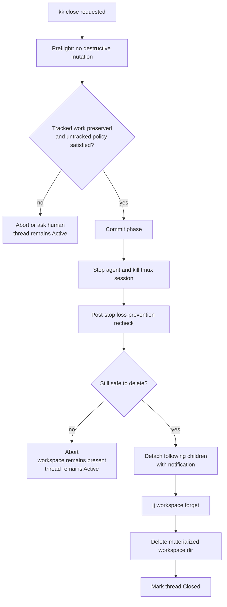
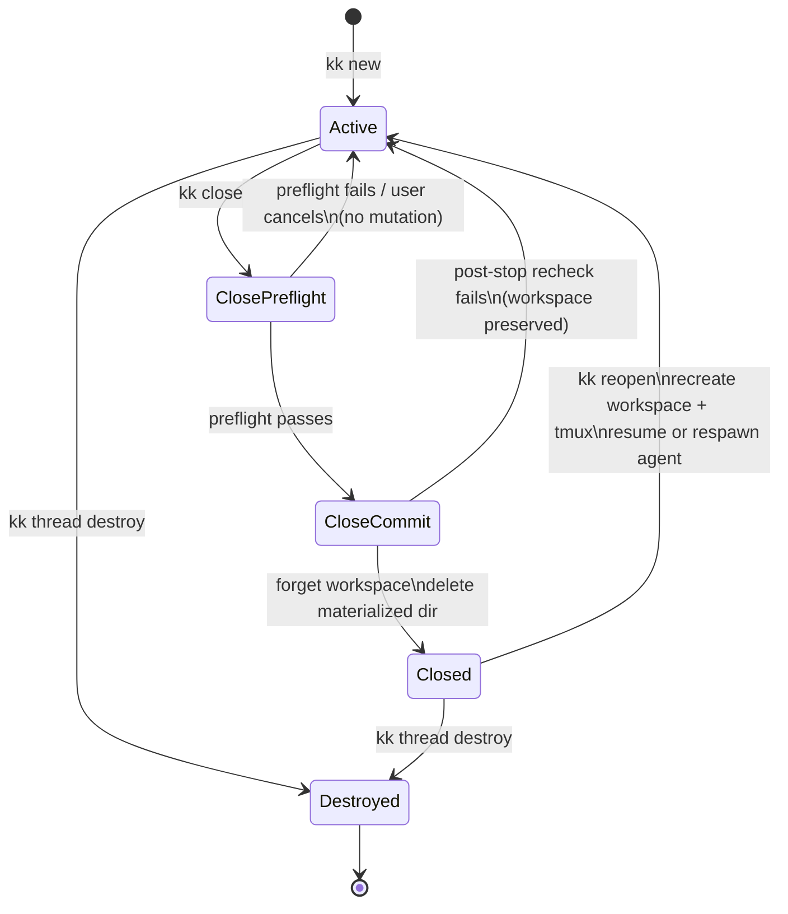

# Threads

The thread is kiki's unit of work. Bookmarks, workspaces, tmux sessions, and agent processes hang off that unit.

## Thread identity

Each thread has a stable sqlite `thread_id`. The thread id is the join key for credentials, audit rows, transcript rows, PR links, lifecycle state, and follows links.

Mutable projections include:

- jj workspace path
- jj bookmark name
- tmux session name
- harness session id

## Creation

`kk new` atomically creates:

- sqlite thread row
- jj workspace
- bookmark
- initial jj change on that bookmark
- tmux session rooted in the workspace
- harness process
- per-thread hook credential and hook configuration

If any step fails, kiki unwinds prior steps to avoid orphaned state.

When invoked inside an existing thread, `kk new` follows the current thread by default. `--no-follow` suppresses that default. `--follows <parent>` selects an explicit parent.

Creation must leave the system in one of two states: the thread exists with all v1 projections, or it does not exist. Partial thread creation should be unwound before returning control.

`kk new` without a name may derive a placeholder from the initial prompt. The placeholder is kiki-owned metadata and follows the metadata ownership rules.

`kk new --harness <name>` selects the harness for the thread. v1 accepts only `claude-code`; unsupported harness names error clearly.

The follows graph is a DAG. kiki rejects a follows edge that would introduce a cycle.

Users may spawn any number of sibling threads. v1 does not rate-limit human-created threads.

## Workspace isolation

Per-thread workspaces prevent accidental file interference during normal cooperative use. They do not prevent a same-UID process from reading or writing sibling workspaces, `~/.kiki`, or shared jj repository state.

## Close

`kk close` archives a thread without deleting tracked jj work.

Close is two-phase:

1. Preflight performs no destructive mutation.
2. Commit stops the agent and tmux session, reruns loss-prevention checks, forgets the jj workspace, deletes the materialized workspace directory, and marks the thread closed.

Close must allowlist kiki-owned ephemeral workspace files such as `<workspace>/.kiki/hook-cred` and generated per-thread harness config. These files must not self-block close. User-created untracked or ignored files that would be deleted still require explicit handling.

Plain `kk close` leaves any open PR untouched. `kk close --discard-pr` is the explicit PR-closing path.

Children of a closed thread auto-detach with notification.

Close is intentionally boring. It should be possible to close a thread with confidence that tracked work survives and that local junk is not silently swept away.

After close, the tmux client switches to the parent thread if that session exists. Otherwise it returns to the previously focused thread if possible, or detaches.

## Lifecycle states

## Reopen

`kk reopen <thread>` restores a closed thread by recreating the workspace, tmux session, hook credentials, and harness process.

Reopen prepends a short local catch-up message composed from non-synthesized transcript rows. The catch-up is local-only and is recorded as kiki-authored synthesized transcript content.

Reopen reissues the thread-scoped credential and reinstalls per-thread hook configuration.

## Destroy

`kk thread destroy <thread>` is irreversible except through jj operation recovery. It abandons the bookmark, revokes credentials, tombstones the thread row, and deletes transcript rows by default.

`--keep-log` retains transcript rows for explicit destroyed-thread views.

Destroy abandons the bookmark, revokes credentials, and removes transcript rows unless told otherwise. It needs the authority and confirmations appropriate to irreversible work.
