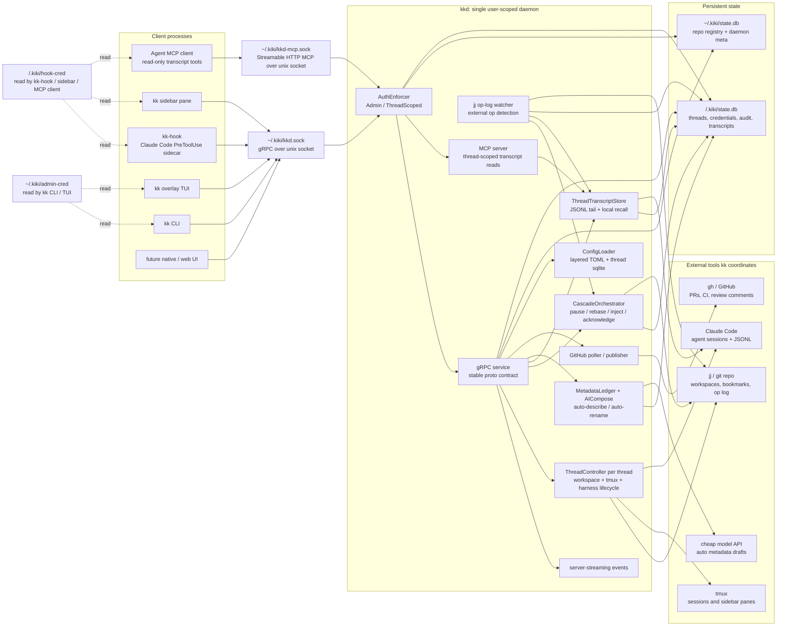
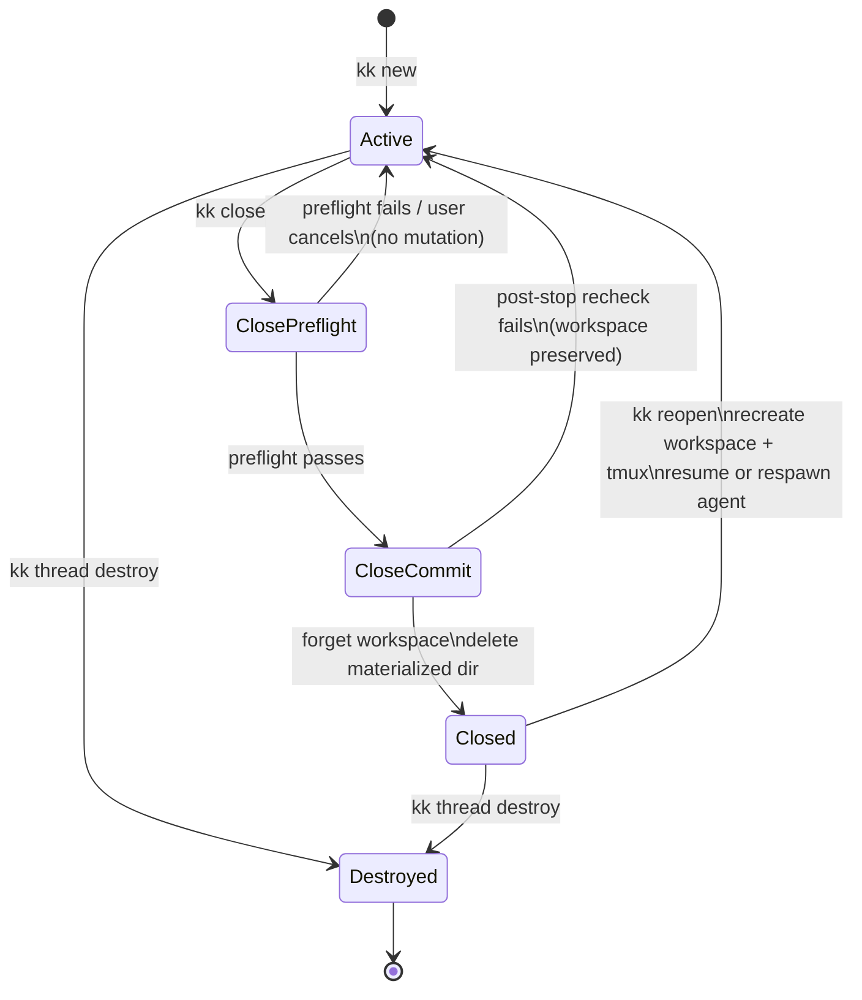
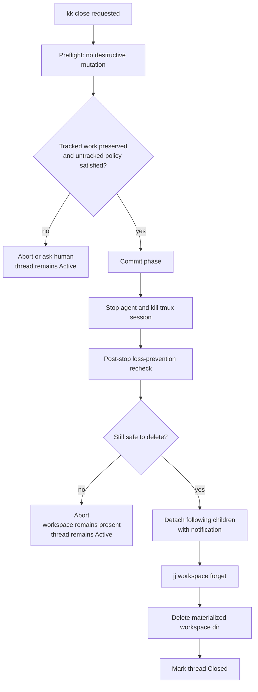
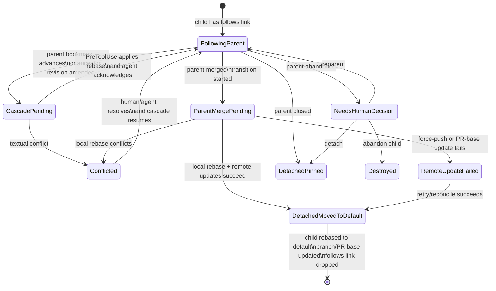

# PRD: kiki (`kk`) — agentic coding workflow tool

## Problem Statement

Working with AI coding agents on multiple lines of inquiry simultaneously is currently expensive and error-prone. To switch from one piece of work-in-progress to another, the developer has to stash or commit changes, switch branches, lose terminal state, and lose the agent's in-flight context. When an agent's edits cascade across related work — for example, a refactor in one direction triggers updates everywhere that work depends on it — the developer has to manually rebase descendants, often rebuilding agent context from scratch each time. There is no first-class abstraction for "a self-contained, themed line of agentic work" that bundles the version-control state, the terminal session, and the agent's reasoning into something pausable, resumable, and composable. As a result, multi-threaded agentic workflows feel chaotic instead of fluid, and "let me try this in parallel" carries enough friction that developers don't, even when they should.

## Solution

kiki (binary: `kk`) is a daemon-backed coordinator that ties together four existing technologies — jujutsu (jj) for version control, tmux for terminal sessions, Claude Code (and later Codex/other harnesses) for AI-driven editing, and the GitHub CLI (`gh`) for publishing — into a single, ambient workflow.

The atom is a **thread**: a themed sequence of jj revisions on a bookmark, materialized in its own jj workspace, attached to its own tmux session running a shell and an AI agent. Threads can branch off other threads with live-follow semantics: when an ancestor thread's work evolves, descendants automatically rebase, and their agents are cleanly paused, informed of the change via a synthetic tool result, and resumed — so they never act on stale context.

Bookmark names and revision descriptions auto-evolve via AI as work takes shape, but kiki never silently overwrites human-authored prose. `kk publish` opens a PR (against the parent thread's branch when stacked, recursively publishing unpublished ancestors first), with an AI-drafted title and description the user reviews in `$EDITOR`. `kk close` archives a thread non-destructively.

Architecturally, all state and behavior lives in a single user-scoped daemon (`kkd`); the CLI, TUI, and a small PreToolUse hook sidecar (`kk-hook`) are pure clients of a stable gRPC contract over a unix socket — so a future native GUI or web client can be built without touching the daemon. kiki is an _ambient coordinator_, not a gatekeeper: humans and agents can use jj, tmux, and gh directly and kiki reacts to whatever it observes.

## User Stories

### Setup and lifecycle

1. As a developer, I want to install `kk` from a single binary distribution, so that getting started is one command.
2. As a developer, I want to run `kk init` in a git+jj repository to opt that repo into kiki management, so that I am explicit about which repos kkd watches.
3. As a developer, I want kk to verify prerequisites (jj initialized, gh authenticated, Claude Code installed) at `kk init`, so that I get clear errors instead of cryptic failures later.
4. As a developer, I want kkd to start automatically the first time I invoke `kk`, so that I never have to think about daemon lifecycle.
5. As a developer, I want kkd to recover from crashes by reading its sqlite state on restart, so that my threads survive daemon issues.
6. As a developer, I want kkd to be resurrectable across system restarts via launchd/systemd-user, so that my threads survive reboots.
7. As a developer, I want `kk init` to NOT auto-spawn a starter thread, so that I am explicit about when threads are created.

### Thread creation

8. As a developer, I want `kk new <name>` to spawn a thread with its own jj workspace, tmux session, and Claude Code agent, so that I start a new line of work instantly.
9. As a developer, I want `kk new` (no name) to derive a placeholder name from my initial prompt, so that I do not have to commit to a name upfront.
10. As a developer, I want `kk new <name> --follows <parent>` to create a child thread coupled to a parent, so that I can stack work on top of a work-in-progress feature.
11. As a developer, I want `kk new <name> --no-follow` to create a snapshot fork (no live coupling), so that I can branch off the current state without inheriting future changes when the contextual default would otherwise follow the current thread.
12. As a developer, I want `kk new --harness <name>` to override the default agent harness for a single thread, so that once additional harnesses ship I can pick the right one per task. (v1: only `claude-code` is accepted; any other harness name errors with a clear "unsupported harness, see [agent.default_harness] config" message until further adapters are added.)
13. As a developer, I want each thread to live in its own jj workspace so agents in different threads do not accidentally interfere with each other's files in the course of normal cooperative work, so that parallel agentic work stays in its own lane. (This is a cooperative isolation property, not filesystem access control — see Trust model: same-UID processes can still reach sibling workspaces.)
14. As a developer, I want to spawn N sibling threads off the same starting point in parallel (e.g., one per caller of a function I'm refactoring), so that I can fan out migration work across agents simultaneously.

### Switching and orientation

15. As a developer, I want `kk switch <thread>` to point my tmux client at that thread's session, so that switching is instant.
16. As a developer, I want a tmux keybinding (e.g., `prefix+k`) that overlays the kk TUI for fast switching and spawning, so that I never have to leave my current session.
17. As a developer, I want `kk` with no arguments to open the interactive TUI, so that I can browse and act on threads visually.
18. As a developer, I want `kk ls` to list active threads with status icons, so that I can scan state at a glance from any terminal.
19. As a developer, I want `kk ls --all` to include closed threads, so that I can find archived work.
20. As a developer, I want a tmux status-line strip showing thread count and an "attention needed" indicator, so that I have ambient peripheral awareness while heads-down.
21. As a developer, I want `kk` invocations inside a thread's tmux session to know which thread I am in via env, tmux session name, or cwd, so that thread-acting commands work without specifying a target.
22. As a developer, I want `kk` invocations outside any registered repo to show threads across all registered repos, so that I get the full picture from anywhere.

### Cascade coordination (the killer feature)

23. As a developer working in thread A, I want my edits to ancestor revisions to automatically rebase descendant thread B without breaking B's agent, so that refactoring naturally flows downstream.
24. As a developer in thread B (a child of A), I want my agent to receive a clear "your base changed, here is the diff" signal at the next tool boundary when A's revisions are amended, so that I never act on stale context.
25. As a developer, I want my thread's working copy to be rebased ONLY at agent tool boundaries or quiescence — never with the agent mid-edit, so that the agent's mental model never diverges from what is on disk.
26. As a developer, I want the cascade to handle textual conflicts by marking the thread "conflicted" and surfacing a notification, so that I resolve them deliberately instead of corrupting agent state.
27. As a developer in a child thread B that follows parent A, I want B to pick up A's new commits automatically (auto-rebased onto A's new tip), so that stacked work stays coordinated without manual rebasing.
28. As a developer, I want `kk thread detach` to break the live-follow link, so that I can pin a child thread at its current base while the parent advances independently.
29. As a developer, I want `kk thread attach <child> --to <parent>` to re-establish a follows link, so that I can resume live coupling after a turbulent moment.
30. As a developer, I want `kk thread reparent <child> --onto <new-parent>` to move a thread under a different parent, so that I can correct stack relationships when I realize the topology was wrong.
31. As a developer, I want kk to refuse cyclic follows links, so that the coupling graph stays a DAG.
32. As a developer, I want a child thread to move onto the repo default branch and auto-detach (with notification) when its parent thread merges, so that stacked work survives the parent landing without silently following a moving target.
33. As a developer, I want kk to escalate from soft-pause to SIGINT+resume only when (i) a textual conflict cannot auto-resolve, (ii) the agent is in long pure-thinking with no upcoming tool call to intercept, or (iii) I explicitly request `kk thread interrupt`, so that the disruptive escalation is rare and predictable.
34. As a developer, I want `kk thread interrupt <thread>` as the explicit human escape hatch to hard-stop and re-frame an agent, so that I can rescue a stuck or off-track thread.

### Ambient coordinator (no gatekeeping)

35. As a developer, I want to run `jj` directly inside or outside any thread's workspace and have kk react to my ops, so that kk feels additive to my normal jj workflow rather than invasive.
36. As a developer, I want kk to detect when an agent invokes `jj` via Bash and react identically to a human invocation, so that the abstraction does not leak.
37. As a developer, I want kk to surface a "your parent thread was abandoned" prompt when external `jj abandon` removes a parent's bookmark, so that I am asked how to respond instead of silently breaking.
38. As a developer, I want kk to never re-react to its own jj ops (op-attribution dedupe), so that the system cannot fall into self-triggered loops.
39. As a developer, I want kk to coalesce rapid-fire jj op storms into a single cascade per thread, so that ten quick ops do not cause ten cascades.
40. As a developer, I want kk to detect when something other than kk force-pushes a thread's branch (manual `git push --force`, etc.) and surface a "remote diverged" warning requiring explicit reconciliation, so that I never have a silent mismatch between local and remote state.

### AI auto-evolution

41. As a developer, I want kk to auto-evolve revision descriptions as work takes shape, so that my history narrates itself.
42. As a developer, I want kk to auto-evolve bookmark names as a thread's theme emerges, so that I do not have to manually rename.
43. As a developer, I want auto-rename and auto-describe to fire when the thread's agent has been quiescent for a configurable window OR after specific events (`jj split`, `jj squash`), so that the AI loop never races my agent.
44. As a developer, I want kk to NEVER silently overwrite a description I or my agent typed, so that my prose and intent stay intact and kk remains trustworthy.
45. As a developer, I want kk to NEVER re-rename a bookmark I renamed manually, so that my deliberate naming sticks for the rest of the thread's life.
46. As a developer, I want `kk thread describe --refresh` to opt a revision back into auto-describe, so that I have an explicit escape hatch when I want kiki to take over again.
47. As a developer, I want auto-describe to use a fast, cheap model (e.g., Haiku-class), so that auto-AI cost stays modest.
48. As a developer, I want auto-describe to discard its model output if the input state changed during model latency (input-hash recheck), so that descriptions never describe stale content.
49. As a developer, I want auto-rename's prompt to include sibling bookmark names so the model picks a distinct slug, so that I never end up with two threads colliding on the same name.
50. As a developer, I want a squash that combines a kk-owned revision with a human-owned one to mark the squashed result as human-owned, so that ownership defaults to the more conservative side.

### Publishing

51. As a developer, I want `kk publish` to open `$EDITOR` with an AI-pre-filled PR title and description, so that I review and edit instead of writing from scratch.
52. As a developer, I want `kk publish --no-edit` to skip the editor and use the AI draft as-is, so that low-stakes PRs are one command.
53. As a developer, I want `kk publish --no-ai` to open the editor empty, so that I can write sensitive PRs without any model involvement.
54. As a developer, I want `kk publish -m "<title>"` to set the title inline, so that I can fast-path simple cases.
55. As a developer, I want `kk publish --ready` to open the PR as ready-for-review (default is draft), so that I do not unnecessarily block reviewers on WIP.
56. As a developer, I want `kk publish` from a child thread whose parent is unpublished to automatically publish ancestors first (top-down), so that the PR stack is wired up correctly.
57. As a developer, I want each thread in a stack publish to get its own editor session top-down, so that I can review and edit each PR title/description as it is published.
58. As a developer, I want `kk publish --downstack` to publish the current thread plus all unpublished descendants, so that I can land a feature tree in one command.
59. As a developer, I want a thread's PR base to default to the parent thread's branch when stacked, otherwise to the repo's default branch (resolved from `gh repo view`), so that stack relationships translate correctly to GitHub.
60. As a developer, I want PR descriptions to be human-territory after creation (kk does not silently overwrite), with `kk publish --refresh` as an opt-in regenerator, so that my reviewer-facing prose is stable.
61. As a developer, I want a child thread's branch to be automatically rebased onto the repo default branch and force-pushed with `--force-with-lease` when its parent merges, with the PR base updated to that default branch, so that stacked PRs survive the parent landing without manual cleanup.
62. As a developer, I want `kk thread comments` to list a thread's PR review comments inside the thread context (read-only display in v1), so that I can respond with full context.

### Closing and reopening

63. As a developer, I want `kk close` to archive the current thread (kill tmux session, forget jj's workspace record, and remove the materialized workspace directory after a loss-prevention preflight plus post-stop recheck) while preserving the bookmark and revisions, so that I never lose tracked work to closure.
64. As a developer, I want `kk close` to take me back to the parent thread's session if it exists, so that I keep working without manual session-switching.
65. As a developer, I want `kk reopen <thread>` to restore an archived thread (re-create workspace, re-spawn tmux session, re-resume agent), so that I can pick up old work seamlessly.
66. As a developer, I want children of a closed thread to auto-detach with a notification, so that I am aware of the lifecycle change.
67. As a developer, I want a merged PR to auto-archive its thread with a 5-second undo grace period, so that completion cleans itself up.
68. As a developer, I want a PR closed-without-merge to surface a notification but NOT auto-archive its thread, so that I can decide whether to keep iterating.
69. As a developer, I want `kk thread destroy` as a separate, irreversible command (one-way `jj abandon`), so that I have a clear ladder from soft-close to permanent removal.
70. As a developer, I want plain `kk close` to leave any open PR untouched, with `kk close --discard-pr` as the explicit "also close the PR" option, so that GitHub-visible state is preserved unless I deliberately change it.

### Observability and notifications

71. As a developer, I want OS-native notifications when an agent hits a permission prompt, when a cascade produces a conflict, when a parent thread merges or is abandoned, and when a PR check fails, so that I do not miss important moments.
72. As a developer, I want notifications to be configurable per-event-type, so that I can tune signal vs. noise.
73. As a developer, I want CI status changes on a PR to surface as notifications but NOT auto-trigger any fix action, so that kk does not make assumptions about what to do.
74. As a developer, I want the TUI to show a tree of threads (parent-child via follows), so that I can visualize my work structure.
75. As a developer, I want `kk status` on a thread to show its branch, recent activity, agent status, and PR (if any), so that I can quickly orient.

### Configuration

76. As a developer, I want layered TOML configuration (defaults → user-global → repo-local-gitignored → repo-shared-committed → per-thread → env → CLI flags), so that I can express preferences at the right level.
77. As a developer, I want `kk config get|set|unset|edit|show` commands, so that I can manage config without hand-editing files.
78. As a developer, I want `kk config get <key>` to show which layer the effective value came from, so that "why is my config not taking effect" is fast to debug.
79. As a developer, I want unknown config keys to produce warnings (not errors), so that old configs survive kk upgrades.
80. As a developer, I want an opt-in `Kk-Auto: true` description trailer for transparency, so that I can audit which descriptions were AI-written.

### Pluggable UI architecture

81. As a future UI author, I want a stable gRPC contract over a unix socket exposing all daemon state and behavior, so that I can build alternative UIs (native macOS GUI, web, mobile) without modifying kkd.
82. As a future UI author, I want server-streaming events for thread state changes, so that my UI reacts in real-time without polling.
83. As a developer, I want `kk` CLI, `kk` TUI, and `kk-hook` to be pure clients of the same gRPC API (no privileged internals), so that UIs and the daemon evolve independently.

### Cross-repo

84. As a developer, I want one kkd per user, not per repo, so that I have a single mental model — one daemon, one credential surface, one set of CLI verbs — even though each `kk` TUI invocation is repo-scoped (the cross-repo view ships as `kk ls` with the `repo` column).
85. As a developer, I want `kk init` in each repo to be the per-repo opt-in, so that kkd is explicit about what it manages.
86. As a developer, I want `kk ls` outside a registered repo to list threads across ALL registered repos with a `repo` column, so that I get the full picture.
87. As a developer, I want `kk ls` inside a registered repo to default to that repo, with `--all-repos` to widen the repo scope to every registered repo and `--all` to widen the lifecycle scope to include closed threads (the two flags compose independently), so that the contextual default matches my likely intent and the two scope axes never conflate.

### Hooks and harness integration

88. As a developer, I want kk to install Claude Code PreToolUse and Stop hooks per-thread without polluting my global Claude Code config, so that my non-kk Claude Code work is unaffected.
89. As a developer, I want kk's hooks to chain non-destructively with my user-defined hooks (kk runs first, passes through if it has nothing to inject), so that I keep my custom hooks.
90. As a developer, I want kk to revert hook config when a thread is closed, so that nothing lingers on disk.
91. As a developer with a less-capable harness (Codex without rich hook support), I want kk to gracefully degrade to SIGINT+resume for context delivery, so that the tool still works just less smoothly.
92. As a developer, I want the `kk-hook` sidecar to add imperceptible latency (target <5ms typical) to each agent tool call, so that the hook never feels in the way.

### Trust model and auditability

93. As a developer, I want destructive and global operations (close other threads, destroy, reparent across threads, register/unregister a repo) to require an `Admin` credential — so that a buggy hook or a misbehaving agent acting on its own thread cannot accidentally take destructive action elsewhere.
94. As a developer, I want each thread's `kk-hook` to be issued a `ThreadScoped` credential bound to that thread's id, so that even if a hook's behavior is wrong it cannot mutate any other thread's state.
95. As a developer, I want every parseable daemon transport attempt (accepted or rejected, gRPC or MCP) logged in an append-only audit log with caller credential when identifiable, declared scope, method, args summary, outcome, and timestamp, so that when something destructive or suspicious happens I can answer "who did it" definitively.
96. As a developer, I want `kk audit log` (Admin) and per-thread audit slices via `kk thread audit` to surface the audit trail, so that auditing is discoverable rather than buried in the daemon. (Distinct from `kk thread transcript`, which is the conversational transcript per the Thread transcript section.)
97. As a developer, I want the trust model documented honestly — kkd does not defend against an actively malicious same-UID agent that has the user's `Admin` credential — so that I do not over-rely on the capability scoping for properties it cannot deliver.

### Thread transcript

98. As a developer, I want kkd to capture each human-authored, agent-authored, and kk-authored conversational text event in a thread to a durable on-disk log bound to the jj change-id that was `@` at capture time, so that I have a recall surface separate from what was committed.
99. As a developer, I want the thread transcript to live in `<repo>/.kiki/state.db` (gitignored, never pushed), so that prose containing dead ends, tool errors, or quoted file contents stays local.
100.  As a developer, I want `kk thread transcript [<change>]` to print messages for a change, with `--search <query>` for full-text, `--range <from>..<to>` for spans, and `--recent <n>` for tail-of-thread, so that I can recall context as a human reader.
101.  As a developer, I want my agent to be able to retrieve from its own thread's log mid-task via a kiki-hosted MCP server, so that the agent can recall what the user asked or what happened earlier without me bridging it manually.
102.  As a developer, I do NOT want my agent to read another thread's log via MCP in v1, so that cross-thread context-sharing waits for the v2 substrate design and its safety mechanisms (causal-chain detection, depth caps, audit trail).
103.  As a developer, I want `kk reopen` to seed the resumed agent with a brief catch-up message synthesized from the log, so that a reopened thread is not a cold start.
104.  As a developer, I want auto-describe and the `kk publish` PR-drafter to NOT read from the thread transcript, so that local-only prose cannot silently leak into externally-published artifacts.
105.  As a developer, I want `kk thread destroy` to delete the thread transcript alongside the bookmark by default, with `--keep-log` as the explicit retention opt-out, so that destroy means destroy unless I say otherwise.
106.  As a developer, I want the capture path abstracted behind a `TranscriptAdapter` trait, so that future harnesses (Codex, others) can be added without touching the log schema or the read API.
107.  As a developer, I do NOT want token-streaming deltas, structured tool-call inputs and outputs, or extended-thinking blocks captured in v1, so that the log is a readable narrative rather than a verbose event stream.

### Revision and status view (`kk log`, `kk status`)

108. As a developer, I want `kk log` to be the daily-driver revision view — analogous to `jj log`, but stack-aware: my current thread's revisions render in detail and unrelated threads collapse to one-line summaries — so that I see what I am working on without drowning in everyone else's history.
109. As a developer, I want `kk log`'s default expansion to follow the entire follows-stack the current thread sits in (current + every ancestor thread up to trunk), so that stacked work reads as one coherent chain instead of forcing me to switch threads to see what I am building on.
110. As a developer, I want sibling and unrelated threads to render as collapsed one-liners showing the bookmark, an optional PR number, a status glyph, and the thread's last revision description, so that scanning is cheap and the screen stays useful.
111. As a developer, I want `kk log --no-stack` to drop to strict-current-thread expansion (ancestors collapse), so that I have a focused view when the stack is irrelevant to what I'm reading.
112. As a developer, I want `kk log --all` to include closed/archived threads as collapsed lines, so that I can find archived work without leaving the log.
113. As a developer, I want `kk log --wide` (`-w`) to switch collapsed lines to a richer format including PR draft/ready state, CI roll-up, and agent state, so that I get a one-screen status view when I want one.
114. As a developer, I want `kk log -r <revset>` to pass through to a jj revset and render results with kk decoration (PR badges, thread coloring) but disable collapse logic, so that I have one explicit escape hatch for "I know exactly what I want."
115. As a developer, I want `kk log -r` combined with `--no-stack`/`--all`/`--wide` to error rather than silently ignore the conflicting flag, so that the override semantics stay unambiguous.
116. As a developer, I want `kk log` invoked when no thread can be resolved from env/tmux/cwd to render the trunk in detail with all repo threads as collapsed lines, plus a header announcing the degraded state, so that the command is always useful from anywhere in a registered repo.
117. As a developer, I want `kk log` invoked outside any registered repo to error with a pointer to `kk ls` (the cross-repo view), so that `kk log` and `kk ls` stay distinct concepts.
118. As a developer, I want `kk status` to render a small kk-shaped header (thread, PR, CI, agent state, follows summary) followed by literal `jj st` output for the working copy, so that I get the thread context plus the file listing I already know how to read.
119. As a developer, I want `kk status --diff` (`-p`) to append the working-copy patch (and `--diff --stat` for diffstat), so that I can review changes without dropping to `jj diff`.
120. As a developer, I want `kk status --no-jj` to suppress the working-copy section and emit only the kk header, so that I can script against the thread context and so the sidebar can reuse the same renderer cheaply.
121. As a developer, I want the cascade-state indicator in `kk status` to be three-valued (`in sync` / `pending` / `conflicted`) with no count, so that the most common signal is glanceable and the noisy edge ("how many cascades behind") doesn't become a recurring distraction.
122. As a developer, I want `kk` to remain pure porcelain — `kk log` and `kk status` adopt no jj flags beyond `-r <revset>` — so that anything jj can do, I do via `jj` directly without learning a near-mirror surface that risks subtle drift.

### Interactive overlay TUI (`prefix+k` / `kk`)

123. As a developer, I want the overlay TUI to be a left sidebar plus a right-hand content pane, where the sidebar shows two sections — a Stack section (the same stack-aware log as `kk log` with the current thread's status inlined under its bookmark line) on top and an Activity section (the same threads, flat-listed by most-recent agent event) below it — so that one panel answers both "where am I in the work?" and "who needs me?" without me leaving navigation.
124. As a developer, I want the navigation cursor to move on log lines (j/k or arrows) and `enter` to switch to the cursored thread (dismissing the overlay), so that the most common action is the cheapest keystroke.
125. As a developer, I want `space` to preview the cursored thread in the right pane (transcript tail / diff / comments toggleable via `t`/`d`/`c`) without changing my active thread, so that I can peek before committing to a switch.
126. As a developer, I want destructive and creative verbs (`n` spawn, `N` spawn-as-child-of-cursored, `p` publish, `x` close, `i` interrupt) to be available only in the overlay TUI — not in the persistent sidebar pane — so that a stray keypress in a passive sidebar can't take action. (`c` is reserved for the PR-comments preview in story 125; close binds to `x` to avoid the collision.)
127. As a developer, I want destructive overlay verbs (`x`, `i`) to open a confirmation modal rather than firing immediately, so that fat-fingering doesn't cost me work.
128. As a developer, I want lowercase `t` in the overlay to surface a transcript-tail preview in the right pane (alongside `d` diff and `c` PR comments) and shift-`T` to escalate to a full-screen `kk thread transcript` reader for the cursored thread, so that the cheap glance and the deep drill-down sit on the same letter at two different intensities.
129. As a developer, I want `?` to surface a help overlay listing the active keymap, so that the action set is discoverable rather than memorized.

### Persistent sidebar pane (opt-in)

130. As a developer, I want to opt into a persistent sidebar tmux pane (left, fixed-width) on every thread session via `[ui] persistent_sidebar = true` in my user-global config, so that I have continuous peripheral awareness of log + thread status without invoking the overlay.
131. As a developer, I want `kk new <name> --sidebar` / `--no-sidebar` to override my default per thread, so that one-off threads can opt in or out without changing global config.
132. As a developer, I want the sidebar pane to render the same Stack + Activity content the overlay's sidebar does, so that there is one mental model for the sidebar regardless of where it lives.
133. As a developer, I want the sidebar pane restricted to navigation-only keys (j/k/arrows/tab/enter/q/?, plus mouse click-to-focus and scroll) — destructive/creative verbs are not bound — so that accidental focus on the sidebar pane (a real tmux focus accident) cannot mutate state.
134. As a developer, I want the sidebar pane to spawn at thread birth (during `kk new`'s atomic spawn), and to be re-ensured idempotently at every `kk switch`/`kk reopen` to that thread, so that the pane is reliably present without kk policing tmux mid-session.
135. As a developer, I want kk to NOT auto-respawn the sidebar pane within a live session if I deliberately killed it (`prefix+x`), so that maximizing the agent pane is honored until I detach and reattach.
136. As a developer, I want kk to skip spawning the sidebar pane when my terminal is narrower than `[ui] sidebar_min_terminal_cols` (default 100) and log a warning at `kk new` time, so that the sidebar never renders broken on a narrow terminal.
137. As a developer, I want toggling `[ui] persistent_sidebar` after threads exist to take effect at next `kk new`/`kk reopen` (not retroactively reshape live sessions), with a config-set warning making the lag visible, so that I'm not surprised when an existing thread stays unchanged.

### Stated non-goals (from the user)

138. As a developer, I do NOT want kk to manage or cap my agent's resource consumption (CPU, RAM, tokens), so that those decisions stay in my hands.
139. As a developer, I do NOT want kk to refuse `jj`, `gh`, or tmux operations I run directly, so that kk remains additive infrastructure.
140. As a developer, I do NOT want kk to surface CPU/RSS for agent processes — that is what Activity Monitor and htop are for, and duplicating them poorly clutters kk.
141. As a developer, I do NOT expect per-thread workspace isolation to act as a security boundary (filesystem ACLs, sandboxing) in v1; that is a future-version concern. v1 promises only cooperative separation.

## Implementation Decisions

### Architecture

- **Cargo workspace with four crates**: `kiki-core` (shared types/traits/proto/migrations, no I/O), `kkd` (daemon binary), `kk` (CLI binary, hosts the TUI as a subcommand), `kk-hook` (PreToolUse sidecar binary). All three binaries are clients of the gRPC service; no shared internal API.
- **Single user-scoped daemon (`kkd`)**, opt-in per repository via `kk init`. State split into `~/.kiki/state.db` (cross-repo registry) and `<repo>/.kiki/state.db` (per-repo runtime state). `<repo>/.kiki/` is gitignored.
- **gRPC over unix socket** (`~/.kiki/kkd.sock`) as the single, stable protocol contract. `tonic` for the server, codegen for clients. Server-streaming RPCs for event subscriptions. Schema-versioned via `proto3` field-add discipline.
- **Pluggable UI rule**: `kkd` owns all state and behavior; UIs are pure views that consume the protocol. The CLI, TUI, and hook sidecar are the first three clients but are not privileged.
- **Internal architecture inside `kkd`**: although externally a single daemon (per the tmux-server analogy), internally cleanly split-by-concern. A `ThreadController` owns each thread's lifecycle and dies with the thread; a small set of cross-cutting components own daemon-wide concerns (op-log watcher, cascade orchestrator, AI background queue, GitHub poller). This keeps "killing thread foo's tmux session" from becoming entangled with global daemon state — only foo's controller dies, not the whole world. The split also makes it possible to extract per-thread supervisors into separate processes later without rewriting business logic.

### Trust model and authorization

A same-UID adversary on the user's machine cannot, in general, be defended against by kiki: agents have filesystem access as the user, can read any token kkd writes anywhere on disk, and can invoke `kk` directly. kiki's authorization model therefore aims at a different goal — **making accidental and buggy agent behavior far less catastrophic** — not at defeating actively malicious agents that have already executed user-level code. The PRD's earlier framing of "single user-scoped daemon, filesystem permissions on the socket" is replaced by the explicit two-class capability model below; filesystem permissions on the socket are necessary but not sufficient.

- **Two capability classes** at the daemon level: `Admin` and `ThreadScoped<thread_id>`. Every gRPC method carries the minimum class it requires, statically declared in the proto and enforced by the daemon on every request.
  - `Admin` — required for any global, cross-thread, or destructive operation: `thread.close`, `thread.destroy`, `thread.reparent`, `thread.publish`, `repo.register`/`unregister`, `audit.log`, `config.set --user`/`--repo-shared`, etc.
  - `ThreadScoped<T>` — required for the limited surface a hook or per-thread component genuinely needs: read this thread's state, read this thread's cascade counters, advance `applied_cascade_seq` (PreToolUse decision step, under cascade lock), advance `acknowledged_cascade_seq` (PreToolUse acknowledgement step), set/clear the calling session's `delivered_in_flight_seq`, read this thread's `context_queue` and drain it up to the acknowledgement point, write a `Kk-Auto`-tagged description to this thread's revisions, **subscribe to repo-wide thread summaries (read-only, same-repo only)** for the persistent sidebar pane's collapsed sibling lines (see _TUI surface_). Operations on any other thread are rejected even if the credential is otherwise valid.
  - **Repo-summary read scope (deliberate small expansion).** Originally `ThreadScoped<T>` was strictly "thread T only." The persistent sidebar pane (and the overlay TUI's sidebar, which uses the same renderer) needs to render one-line summaries for sibling threads in the same repo — name, status glyph, PR number, last revision description. Granting that read access without minting a second credential class is the right tradeoff: the data is already visible to anyone with `kk ls` access (i.e., the same human user), the surface is read-only, and it is bounded to the repo `T` belongs to. **What this expansion does NOT permit:** reading sibling transcripts, reading sibling diffs, reading sibling cascade counters, or any write to a sibling. The MCP authorization rules at `~/.kiki/kkd-mcp.sock` (the four-outcome contract under _Thread transcript / Read API surface_) are unchanged — transcripts remain strictly per-thread. The expansion lives only on the main gRPC service's `kkd.sock`, on a small dedicated `RepoThreadSummaries` method (server-streaming), and is the only cross-thread read a `ThreadScoped<T>` credential can perform.
  - **Switch is not a daemon mutation, and not Admin-gated.** "Active thread" is not kkd-owned state — kkd discovers focus via `ContextDiscovery` (env → tmux session name → cwd), it does not store it. `kk switch <thread>` therefore decomposes into (i) a read-only daemon lookup of the target thread's tmux session name (any valid credential, including `ThreadScoped<other>`, is sufficient — this is a `RepoThreadSummaries`-class read) and (ii) a `tmux switch-client -t <session>` invocation that targets tmux, not kkd. There is no cross-thread state mutation to authorize. `kk switch` may additionally emit a `thread.switch_invoked` audit-log row when invoked from a credentialed CLI subprocess (the kk binary always reads `~/.kiki/admin-cred`), but the audit emission is the only daemon write in the whole flow and it records the _invoker_ not the _target_. This is what lets the persistent sidebar pane drive switches without escalating beyond `ThreadScoped + RepoThreadSummaries`: the pane either calls tmux directly or `exec`s a fresh `kk switch` subprocess that picks up the user's `Admin` cred from disk on its own — the sidebar process does not propagate or hold `Admin` in memory.
- **Credential issuance and storage.**
  - `Admin` credential: written to `~/.kiki/admin-cred` (mode `0600`) at first daemon start. `kk` reads it on each invocation and presents it.
  - `ThreadScoped<T>` credential: minted at thread spawn, written to `<thread workspace>/.kiki/hook-cred` (mode `0600`), rotated on `kk close` and `kk reopen`. `kk-hook` reads it on each invocation.
  - Both files are user-private. A same-UID agent can read them; see the framing above. The point is to ensure the _daemon_ enforces capability scope on every call, not to hide tokens from an adversary that already has user-level execution.
- **Daemon enforcement.**
  - Every parseable daemon transport attempt is annotated with caller credential when identifiable, declared scope, method, args summary, outcome, and timestamp in an append-only `audit_log` table. Accepted and rejected gRPC calls use the same audit path; MCP calls use the same table and status-code vocabulary. Completely unparseable bytes on a socket may only produce a transport warning, but once kkd can identify a method/path and outcome, the attempt is audited.
  - `kk audit log` exposes this log (Admin-only). Per-thread audit slices surface via `kk thread audit` (distinct from `kk thread transcript`, which is the transcript reader; see _Thread transcript_).
  - Per-credential rate limits on destructive operations from `ThreadScoped` callers: a buggy hook spamming legitimate-but-pathological calls is itself a denial-of-service problem; rate limits are a second layer behind capability scoping.
- **What this DOES NOT defend against** (stated explicitly so future implementers do not over-rely on the model):
  - A malicious agent that calls `kk` directly: it has the user's `Admin` credential and can do anything the human can. Mitigation: the audit log makes the action visible after the fact.
  - A malicious agent that reads another thread's `hook-cred`: it can impersonate that thread's hook within `ThreadScoped` bounds but cannot escalate to `Admin`. Mitigation: scope is genuinely tight; the worst it can do is corrupt its sibling's metadata, not the daemon's global state.
  - Side-channels via the filesystem (writing to a sibling's workspace, to `~/.kiki`, to `.jj/repo`): outside the gRPC trust model entirely. See _Thread atom_ for the explicit non-claim about workspace isolation.

This model is the realistic minimum. Future versions may add per-thread filesystem sandboxing (sandbox-exec / bubblewrap / namespaces) and process-credential-binding to make some of the "does not defend against" cases tractable; v1 does not.

### Thread atom

- Each thread has a stable sqlite `thread_id` as its canonical identity. `(jj workspace path, jj bookmark name, tmux session name, agent harness session)` are mutable projections of that identity, not the identity itself.
- The stable `thread_id` is the join key for credentials, audit rows, transcript rows, PR links, lifecycle state, and follows links. Bookmark names can auto-evolve, workspace paths can be deleted and recreated, tmux sessions can die, and harness sessions can be resumed or replaced without changing the thread's identity.
- `kk new` performs an atomic spawn: resolve name/prompt/follows options + `jj workspace add` + create bookmark + `jj new` on the bookmark + `tmux new-session -d` cd'd into the workspace path + harness spawn.
- **Initial prompt contract.** `kk new <name> [-- <initial prompt...>]` starts a named thread and sends the optional prompt text to the harness. `kk new --prompt "<text>"` is equivalent and works with or without `<name>`. `kk new` with no name and prompt text derives a placeholder bookmark name from the prompt before spawn. `kk new` with neither name nor prompt opens an interactive prompt in the CLI/TUI; if the user submits empty text, kk creates a thread with a generated placeholder name, an idle agent, and no initial instruction. Name derivation only runs when prompt text exists.
- Per-thread workspaces give each agent its own working directory, so during _normal cooperative operation_ agents in different threads do not stomp on each other's files. **This is workspace separation, not filesystem access control.** All agents and `kk` clients run as the same UID, with the same filesystem permissions; an agent that decides (or has been induced) to `cd` into a sibling workspace, into `~/.kiki`, or into the shared `.jj/repo` can do so. Workspace separation prevents accidents and tool-loop interference; it is not a security boundary against a misbehaving agent. Future versions may add per-thread sandboxing (sandbox-exec on macOS, bubblewrap or namespaces on Linux); v1 does not. Disk cost (full working copy per thread) is accepted; `node_modules`/`target/` etc. can be sharing-strategied later.

### Thread lifecycle (active / closed / destroyed)

- **Active.** Workspace materialized; tmux session may be alive; agent process may be running. Default state for `kk new`.
- **Closing is two-phase, with a post-stop safety recheck.** The preflight phase performs no destructive mutation: it confirms intent (or checks `--yes`), snapshots tracked changes, verifies that jj will preserve tracked work, detects untracked/ignored files that would be lost, checks open-PR behavior, and computes child-link actions. If preflight fails or needs human choice, the thread remains exactly `Active`: tmux session, agent, workspace, jj workspace record, bookmark, and sqlite state are unchanged. Only after preflight passes does the commit phase run: stop agent / kill tmux session → immediately rerun the loss-prevention scan on the now-quiescent workspace → if the recheck finds new untracked/ignored files or tracked changes not covered by the preflight snapshot, abort before deletion and leave the thread recoverable as `Active` with the workspace still present → detach `--follows` children with notification → `jj workspace forget <workspace>` → delete the materialized workspace directory → mark sqlite `status=closed`, `closed_at=now()`. The post-stop recheck closes the race where an agent writes files after the initial preflight but before directory deletion. `jj workspace forget` only removes jj's workspace tracking record; kk owns the explicit filesystem deletion step. The bookmark, revisions, and transcript remain in `.jj/repo/` / `<repo>/.kiki/state.db`. Tmux client switches to the parent thread's session if alive, else to the previously focused thread, else detaches. Hidden from `kk ls` by default; surfaced via `kk ls --all`.
- **Reopen.** `kk reopen <thread>` reverses the close: `jj workspace add` at the bookmark → `tmux new-session -d` rebuilt with the thread's saved env → harness respawn via `claude --resume <session_id>` (with a kkd-composed catch-up drawn from the thread transcript prepended as a user message — see _Thread transcript_) if the harness's session-store still holds the session, else fresh agent with the thread's prior context summarized in the same prepended message. The catch-up uses the same `--resume + prepended message` mechanism that hard-escalation uses (`restart_with_message`); it does NOT go through the PreToolUse synthetic-tool-result channel, because that channel only fires on tool calls and a freshly resumed agent may produce prose first. Sqlite row marked `status=active`. Workspaces and tmux sessions are cheap to recreate; reopen is intended to be near-instant.
- **Destroyed.** `kk thread destroy <thread>` runs `jj abandon` on the bookmark and transitions the canonical thread row to `status=destroyed`, `destroyed_at=now()`, with workspace/session fields nulled and credentials revoked. The row is intentionally retained as a tombstone so audit rows, PR links, and optional retained transcript rows keep a stable `thread_id` foreign key. By default, destroy deletes the thread transcript alongside the bookmark; `--keep-log` retains transcript rows for archival recall and exposes them only through explicit destroyed-thread views (for example `kk thread transcript --destroyed` / `kk ls --all --destroyed`). Irreversible (modulo `jj op restore`). Gated behind `--yes` and a confirmation prompt.
- **Auto-archive on PR-merge.** Detection via PR poll triggers `kk close` with a 5-second undo grace period (visible toast in TUI / notification with "undo" affordance).

### Coupling and cascade

- `kk new <child> --follows <parent>` records a parent-thread link in sqlite. `kk new` has a contextual default: when invoked from inside an existing thread, it follows the current thread; when invoked from a repo root or outside a resolved thread context, it creates a snapshot fork with no live-follow link. `--no-follow` explicitly suppresses the contextual follow default, and `--follows <parent>` explicitly chooses the parent regardless of context.
- **Live follow** is the cascade rule when the link exists: any operation on the parent that advances the parent's bookmark OR amends a revision in the child's ancestry triggers cascade rebase of the child.
- **Core invariant** (the testable, explainable promise): **a thread's working copy is rebased onto live ancestor state at agent-resume time, never at agent-mid-edit time.** This is what makes the cascade safe — the agent's mental model never disagrees with what is on disk.
- **Pause-propagate-resume protocol**: kkd detects the relevant op and enqueues a _pending_ rebase for the child (it does not run `jj rebase` immediately). The next PreToolUse hook on the child blocks the in-flight tool, atomically claims the pending rebase, performs `jj rebase` on the child's bookmark under the hook's protection, _reads_ the child's `ContextMessage` queue (without draining it), composes the synthetic payload, **persists it to `cascade_outbox` keyed on `(thread_id, applied_cascade_seq)`** so retries re-emit byte-identical content, and returns the payload to the child's agent. Only _after_ the synthetic result has been emitted on stdout does the hook issue a separate `MarkDelivered` RPC; that handler — in one SQLite transaction — inserts the visible `thread_messages` row, marks the outbox row delivered, and records `delivered_in_flight_seq` for the agent's session. See the cascade state machine for why this combined ordering (outbox before stdout, transcript+marker after) avoids both false acknowledgement and phantom transcript rows. The queue is drained at the _next_ PreToolUse — that next call is the signal that the agent integrated the synthetic result and acted again — so a crash between delivery and the follow-up tool call leaves the queue intact for idempotent re-delivery on `--resume`. PostToolUse is not part of this state machine because Claude Code does not fire PostToolUse for tools that PreToolUse blocked. If the rebase produces textual conflicts, the thread transitions to a `Conflicted` state and a notification fires; agent is hard-stopped via SIGINT+resume with a "you have a conflict" framing.
- **Cascade state machine** (per thread, three counters plus a per-agent-session counter; explicit because soft-pause detection AND delivery acknowledgement are the most ordering-sensitive parts of the system, and because Claude Code's PostToolUse hook does _not_ fire after a tool that PreToolUse blocked — which it does whenever a synthetic result is delivered — so all state transitions must happen at PreToolUse boundaries):
  - `pending_cascade_seq` (per thread) — bumped by kkd at the moment cascade work is _enqueued_ (before any rebase). Strictly monotonic.
  - `applied_cascade_seq` (per thread) — bumped at PreToolUse after the rebase is performed under hook protection. Captures "the working copy has been moved." Always `≤ pending_cascade_seq`.
  - `acknowledged_cascade_seq` (per thread) — captures "an agent session has actually integrated the synthetic tool result for this cascade and proceeded with another tool call." Bumped at PreToolUse N+1, retroactively acknowledging what PreToolUse N delivered. Always `≤ applied_cascade_seq`. **This is the counter that gates re-delivery; `applied_cascade_seq` alone is insufficient because a blocked-tool delivery does not imply agent integration.**
  - `delivered_in_flight_seq` (per agent session) — set by `kk-hook`'s post-stdout `MarkDelivered` RPC, recording the `applied_cascade_seq` snapshotted at delivery time. Critically _not_ written until after the synthetic result has been emitted on stdout, to avoid a false-acknowledgement window (see "Marker write ordering" below). Cleared at the next PreToolUse for the same session, after that PreToolUse promotes its value into `acknowledged_cascade_seq`. `0` when no delivery is in flight. Per-session, not per-thread, because a fresh `--resume` session must not be credited with the previous session's deliveries.
  - **No reliance on PostToolUse for state machine transitions.** PostToolUse may still fire for tools that proceed normally (no cascade in flight), but the cascade machinery does not depend on it. Acknowledgement is signaled by the agent's _next_ tool call, which is a stronger signal anyway: the agent has not merely received the synthetic result, it has integrated it into its reasoning enough to act again.
  - **`context_queue` drain rule.** Messages are _read_ (not drained) by PreToolUse during the delivery step. The queue is drained at PreToolUse during the acknowledgement step (when promoting `delivered_in_flight_seq` into `acknowledged_cascade_seq`), up to that newly-acknowledged value. Re-delivery on agent crash is idempotent because the queue still holds the un-acknowledged messages.
  - **PreToolUse hook logic** (single handler, runs every tool call). The marker-write order matters and is non-obvious; see the "marker write ordering" sub-bullet below. The decision step consults the `cascade_outbox` first to keep retries byte-identical with their original payload — see _Thread transcript / Cascade-injection bypass (delivery outbox model)_ for the rationale and the failure-mode walkthrough.
    1. **Acknowledgement step.** If this session's `delivered_in_flight_seq > 0`: set `acknowledged_cascade_seq = max(acknowledged_cascade_seq, delivered_in_flight_seq)`; drain `context_queue` up to `acknowledged_cascade_seq`; clear this session's `delivered_in_flight_seq`.
    2. **Decision step.** Take the per-thread cascade lock. **First, look up `cascade_outbox` for the highest row with `applied_cascade_seq > acknowledged_cascade_seq`** (the lookup intentionally does _not_ filter on `delivered_at` — see _Thread transcript / Cascade-injection bypass / Decision step_ for why this catches both pre-stdout-crash retries and Scenario-5-style post-delivery agent crashes uniformly). If one exists, re-emit its `payload` byte-identically — do **not** advance `applied_cascade_seq`, do **not** re-read the queue, do **not** insert a new outbox row; release the cascade lock and return the payload to `kk-hook`. Otherwise: if `pending_cascade_seq > applied_cascade_seq`, apply the rebase and advance `applied_cascade_seq = pending_cascade_seq`; read (do not drain) the queue for messages with `seq > acknowledged_cascade_seq`; compose the synthetic payload; snapshot the post-rebase `(change_id, commit_id, op_id)` for the thread's workspace; insert a `cascade_outbox` row with `(thread_id, applied_cascade_seq, payload, anchor_change_id, anchor_commit_id, anchor_op_id, prepared_at=now, delivered_at=NULL)`; release the cascade lock; return the payload to `kk-hook`. `kk-hook` writes the payload to stdout for Claude Code to consume; then, _as a separate post-stdout RPC_, calls `MarkDelivered(session_id, applied_cascade_seq_at_delivery)`. The `MarkDelivered` handler — inside a single SQLite transaction — inserts the `thread_messages` row with `dedup_key=cascade:<applied_cascade_seq>`, the outbox payload, and the outbox-pinned `(change_id, commit_id, op_id)` anchor; sets `cascade_outbox.delivered_at = now` and `transcript_row_id = <inserted row id>`; and sets the calling session's `delivered_in_flight_seq = applied_cascade_seq`. The transcript row is therefore conditional on actual delivery and anchored to the `@` that was current when kkd composed the payload — no phantom rows, no anchor drift.
    3. **Else** (no outbox row, no `pending > acknowledged`) fast-path pass-through.
  - **Marker write ordering — the load-bearing detail.** `delivered_in_flight_seq` _and_ the `thread_messages` row are both written inside the `MarkDelivered` RPC handler, which only fires _after_ the synthetic result has been emitted on stdout. Concretely: kk-hook receives the synthetic result content from kkd; writes it to stdout; then issues a separate `MarkDelivered(session_id, applied_cascade_seq_at_delivery_time)` RPC to kkd, which performs the marker write _and_ the transcript-row insert in the same SQLite transaction; then exits. This ordering is the only way to avoid two failure modes simultaneously: (i) a _false acknowledgement_ window — if the marker were written before stdout and the hook crashed between the two, the next PreToolUse would promote a marker for a delivery the agent never saw, drain the queue, and silently lose the cascade; (ii) a _phantom transcript row_ — if the row were written inside the decision-step transaction (before stdout) and a new cascade arrived before the retry, the retry would compose a different combined payload, leaving the original row in the log as content the agent never saw (the reviewer's specific scenario). With both writes deferred until `MarkDelivered`, every crash window degrades to _double delivery_ — the next PreToolUse sees no marker, finds the un-delivered outbox row, and re-emits the byte-identical payload. The transcript row is written exactly once, on the eventual `MarkDelivered`. Double delivery is benign (the agent reads "your base changed" twice in pathological cases); silent loss and phantom rows are not.
  - **Session start / `--resume`.** A new agent session initializes `delivered_in_flight_seq = 0` regardless of any previous session's state. The first PreToolUse on the new session has nothing to acknowledge; if `pending_cascade_seq > acknowledged_cascade_seq`, it re-delivers — idempotently, because the queue has not been drained.
  - **Failure-mode coverage.**
    - Agent crash after PreToolUse delivers synthetic result, before next tool call: previous session's `delivered_in_flight_seq` is durable in sqlite but tied to its session_id and never consulted again; the new session's first PreToolUse re-delivers from the un-drained queue.
    - Hook process crash _before_ stdout write (after rebase apply, before synthetic result emitted): `applied_cascade_seq` may have advanced and a `cascade_outbox` row exists with `delivered_at IS NULL`; `delivered_in_flight_seq` is unwritten because `MarkDelivered` only fires after stdout write. Next PreToolUse takes the lock; the outbox lookup (`applied_cascade_seq > acknowledged_cascade_seq`, regardless of `delivered_at`) returns the row; re-emits its payload byte-identically (without re-reading the queue, without advancing `applied_cascade_seq`); on stdout + `MarkDelivered`, the transcript row is written and the outbox row is marked delivered. No stale-acknowledgement risk; no phantom transcript row.
    - **Hook process crash _before_ stdout write, with a new cascade enqueued before the retry** (the reviewer's scenario; would silently corrupt the transcript without the outbox): outbox row from the first attempt sits with `delivered_at IS NULL` and `applied_cascade_seq = N`. Meanwhile `pending_cascade_seq` advances to `N+M`. Next PreToolUse's decision step's outbox lookup returns the existing `applied=N` row and re-emits its payload — only the original cascade's content. The newer cascade is _not_ combined into this delivery. The transcript row eventually written for `cascade:N` contains exactly what the agent received. The newer cascade is delivered on the _following_ PreToolUse: that decision step's outbox lookup now returns nothing covering `acknowledged < N+M`, falls to step 2, advances `applied=N+M`, composes a fresh payload covering only the newer-cascade messages, inserts a new outbox row at `applied=N+M`, returns. Each transcript row faithfully records what the agent saw; no payload combining across crash boundaries.
    - Hook process crash _between_ stdout write and `MarkDelivered`: stdout has been emitted (so Claude Code received the synthetic result), but the marker is unwritten and the transcript row was not written (the row write lives in the `MarkDelivered` handler). Outbox row remains `delivered_at IS NULL`. Next PreToolUse: ack step no-ops (in_flight=0); decision step's outbox lookup returns the row; re-emits its payload byte-identically. Agent reads the same cascade message a second time. Benign double delivery — preferable to silent loss. The eventual `MarkDelivered` writes the transcript row exactly once.
    - Hook process crash _after_ `MarkDelivered` succeeds, before `kk-hook` exits: marker is written; cascade was successfully delivered. Next PreToolUse: ack step promotes correctly. No effect.
    - Daemon crash during `MarkDelivered` RPC: `kk-hook` may not learn whether the marker was written. Treated identically to "between stdout and MarkDelivered" — at worst, double delivery on next PreToolUse.
    - Tool call cancelled by user (PreToolUse fired, agent integrates the synthetic result, then user kills the session): identical to agent crash above.
    - Multiple cascades enqueued in rapid succession before any PreToolUse fires: `pending_cascade_seq` advances multiple times; one PreToolUse applies the rebase to latest state and returns a synthetic result covering all queued messages > `acknowledged_cascade_seq`; the next PreToolUse acknowledges the whole span.
    - New cascade enqueued _between_ this tool call's PreToolUse N and the next PreToolUse N+1: PreToolUse N+1's acknowledgement step promotes only `delivered_in_flight_seq` (= N's `applied_cascade_seq`) into `acknowledged_cascade_seq`, then its decision step observes the new `pending_cascade_seq > acknowledged_cascade_seq` and delivers again.
    - Agent finishes session having received a synthetic result but never issuing another tool call: no acknowledgement; on `--resume` the new session re-delivers (one redundant re-read, no correctness loss).
  - **Tests must cover** every failure mode above plus: enqueue-before-hook-fires; repeated PreToolUse calls under claim-lock contention deliver-exactly-once _per session_ but are _idempotent at the daemon level_ (synthetic result content is byte-identical for the same un-acknowledged cascade span); the acknowledgement step's max() prevents `acknowledged_cascade_seq` regression under concurrent session interleavings; `--resume` does not credit the new session for the old session's `delivered_in_flight_seq`; **`MarkDelivered` is called after stdout write** (the marker-write ordering — verified by killing the hook process at each of the four post-decision-step points and asserting no false acknowledgement and no silent cascade loss).
- **Hard-escalation triggers** (when soft-pause via PreToolUse hook is insufficient and SIGINT+`--resume` is invoked): (i) cascade rebase produced textual conflicts the agent must consciously resolve; (ii) agent is in a long-running tool-less reasoning monologue with no upcoming PreToolUse hook to intercept; (iii) human invokes `kk thread interrupt <thread>`.
- **Parent-merged child transition.** When a parent thread's bookmark merges into the repo's default branch, each published or publishable child attempts one ordered transition: rebase the child's jj bookmark onto the repo default branch tip → force-push the child's branch with `--force-with-lease` if it has a remote branch/PR → update the child PR base to the default branch if a PR exists → drop the follows link in sqlite → notify that the parent merged, the child was moved onto the default branch, and live-follow was detached. The follows link is dropped only after the local rebase and all required remote updates succeed; until then, the child remains linked to the merged parent with a `parent_merge_pending`/attention state so retry and recovery know exactly what transition is incomplete. If the local rebase conflicts, the child enters `Conflicted` and the follows link is retained until the conflict is resolved and the transition is retried or the human detaches. If `--force-with-lease` or PR-base update fails, kk leaves the local rebase in place, keeps the follows link, marks the transition `remote_update_failed`, and requires explicit retry/reconcile before detaching. This is the only parent-merge behavior. By contrast, `kk close` or external `jj abandon` of a parent does **not** move child bookmarks; those events detach or prompt because intent is ambiguous.

- **`jj abandon` of a parent's bookmark** (an external-op blast-radius event): kkd detects via the watcher and surfaces a "your parent thread was abandoned; choose: detach, abandon, or reparent" prompt. Auto-resolving silently is wrong because intent is unrecoverable.
- **Cycle prevention**: at `kk thread reparent` and `kk new --follows`, kkd validates that the new follow-edge does not introduce a cycle in the directed follow-graph. Rejected at the API layer with a clear error.
- Ambient-coordinator posture: kkd watches the jj op log and reacts to operations regardless of who initiated them (human, agent via Bash, kkd itself). Self-attribution via dedupe-by-op-id sqlite + `kk:` op-message prefix. Ancestry impact check is O(threads × ancestry-depth) per op — acceptable in practice.

### Concrete cascade scenarios (illustrative)

**Scenario 1 — Ancestor amend with active descendant agent.** Thread A has agent actively editing. Thread B (child of A) also has agent actively editing. A's agent amends a revision X (an ancestor of B's bookmark). Sequence: kkd detects op via op-log watcher → bumps B's `pending_cascade_seq` and enqueues a `ContextMessage` (no `jj rebase` yet) → B's PreToolUse hook fires on its agent's next tool call → acknowledgement step is a no-op (`delivered_in_flight_seq=0`) → decision step claims the cascade lock, finds no `cascade_outbox` row covering `applied_cascade_seq > acknowledged_cascade_seq`, applies `jj rebase` under the hook's protection, advances `applied_cascade_seq`, _reads_ (does not drain) the queue, composes the synthetic payload, snapshots the post-rebase `(change_id, commit_id, op_id)` for B's workspace, inserts a `cascade_outbox` row pinning `(payload, anchor_*)` under `(thread_id, applied_cascade_seq)`, releases the cascade lock, and returns the payload to `kk-hook` → `kk-hook` writes it to stdout (Claude Code reads it, blocks the tool, hands it to the agent) → `kk-hook` issues `MarkDelivered(session_id, applied_cascade_seq)` → kkd's handler — in one transaction — inserts the visible `thread_messages` row using the outbox-pinned anchor, marks the outbox row delivered, sets `delivered_in_flight_seq` → `kk-hook` exits. Agent reads the synthetic result, replans, eventually issues a follow-up tool call → that tool call's PreToolUse acknowledgement step promotes `delivered_in_flight_seq` into `acknowledged_cascade_seq`, drains the queue up to that point, and (assuming no new cascade and no outbox row covering `applied > acknowledged`) fast-paths through to the tool. Latency from amend to delivery ≤ one tool-call interval on B; acknowledgement lags by one further tool call.

**Scenario 2 — Parent advances by adding new revision (live follow).** Thread bar's bookmark at X. Thread foo follows bar; foo's bookmark = X+f1. bar's agent adds new revision X+b1, advancing bar's bookmark. Sequence: kkd detects bar's bookmark advance → identifies foo as a follower → bumps foo's `pending_cascade_seq` and enqueues a `ContextMessage` → foo's next PreToolUse claims cascade lock, finds no outbox row covering `applied_cascade_seq > acknowledged_cascade_seq`, rebases foo to X+b1+f1 under the hook's protection, advances `applied_cascade_seq`, reads (does not drain) the queue, composes the synthetic payload, snapshots the post-rebase anchor, inserts a `cascade_outbox` row, releases the lock, returns the payload to `kk-hook` → `kk-hook` writes it to stdout → `kk-hook` issues `MarkDelivered` → handler inserts `thread_messages` with the outbox-pinned anchor, marks the outbox delivered, sets `delivered_in_flight_seq` (post-stdout, by design — see "Marker write ordering") → foo's agent reads, re-orients, continues editing on the new base; the _following_ PreToolUse acknowledges and drains the queue.

**Scenario 5 — Agent crash after delivery, before next tool call.** Thread B has `pending_cascade_seq=6`, `applied_cascade_seq=5`, `acknowledged_cascade_seq=5`, session A's `delivered_in_flight_seq=0`. PreToolUse fires for some tool call: acknowledgement step no-ops; decision step's outbox lookup returns nothing (no row with `applied_cascade_seq > 5`); falls to step 2: applies the rebase (advancing `applied_cascade_seq=6`), reads the queue, snapshots the anchor, inserts `cascade_outbox(applied=6, payload, anchor_*)`, releases the cascade lock, returns the payload; `kk-hook` writes it to stdout; `kk-hook` issues `MarkDelivered`; the handler inserts the `cascade:6` `thread_messages` row using the outbox-pinned anchor, marks the outbox row `delivered_at=now`, sets `A.delivered_in_flight_seq=6`; `kk-hook` exits. The agent process crashes before issuing another tool call. `acknowledged_cascade_seq` stays at 5; the queue is undrained; `A.delivered_in_flight_seq=6` lingers in sqlite but is tied to the defunct session. On `--resume`, a new session B starts with `B.delivered_in_flight_seq=0`. The first PreToolUse on B no-ops the acknowledgement step. Decision step's outbox lookup queries `applied_cascade_seq > acknowledged_cascade_seq` (which is `> 5`); the `applied=6` row matches _regardless_ of `delivered_at` status — that's the load-bearing detail of the lookup criterion. Step 1 re-emits the existing outbox payload byte-identically; no new compose, no rebase re-application, no new outbox insert. `kk-hook` writes to stdout; `MarkDelivered` runs, finds the `thread_messages` row already present (idempotent on `dedup_key=cascade:6`), reaffirms `cascade_outbox.delivered_at` (no-op write), sets `B.delivered_in_flight_seq=6`. The agent now consumes the cascade context with the _same_ payload session A delivered; the _next_ PreToolUse on B will acknowledge. Net: agent receives `cascade:6` twice across the two sessions (once in A, once in B), log records exactly one row with the originally snapshotted anchor.

**Scenario 3 — Cascade with textual conflict.** Same setup as Scenario 1, but the rebase produces a textual conflict on file `c`. Sequence: kkd attempts rebase, jj reports conflict → kkd transitions B to `Conflicted` → SIGINT B's agent → restart B via `claude --resume <session>` with prepended user message `"Cascade rebase produced a conflict on c. Resolve before continuing."` → loud notification fires. Agent restarts with conflict context; thread does not auto-resume cascade until the conflict is resolved.

**Scenario 4 — External jj op by the human.** Human types `jj describe -m "..."` directly in thread foo's tmux session, bypassing kk. kkd's op-log watcher sees the op → op-attribution check (no `kk:` prefix, op-id not in kkd's self-initiated ledger) → treated as external → if the op affected any descendant's ancestry, cascade fires for those descendants. Foo itself is undisturbed because the op originated in foo's own session and didn't move ancestor state for foo.

### Op-log watcher

- fsnotify on `.jj/repo/op_heads/` for change detection, with `jj op log --no-graph -T '...'` cursor-polling as a parsing fallback.
- 250ms debounce per repo before triggering cascade evaluation.
- Per-op evaluation walks each managed thread's ancestry (cached) to determine impact.
- **`op_history` cache (per repo, per workspace).** Each observed op is persisted as `(repo_id, op_id, workspace_id, committed_at, change_id, commit_id, parent_op_id)` with `UNIQUE (repo_id, op_id, workspace_id)`. The per-workspace dimension is load-bearing: jj's op log is repo-shared, but `@` is per-workspace, so an op that advances thread A's workspace `@` leaves thread B's workspace `@` unchanged. A repo-keyed cache (one row per op, recording "the resulting `@`") would be wrong — it has no answer to "what was workspace B's `@` at this op?" The denormalized per-workspace key answers the backfill question directly: to anchor a JSONL entry for thread T (workspace W), look up the latest `op_history` row WHERE `workspace_id = W AND committed_at <= entry.timestamp`. Rows are inserted only when an op produces a _new_ `@` for the workspace in question (ops that don't touch W's view emit no row for W); the lookup's "latest row at or before timestamp" semantics handle gaps correctly. The cache exists primarily so the thread-transcript backfill path can reconstruct what `@` was at any past wall-clock moment for the right workspace (see _Thread transcript / Capture mechanism / Anchor rule — backfill_); the watcher path also benefits because per-op evaluation can read `(committed_at, change_id)` from the cache instead of re-querying jj. On daemon restart, kkd runs an op-log catch-up _before_ JSONL backfill: it reads `jj op log` from the last persisted op cursor to the current head, then queries each op's view from each registered workspace root via `jj -R <workspace_root> --at-op <op_id> log -r '@' --no-graph -T 'change_id ++ " " ++ commit_id ++ "\n"'`. The `-R <workspace_root>` is load-bearing because jj resolves `@` from the selected workspace; there is no `jj log --workspace` flag to rely on. kkd inserts a row for each `(op_id, workspace_id)` pair where `@` differs from the workspace's previous row (idempotent on the unique key). Retention is the lifetime of the repo's registration; the table is bounded by `op-log-size × workspace-count`, which jj keeps modest.

### Auto-rename / auto-describe AI loop

- **Trigger model**: idle quiescence (configurable, default 30s of no agent tool calls) OR specific events (`jj split`, `jj squash`, thread creation, manual `kk thread describe --refresh`). Exposed as a `[autorename]` config block so users can shift cadence (always-on after each snapshot, idle-only, off entirely, custom event triggers).
- **Ownership tracking via sqlite content-hash ledger** (NOT via jj trailers by default). For each (thread, revision), kkd records the hash of the description it last wrote. On next read, if the description's hash matches what kkd wrote, kkd may rewrite. If the hash differs (human or agent edited), the revision is marked human-owned permanently; kkd will never touch it again.
- **Trailer is opt-in via config** (`[autorename] trailer = true`) for transparency; default off. Ownership tracking does not depend on trailer presence.
- **Race control**: per-thread metadata-write advisory lock; auto-describe waits for snapshot quiescence (no in-flight agent tool call that would touch files, no in-progress jj op) before writing. Lock timeout 5s; on timeout the auto-describe attempt is abandoned and re-queued. Input-hash-stamped jobs are discarded if the state changed during model latency, then re-queued from current state — preventing stale descriptions at the cost of a sunk model-call bill.
- **Bookmark renames are sticky on human action**: external `jj bookmark rename` marks the bookmark human-owned for the thread's life.
- **Squash/merge ledger semantics**: when a `jj squash` combines a kk-owned revision's description with non-kk content (a human-authored revision, an agent-typed description, or any non-tagged content), the squashed revision becomes human-owned in the ledger. Ownership defaults to the more conservative side; kk steps off.
- **Prompt context**: the auto-rename prompt includes sibling bookmark names so the model picks a slug distinct from its peers. The auto-describe prompt includes ancestor description context, the revision's diff, and the current bookmark name. Both prompts are deterministic functions of the input state (testable). **Neither prompt reads from the thread transcript** — the log is local-only by design and must not influence externally-visible names or descriptions, and feeding the agent's own framing back into auto-rename also creates a self-reinforcing loop. See _Thread transcript_ for the local-only-features rule.
- **Cost cap explicitly NOT in v1** — per the developer's stated non-goal (resource and cost management is the user's domain).
- Same ownership/never-overwrite contract applies to PR descriptions, but PR descriptions are a distinct artifact from per-revision descriptions: PR description is a one-shot whole-thread summary written at `kk publish` and human-territory thereafter, with `kk publish --refresh` as the only opt-in regenerator. **The `kk publish` PR-drafter prompts read the diff and bookmark name only; they do NOT read from the thread transcript.** See _Thread transcript_ — the local-only-features rule keeps prose from leaking into pushed artifacts.

### Agent harness adapter

- **Trait pair**: `Harness` (factory: `name`, `capabilities`, `spawn`) and `RunningAgent` (`thread_id`, `session_id`, `pid`, `enqueue_context`, `restart_with_message`, `terminate`, `status`).
- **`ContextMessage` schema**: `{ kind: MessageKind, text: String, structured: Option<JSON> }` where `MessageKind ∈ { RebaseAlert, ParentMerged, ConflictNoticed, UserNote, ... }`. The `structured` field carries diff payloads / file lists / etc. for richer agent re-orientation.
- **`AgentStatus` enum**: `Running | Quiescent | Stuck(duration) | Crashed`. Used by the daemon to decide whether soft-pause is viable or hard-escalation is needed.
- **Mechanism**: kkd maintains a per-thread `context_queue` in sqlite. `enqueue_context` appends to it. The PreToolUse hook (`kk-hook`) is the single hook handling both delivery and acknowledgement (PostToolUse is not used because Claude Code does not fire it for blocked tools). On each invocation, the hook first runs an _acknowledgement step_ — promoting the calling session's `delivered_in_flight_seq` into `acknowledged_cascade_seq` and draining the queue up to that point — then a _decision step_ — which first consults `cascade_outbox` for the highest row with `applied_cascade_seq > acknowledged_cascade_seq` (regardless of `delivered_at` — the lookup catches both pre-stdout-crash retries and Scenario-5-style post-delivery agent crashes uniformly; re-emitting its byte-identical payload if present, without re-reading the queue or advancing `applied_cascade_seq`), and otherwise (when no outbox row covers the gap and `pending_cascade_seq > applied_cascade_seq`) applies the rebase, reads (does not drain) the queue for messages with seq > `acknowledged_cascade_seq`, composes the payload, snapshots the post-rebase anchor, persists `(payload, anchor_*)` to `cascade_outbox`, and returns the payload. `kk-hook` writes the payload to stdout (blocking the in-flight tool), then — and _only_ then — issues a `MarkDelivered` RPC; the handler inserts the visible `thread_messages` row, marks the outbox row delivered, and sets `delivered_in_flight_seq`, all in one SQLite transaction. The post-stdout combined marker+row write is load-bearing for crash safety; see the cascade state machine in _Coupling and cascade_ for the full ordering rules and "Marker write ordering" rationale, and _Thread transcript / Cascade-injection bypass (delivery outbox model)_ for why the outbox is what prevents phantom transcript rows under crash + concurrent-cascade interleaving.
- **Hard escalation**: `restart_with_message` SIGINTs the agent process, kkd updates state, restarts via `claude --resume <session>` (or harness equivalent) with a prepended user message.
- **Capabilities are honest** (typed struct: `soft_pause`, `session_resume`, `structured_tool_hooks`, `mcp_client`, `quiescence_detection`). Cascade behavior degrades cleanly when a capability is absent: e.g., a harness without `soft_pause` capability has `enqueue_context` lower into "queue and deliver on next `--resume`" rather than relying on a hook intercept; the daemon checks `capabilities` before deciding the cascade path. Codex specifically: ships in v2; Claude Code only in v1.
- **Hook chaining**: kk's PreToolUse hook is installed at thread spawn into a per-thread Claude Code config (scoped to the thread's workspace dir, not polluting user-global). It always runs first; if (after running the acknowledgement step) `pending_cascade_seq <= acknowledged_cascade_seq`, kk's hook returns "continue" and Claude Code's hook chain proceeds to user-defined hooks. Reverted on thread close. (kkd does not depend on PostToolUse for cascade state, so it does not install a PostToolUse hook for cascade purposes — though one may exist for unrelated reasons such as audit logging.)
- **Hook credential**: at thread spawn kkd writes a `ThreadScoped<thread_id>` credential to `<workspace>/.kiki/hook-cred` (mode `0600`); `kk-hook` reads it on each invocation and presents it to the daemon. The daemon validates that the credential's `thread_id` matches the thread the hook is acting on; cross-thread calls are rejected. Rotated on `kk close` and re-issued on `kk reopen`. **The same credential is also used by the agent's MCP client transport** for thread-transcript read calls — kkd writes a per-thread MCP client config at thread spawn that wires the harness to the per-thread URL and presents the credential as a standard MCP auth header. The MCP server enforces identity on the credential, not on the URL path; see _Thread transcript / Read API surface_ and _Authorization_.
- **Per-thread harness selection**: default per-repo via `agent.default_harness`. Override per-thread via `kk new <name> --harness <name>` and `--harness-arg "..."` for harness-specific args. A thread cannot change harness mid-life; `kk thread restart <thread> --harness <new>` is the explicit path (it terminates the current agent and respawns).
- **Hook latency target**: the `kk-hook` round-trip on the fast path (gRPC over unix socket → acknowledgement-step write if `delivered_in_flight_seq > 0` → sqlite read of `pending_cascade_seq` and `acknowledged_cascade_seq` → response) targets <5ms typical, imperceptible to agents. The slow path (claim cascade lock, apply rebase, advance `applied_cascade_seq`, read queue, return synthetic tool result) is bounded by the `jj rebase` itself plus a small constant. The hook stays small (~100 lines of glue) for this reason.
- **Spawn lifecycle**: `kk new` performs an atomic spawn (resolve name/prompt/follows/harness/sidebar options → jj workspace add → bookmark create → `jj new` → tmux new-session detached cd'd into workspace path → harness spawn with thread-id env injected and optional initial prompt delivered → hook config installed). If any step fails, kkd unwinds prior steps to avoid orphaned state.

### Thread transcript

The thread transcript is kkd's on-disk record of human-authored, agent-authored, and kk-authored conversational text events for each thread. It exists for human and agent recall — reflection, merge-conflict context, error handling, bug-fixing — and is intentionally narrower than a full transcript: token-streaming deltas, structured tool-call inputs/outputs, and extended-thinking blocks are not captured.

- **Storage and locality.** Rows live in `<repo>/.kiki/state.db` (gitignored). The log NEVER travels with revisions to remote — agent prose routinely contains dead ends, tool errors, quoted file contents, and user-typed framing that should not be silently published. Future versions may add an opt-in `kk publish --with-log` mode that exports a redacted or summarized form to a sibling git ref; v1 explicitly does not.
- **Schema.** A `thread_messages` table with one row per captured message: `(thread_id, change_id NULL, commit_id NULL, op_id NULL, session_id, seq, captured_at, author ENUM('human','agent','kk'), direction ENUM('inbound_to_agent','outbound_from_agent','local_record'), text, dedup_key, synthesized BOOLEAN DEFAULT FALSE, anchor_unknown BOOLEAN DEFAULT FALSE)` with `UNIQUE (thread_id, dedup_key)` and a `CHECK` constraint enforcing `(anchor_unknown=FALSE AND change_id IS NOT NULL AND commit_id IS NOT NULL AND op_id IS NOT NULL) OR (anchor_unknown=TRUE AND change_id IS NULL AND commit_id IS NULL AND op_id IS NULL)` so the two states cannot drift apart. `author` answers who composed the text; `direction` answers how it flowed relative to the agent. Human prompts are `author=human, direction=inbound_to_agent`; agent prose is `author=agent, direction=outbound_from_agent`; kkd-composed cascade injections, reopen catch-ups, and hard-escalation framing are `author=kk, direction=inbound_to_agent, synthesized=TRUE`. This split is load-bearing: kk-authored context is real transcript content the agent received, but it is not agent-authored prose. `seq` is monotonic per-thread and defines temporal order independent of clock skew. `dedup_key` is the row's idempotency identifier — for harness-projected rows it is the harness-derived row uuid (Claude Code emits a `uuid` field per JSONL row); for cascade-injection rows it is `cascade:<applied_cascade_seq>` (no `session_id` component, because a cascade event is per-thread and may be redelivered across sessions; uniqueness is already scoped to a thread by the index). All inserts use `INSERT OR IGNORE` against the unique index, so any re-read or re-delivery is benign. The `session_id` column on a cascade-injection row records the session that was the target of the _first_ successful row insert; subsequent re-deliveries to other sessions are no-ops and do not change the recorded session. **`synthesized` is `TRUE` for kkd-composed content the agent received** — both channel-#1 cascade-injection rows and channel-#2 prepended-message rows (reopen catch-up, hard-escalation framing). It is `FALSE` for content the human actually typed and prose the agent actually generated. This flag is the load-bearing detail for catch-up composition (see _`kk reopen` catch-up integration_): excluding `synthesized=TRUE` rows is what prevents a reopen catch-up from recursively quoting itself on the next reopen. **`anchor_unknown` is `TRUE` only for backfilled rows** whose entry timestamp predates every `op_history` row for the entry's workspace, and `FALSE` for everything else: live-tailed rows take their anchor from the op-log watcher's last-known `@` for the row's workspace; cascade-injection rows take it from the `cascade_outbox` row's snapshotted `(anchor_change_id, anchor_commit_id, anchor_op_id)` (so a cascade row is _never_ `anchor_unknown=TRUE` — kkd composed it at a known `@`); channel-#2 prepended-message rows are captured via the JSONL projector and follow the live-tailing rule. **`change_id` is the primary alignment key** when present — change-ids are stable across the operations that rewrite a revision in place (amend, edit, squash-into-this, rebase), while `commit_id` shifts on every such rewrite. Anchoring on change-id therefore makes cascade-rebase automatically log-preserving: no re-anchoring of message rows is required when a descendant thread cascades. `commit_id` is captured for historical snapshot purposes (which exact working-copy hash this message saw) and is _not_ maintained-current as the change advances. Anchor-aware queries (`kk thread transcript <change>`, `kiki_transcript_for_change`, `kiki_transcript_range`, the squash `redirected_to` and abandon `tombstoned_at` joins on `thread_changes`) skip `anchor_unknown=TRUE` rows by default and include them with `--include-unanchored`; anchor-agnostic queries (`--recent`, FTS5 `--search`) include `anchor_unknown=TRUE` rows transparently. FTS5 full-text index over `text` for `--search`.
- **Alignment under jj evolution.**
  - **Amend.** Messages bound to the same change-id span every amend. The story is "while this change was `@`, here is what the agent said and the user said," regardless of how many times the snapshot was rewritten underneath.
  - **Squash.** When change A is squashed into change B, A's message rows are not moved; an additional `redirected_to` pointer (column on the change row, not the message row) records the squash, so that querying B's log returns A's + B's messages in temporal order. Preserving rows under their original change-id keeps the temporal narrative intact.
  - **Abandon.** Change row gets `tombstoned_at`; messages remain queryable but hidden from default `kk thread transcript` listings (opt-in `--include-tombstoned`). Audit trail is preserved.
  - **Cascade rebase.** The change-id is preserved by `jj rebase`, so all message bindings are automatically intact. No re-anchoring required. This is the property that motivates change-id-as-key over commit-id-as-key.
- **Capture mechanism (Claude Code adapter).** kkd tails the harness's session JSONL file at the offset persisted in `transcript_offsets`, projects each new entry to the `(author, direction, text)` shape, anchors to a `(change_id, commit_id, op_id)` per the rules below, assigns a `seq`, and inserts into `thread_messages` via `INSERT OR IGNORE` keyed on `(thread_id, dedup_key=<jsonl row uuid>)`. Empty projections (assistant turns that are purely tool-use with no prose) emit no row. The persisted state per `(thread_id, session_id)` is `(byte_offset, last_row_uuid)`: `byte_offset` is the file position at the end of the last successfully captured row; `last_row_uuid` is that row's uuid. After each successful insert, both fields advance in the same SQLite transaction as the row insert, so persisted offset state never diverges from inserted rows.
  - **Anchor rule — live tailing.** While kkd is running and the op-log watcher is current, each new JSONL entry is anchored to the workspace's _current_ `(change_id, commit_id, op_id)` from the watcher's last-known `@`. This is the common case and the original behavior; it is correct because the watcher fires on op events and the `@` it holds reflects the workspace state at the moment the JSONL row appears.
  - **Anchor rule — backfill (daemon was down while the agent ran).** The naive "use whatever `@` is current at projection time" is wrong on the backfill path: messages composed minutes or hours ago would be stamped with a `@` they never saw, corrupting `kk thread transcript <change>`, squash/abandon handling, destroy cleanup, and reopen catch-up. Backfill therefore reconstructs each entry's anchor from the jj op log via the per-workspace `op_history` cache (see _Op-log watcher_). The lookup is **per-workspace, not per-repo** — `@` is a workspace-local concept, and an op that advanced sibling thread A's workspace tells us nothing about what thread B's workspace `@` was at the same moment. On daemon restart, kkd first runs an op-log catch-up that reads `jj op log` from the last persisted op cursor to the current head and, for each registered workspace, inserts the per-`(op_id, workspace_id)` rows where that workspace's `@` advanced (see _Op-log watcher_ for the `op_history` schema and the per-workspace insertion rule). Then it runs the JSONL backfill: for each entry in thread T's JSONL (workspace W), it queries `op_history` for the latest row WHERE `workspace_id = W AND committed_at <= entry.timestamp` (the JSONL row's wall-clock timestamp from the harness) and uses that row's `(change_id, commit_id, op_id)` as the anchor. The op-log catch-up always precedes the JSONL backfill, so the cache is current before any anchor lookup runs.
  - **Anchor unknown.** If the JSONL entry's timestamp is older than every `op_history` row kkd can reconstruct _for the entry's workspace_ (e.g., the entry predates the workspace's first observed op, or the entry has a missing/clearly-wrong timestamp), the row is inserted with `anchor_unknown=TRUE` and `(change_id, commit_id, op_id)` left NULL. The per-workspace key matters here too: an entry from workspace W is unanchored iff _W_'s op-history is too sparse before the entry's timestamp — sibling workspaces' op coverage doesn't help. Anchor-aware queries (`kk thread transcript <change>`, `kiki_transcript_for_change`, `kiki_transcript_range`, the squash `redirected_to` and abandon `tombstoned_at` joins) skip `anchor_unknown=TRUE` rows by default; `kk thread transcript --include-unanchored` and a corresponding MCP tool flag opt them back in. Anchor-agnostic queries (`--recent`, FTS5 `--search`) include them transparently. A structured warning is emitted on every anchor-unknown insert so backfill anchoring failures are visible rather than silent.
  - **Mid-message daemon restart.** If kkd stops while a JSONL entry is being written by the harness (incomplete row at end-of-file), the next-start tail reads the partial row, fails to parse, advances `byte_offset` no further than the last complete row, and resumes after the agent finishes writing. The `dedup_key=<jsonl row uuid>` keyed `INSERT OR IGNORE` prevents any duplicate even if the harness re-emits a previously-partial row at the same offset.
  - **Projection rules.** `role: user` rows with text content → `author=human, direction=inbound_to_agent` by default. If the row matches `pending_kkd_prepends`, it is instead inserted as `author=kk, direction=inbound_to_agent, synthesized=TRUE`. `role: assistant` rows with `content` blocks of type `text` → `author=agent, direction=outbound_from_agent` (concatenated). `thinking` blocks, `tool_use` blocks, and `tool_result` blocks are NOT projected. Token-streaming deltas are not the unit of capture — the assembled message is.
  - **kkd-prepended-message recognition.** When kkd uses the channel-#2 prepended-message path (reopen catch-up, hard-escalation framing), it inserts a row into the `pending_kkd_prepends` sidecar table — `(prepend_id PRIMARY KEY, thread_id, text_sha256, inserted_at)` with a 60-second TTL — _before_ invoking the harness with the prepend. **The match key is `(thread_id, text_sha256)`, not `(thread_id, session_id, text_sha256)`**, because the channel-#2 invocation can take two paths and they have different session-id timing:
    - **Same-session reopen** (`claude --resume <session_id>`): kkd knows `session_id` at sidecar-insert time (it is persisted in `agent_sessions`), so it _could_ include it. But the next path doesn't have that property and we want one rule.
    - **Fresh-session reopen** (the harness's session-store no longer holds the prior session, so kkd respawns the agent without `--resume`): kkd cannot know the new `session_id` at sidecar-insert time — the harness generates it on startup. Including `session_id` in the match key would silently fail to match on this path, the JSONL row would be inserted with `synthesized=FALSE`, and recursion-prevention would silently degrade.
    - Dropping `session_id` from the match key handles both paths uniformly. The `session_id` column on the inserted `thread_messages` row is set from the JSONL row itself (which carries it via the file path or row metadata), so each row's recorded session_id is accurate even though the match was session-agnostic.
    - **Duplicate rows in the sidecar are deliberately allowed** (the surrogate `prepend_id` primary key, with no `UNIQUE` constraint on `(thread_id, text_sha256)`, is what makes that possible). Two near-simultaneous channel-#2 invocations in the same thread with identical text — for example, two back-to-back hard-escalations whose framing message happens to be byte-identical — produce two sidecar rows, both eligible to match incoming prepended JSONL rows. Coalescing them into one row at insert time would mean the second JSONL prepend lands as `synthesized=FALSE` and re-introduces the recursion bug for that one row. Allowing duplicates keeps the spec's two-rows-yield-two-`synthesized=TRUE`-rows property well-defined.

    The JSONL projector, on every `role=user` row, computes `sha256(text)` and runs a single SQLite transaction:
    1. `SELECT prepend_id FROM pending_kkd_prepends WHERE thread_id = ? AND text_sha256 = ? AND inserted_at > now() - ttl ORDER BY inserted_at ASC LIMIT 1` — pick the **oldest unexpired** matching sidecar row (FIFO consumption when duplicates are present, so each JSONL prepend consumes a distinct sidecar entry deterministically).
    2. If a row is returned: insert into `thread_messages` with `author=kk, direction=inbound_to_agent, synthesized=TRUE`; `DELETE FROM pending_kkd_prepends WHERE prepend_id = ?` (the specific row matched in step 1, never two-at-once); advance `transcript_offsets`.
    3. If no row is returned: insert with `author=human, direction=inbound_to_agent, synthesized=FALSE` (the default — a real user prompt) and advance `transcript_offsets`.

    Putting the lookup, insert, single-row delete, and offset advance in one transaction means a kkd crash mid-projection cannot leave a sidecar row paired with an inserted `synthesized=FALSE` row, and cannot consume more than one sidecar row per JSONL row. Sidecar rows older than the TTL are GC'd lazily and a structured warning is emitted if a TTL-expired row is observed (recursion-prevention has degraded for that one reopen, surfaced rather than silent). This is how kkd-composed user-role messages are distinguished from human-typed user prompts in the log without requiring kkd to emit any visible marker into the prepended text — the agent sees clean prose, and the log sees an honest synthesized flag.

- **Cascade-injection bypass (delivery outbox model).** Cascade synthetic content enters the agent via stdin from `kk-hook` — the JSONL would never see it as agent-emitted — so a transcript row must be written by kkd directly. The naive design (write the row inside the decision-step transaction, before stdout) has a real failure mode the reviewer surfaced: if `kk-hook` crashes after the row write but before stdout, and a _new_ cascade is enqueued before the next PreToolUse, the retry advances `applied_cascade_seq`, reads a larger queue, composes a _combined_ payload, and writes a `cascade:<new_seq>` row containing different content from the `cascade:<old_seq>` row that was written but never delivered. The log ends up with a phantom row for content the agent never saw. The fix is a small **delivery outbox**: the synthetic payload (and its anchor) is fixed at the moment the decision step composes it, persisted under a `(thread_id, applied_cascade_seq)` key, and the visible `thread_messages` row is written only when `MarkDelivered` confirms the agent actually saw the content via stdout. Retries — whether from a pre-stdout crash, between-stdout-and-MarkDelivered crash, or a `--resume` after agent crash — all re-read the _same_ outbox row and re-emit the _exact_ payload, so cascades never become phantom rows and never have anchor drift. The lookup criterion is `applied_cascade_seq > acknowledged_cascade_seq` (regardless of `delivered_at`) so that both un-delivered and delivered-but-un-acknowledged rows are re-emitted uniformly.
  - **`cascade_outbox` table.** Schema: `(thread_id, applied_cascade_seq, payload TEXT, anchor_change_id, anchor_commit_id, anchor_op_id, prepared_at, delivered_at NULL, transcript_row_id NULL)` with a `UNIQUE (thread_id, applied_cascade_seq)` index. The `anchor_*` triple captures the post-rebase `@` for the thread's workspace at decision-step time, so the eventual `thread_messages` row written by `MarkDelivered` is anchored to the `@` that was current when the cascade was _composed_ — not whatever `@` is current when `MarkDelivered` finally fires (which can drift if the agent crashed and reopen, or any sibling tooling, moved `@` in the interim). A row exists for every `applied_cascade_seq` that was ever prepared; `delivered_at IS NULL` distinguishes outstanding deliveries from completed ones. GC of `delivered_at IS NOT NULL` rows is lazy (rows are tiny; retention helps the audit story).
  - **Decision step (revised).** Inside the cascade-lock transaction:
    1. **Outbox lookup.** `SELECT applied_cascade_seq, payload FROM cascade_outbox WHERE thread_id = ? AND applied_cascade_seq > ? /* acknowledged_cascade_seq */ ORDER BY applied_cascade_seq DESC LIMIT 1`. The lookup intentionally **does not filter on `delivered_at`** — it catches both un-delivered rows (pre-stdout crash) _and_ delivered-but-un-acknowledged rows (Scenario 5: prior session delivered, agent crashed before acking, new `--resume` session needs to re-deliver the same payload). If a row is returned, re-emit its `payload` byte-identically — **do not advance `applied_cascade_seq`, do not re-read the queue, do not insert a new outbox row**. Return the payload to `kk-hook`.
    2. **No outbox row covers the gap** (no row exists with `applied_cascade_seq > acknowledged_cascade_seq`). This means either no cascade is in flight (in which case step 3 below is a no-op) or `pending_cascade_seq > applied_cascade_seq` and a fresh payload is needed. Apply the rebase if `applied_cascade_seq < pending_cascade_seq`; advance `applied_cascade_seq = pending_cascade_seq`. Read (do not drain) the queue for messages with `seq > acknowledged_cascade_seq`. Compose the synthetic payload. Snapshot the post-rebase `(change_id, commit_id, op_id)` for the thread's workspace (the same triple the live op-log watcher would emit on its next event). Insert one row into `cascade_outbox` with `(thread_id, applied_cascade_seq, payload, anchor_change_id, anchor_commit_id, anchor_op_id, prepared_at=now, delivered_at=NULL)`. The INSERT is unique on `(thread_id, applied_cascade_seq)`; under correct algorithm execution this never collides (a colliding row would have been returned by step 1). Return the payload to `kk-hook`.
    3. **Else** (no in-flight cascade, fast-path): release lock and pass through to the tool.

    The outbox table is therefore the _single source of truth_ for "what payload corresponds to this `applied_cascade_seq`" — composed once at the moment applied advances, re-emitted byte-identically by every retry until acknowledged.

  - **`MarkDelivered` handler (revised).** When `kk-hook` calls `MarkDelivered(session_id, applied_cascade_seq_at_delivery)`:
    1. Open a transaction.
    2. Look up the outbox row by `(thread_id, applied_cascade_seq=marker_value)`.
    3. Insert `thread_messages` with `(author=kk, direction=inbound_to_agent, text=outbox.payload, synthesized=TRUE, dedup_key=cascade:<applied_cascade_seq>, session_id=<calling session>, change_id=outbox.anchor_change_id, commit_id=outbox.anchor_commit_id, op_id=outbox.anchor_op_id, anchor_unknown=FALSE)`. The anchor is taken from the outbox row, not re-snapshotted at delivery time, so the row binds to the `@` that was current when kkd composed the payload — even across crash + reopen + sibling-`@`-movement. The `UNIQUE (thread_id, dedup_key)` index keeps this idempotent across retries from the same session and re-deliveries from fresh `--resume` sessions.
    4. Set `cascade_outbox.delivered_at = now` and `transcript_row_id = <inserted row id>`.
    5. Set the calling session's `delivered_in_flight_seq = applied_cascade_seq` (the existing semantics, unchanged).
    6. Commit.

    The transcript row write is now _conditional on actual delivery_, with an anchor that survives crash boundaries. The outbox payload + anchor triple is the source of truth for retries.

  - **Failure modes (revised, exhaustive).** Recall step 1's lookup criterion: highest outbox row with `applied_cascade_seq > acknowledged_cascade_seq`, regardless of `delivered_at`.
    - **Crash before outbox write** (decision step never committed): nothing happened. Next PreToolUse retries from current state via step 2 (no outbox row covers the gap). ✓
    - **Crash after outbox write, before stdout** (kk-hook dies; payload sits in outbox `delivered_at IS NULL`): even if a new cascade arrives between crash and retry — bumping `pending_cascade_seq` — the retry's step 1 finds the existing outbox row at `applied_cascade_seq` and re-emits its _original_ payload. `applied_cascade_seq` is not advanced; the queue is not re-read; no combined payload is composed. Agent reads the original content; `MarkDelivered` writes the transcript row for that exact payload. The newer cascade waits for the _following_ PreToolUse — once the prior cascade is acknowledged, step 1's lookup no longer returns a row, step 2 advances `applied` and composes a fresh payload for the newer cascade only. Clean separation of cascades, no phantom rows. ✓
    - **Crash between stdout and `MarkDelivered`** (agent received, marker not written, transcript row not written): outbox row is still `delivered_at IS NULL`. Retry's step 1 returns it; re-emits same payload. Agent sees it twice (benign double delivery). Eventual `MarkDelivered` writes the transcript row exactly once. ✓
    - **Crash after `MarkDelivered`**: outbox `delivered_at` set, transcript row exists, marker set. Next PreToolUse acknowledges normally (ack step promotes `delivered_in_flight_seq` into `acknowledged_cascade_seq`; once `acknowledged_cascade_seq >= applied_cascade_seq`, step 1's lookup returns nothing for that row). ✓
    - **`--resume` re-delivery to a fresh session, prior session acknowledged**: prior session's `acknowledged_cascade_seq = applied_cascade_seq`. New session's step 1 lookup returns nothing for the acknowledged row. If a _new_ cascade has since enqueued (`pending > acknowledged`), step 2 advances and composes a fresh payload. ✓
    - **`--resume` re-delivery to a fresh session, prior session crashed pre-`MarkDelivered`** (Scenario 5 variant): un-delivered outbox row remains. New session's step 1 lookup returns it (the lookup doesn't care about `delivered_at`); re-emits same payload byte-identically; `MarkDelivered` writes the transcript row for the first time. ✓
    - **`--resume` re-delivery to a fresh session, prior session received delivery but crashed pre-acknowledgement** (Scenario 5 main case): outbox row has `delivered_at IS NOT NULL` and transcript row exists. New session's step 1 lookup returns it (because `applied_cascade_seq > acknowledged_cascade_seq` — the prior session never acked); re-emits same payload byte-identically. `MarkDelivered` runs, transcript-row insert no-ops on `dedup_key`, outbox `delivered_at` is overwritten with new timestamp (cosmetic), `delivered_in_flight_seq` set on new session. Agent reads same content twice across the two sessions; log has one row. ✓
    - **The reviewer's specific scenario (new cascade enqueued between pre-stdout crash and retry)**: at retry, outbox row from cascade #1 sits with `delivered_at IS NULL`. Step 1 returns it; re-emits cascade #1's payload only. The newer cascade waits for the next PreToolUse (after #1 is acked). Log eventually contains two distinct rows (`cascade:1`, `cascade:2`), each holding the payload that was actually delivered. No phantom row. ✓
  - **Why this is preferable to "write the row only after `MarkDelivered`" without an outbox.** Without persisting the payload, a crash between decision-step compose and `MarkDelivered` would force the retry to re-compose from current state, which (under the reviewer's scenario) yields different content than what the previous attempt would have emitted. The outbox is the smallest mechanism that pins the _intended_ payload across retries; the transcript row is then a faithful record of what the agent received.
  - **Recovery and audit alignment.** `cascade_outbox` rows that remain undelivered for an unusually long time (default `5 * cascade_lock_timeout`) are surfaced in `kk thread audit` as warnings — a stuck or lost delivery is not silently invisible. The outbox table is also useful for v2 visibility tooling (a "cascade health" view).

- **Pluggable harnesses (`TranscriptAdapter` trait).** Capture-only abstraction. Methods: `discover()` resolves the harness's session-record location from the running session id; `tail()` returns new entries as they appear; `project()` maps an entry to `Option<(author, direction, text, dedup_key)>` where `dedup_key` is the harness-derived row uuid; `position()` reports the current persisted offset. Cascade-injection row writes are NOT part of this trait — they are performed by kkd's cascade orchestrator inside the `MarkDelivered` handler (after the outbox-write happens inside the cascade-lock transaction; see _Cascade-injection bypass (delivery outbox model)_ for the full ordering: outbox-write under cascade-lock → stdout → `MarkDelivered` handler writes the visible `thread_messages` row), independent of harness. Spawning, signalling, and stdin-write injection of synthetic tool results live on the existing `Harness` trait alongside `capabilities`. Claude Code is the v1 `TranscriptAdapter` implementor; the schema and downstream code are harness-neutral. v2's Codex adapter writes a different projector and reuses the rest.
- **Read API surface.**
  - **Human, via CLI.** `kk thread transcript [<change>]` prints messages bound to a change, `--search <query>` runs FTS5 across the thread, `--range <from>..<to>` prints a change-range, `--recent <n>` shows the last n messages, `--include-tombstoned` surfaces messages on abandoned changes. All thin shims over kkd gRPC. Repo-wide authority — the human can read any thread's log.
  - **Agent, via MCP.** kkd hosts a narrowly-scoped MCP server (read-only, log-only) over a second unix socket (`~/.kiki/kkd-mcp.sock`). Tools: `kiki_transcript_for_change(change_id)`, `kiki_transcript_range(from_change, to_change)`, `kiki_transcript_search(query, limit?)`, `kiki_transcript_recent(n)`. **Identity is bound to the `ThreadScoped<T>` credential, never to the URL path.** Each thread's agent connects to a per-thread URL like `http+unix://...sock/threads/<uuid>` for routing convenience, but the URL path is caller-controlled and is never trusted as identity. At thread spawn, kkd writes the existing `<workspace>/.kiki/hook-cred` (the same `ThreadScoped<thread_id>` credential `kk-hook` uses, mode `0600`) and writes a per-thread MCP client config to the harness's per-workspace config directory that points at the per-thread URL and presents the credential as a standard MCP auth header on every request.

    The MCP server's per-call check resolves to one of four exact outcomes — there is one status code per case, and the cases are evaluated in this order:
    1. **No credential, malformed credential, revoked credential, or signature-invalid credential:** reject with `Unauthenticated`.
    2. **Credential is well-formed but is not a `ThreadScoped<T>` credential** (e.g., an `Admin` credential presented at the MCP server, or any future credential class): reject with `PermissionDenied`. The MCP surface is narrowly scoped to per-thread agents — Admin creds belong on the gRPC + CLI surface, not on the MCP transport — and accepting them here would broaden the surface contrary to the v1 narrow-scope premise.
    3. **Path-vs-arg mismatch** (the request carries an explicit `thread` argument and a URL path with a `<uuid>` component, and they disagree): reject with `InvalidArgument`. This is a malformed request regardless of credential — the caller has stated two different routing targets.
    4. **Cred-vs-asked-thread mismatch** (the credential authorizes thread `T`; the request asks for thread `U` where `U ≠ T`; the "asked-for thread" is the explicit `thread` argument if present, else the URL path's `<uuid>`): reject with `PermissionDenied`. This is the case where a same-UID agent connects to a sibling thread's URL path or passes a sibling's UUID as `thread` without holding that thread's credential.

    No "re-dispatch on cred" path exists — the daemon never silently corrects the request to whatever the credential authorizes, because that would mask client bugs and obscure the audit trail. v2 relaxes the cross-thread policy by issuing additional credentials, not by loosening these checks; the broader MCP substrate (cross-thread post, spawning, causal chains) is the v2-deferred design captured below.

  - **TUI.** A log panel reads via the same gRPC service the CLI uses.

- **`kk reopen` catch-up integration.** On reopen, kkd composes a brief catch-up message ("Welcome back. The last N messages on this thread were:\n\n...") and prepends it as a user message to `claude --resume <session_id>` (the same `--resume + prepended message` mechanism that the existing `restart_with_message` hard-escalation uses; not the PreToolUse synthetic-tool-result channel, because that channel requires the agent to make a tool call before it fires). The composition and capture interact carefully to avoid the catch-up recursively quoting itself across reopens:
  - **Source query for catch-up.** kkd composes the catch-up by selecting the last N rows from `thread_messages WHERE thread_id = ? AND NOT synthesized ORDER BY seq DESC`. The `NOT synthesized` predicate is what excludes prior catch-up rows, prior cascade-injection rows, and prior hard-escalation framing rows from the source — only human-authored prompts and agent-authored prose are eligible to be quoted. Without this predicate, every reopen would nest the previous reopen's catch-up inside its own, and the log would grow recursively.
  - **Capture path.** Just before invoking the harness with the prepend (whether `claude --resume <session_id>` or a fresh `claude` spawn — see lifecycle _Reopen_), kkd inserts `(thread_id, sha256(catchup_text), now())` into the `pending_kkd_prepends` sidecar (60s TTL). The match key intentionally omits `session_id` because the fresh-session reopen path generates a new `session_id` at harness startup that kkd does not know in advance — see _Capture mechanism / kkd-prepended-message recognition_ for the full rationale. The harness's JSONL emits the prepended message as a `role: user` row; the JSONL projector hashes the row's text, finds the sidecar match, inserts the row into `thread_messages` with `synthesized=TRUE` and the actual `session_id` taken from the JSONL itself, and deletes the matching sidecar entry. The catch-up appears in the log exactly once, marked `synthesized=TRUE`, with a regular harness-uuid `dedup_key` (no special prefix). Subsequent catch-up composition skips it via `NOT synthesized`, breaking the recursion.
  - **Hard-escalation framing.** Same path: `restart_with_message` inserts into `pending_kkd_prepends` before invoking `--resume` with its framing message; the framing row is captured `synthesized=TRUE`; future catch-ups exclude it.
  - **Channel boundary.** In-session cascade events still use channel #1 (PreToolUse synthetic tool result) — the agent is running and the next tool call is the natural delivery boundary. Channel #2 (`--resume` prepended user message) is reserved for boundaries where no in-flight tool call exists: cascade hard-escalation and reopen catch-up. This is the cascade delivery rule going forward — channel #1 inside a session, channel #2 at session boundaries — and both channels mark the resulting log row `synthesized=TRUE`.

  Size budget: a small fixed number of recent message-pairs (default 10, configurable via `[reopen] catchup_pairs`). The agent always has `kiki_transcript_recent` and `kiki_transcript_range` to retrieve more on its own. The MCP read tools include `synthesized=TRUE` rows by default — the agent's recall benefits from seeing the kkd-injected context it has historically received. The human CLI defaults to including them too, rendered with a discreet `[kk]` prefix; `kk thread transcript --no-synthesized` filters them out.

- **Local-only-features rule (explicit and load-bearing).** The thread transcript feeds back into AI-driven features only at LOCAL boundaries (`kk reopen` catch-up, agent self-query via MCP). It does NOT feed into features that produce externally-published artifacts: `kk publish`'s PR-drafter remains diff-only in v1, and auto-describe / auto-rename remains diff-only in v1. No externally visible artifact may consume transcript rows in v1. The asymmetry is by design — local-only prose must not leak into pushed artifacts. v2 may design a careful summarizer for opt-in `kk publish --include-transcript-context`; v1 does not, because a redactor that's "good enough most of the time" is exactly the kind of feature that quietly leaks the one prompt you wish hadn't shipped.
- **Lifecycle interaction.**
  - `kk close`: log is preserved (consistent with bookmark and revisions being preserved).
  - `kk thread destroy`: log is deleted by default, alongside the bookmark; `--keep-log` is the explicit retention opt-out and retains the destroyed thread's sqlite tombstone so transcript rows keep a stable `thread_id`.
- **Privacy posture.** No secret scrubbing in v1. Local-only storage IS the privacy posture; per-message scrubbing is a research project with high false-positive cost and adds little when the log is not pushed. Stated explicitly so future implementers do not over-rely on the log being safe to share.
- **Volume.** No retention caps in v1. SQLite handles the volumes trivially; large tool-call payloads are not in the log per the v1 granularity rule.
- **Recovery and idempotency.** Three crash/restart paths, all converging on "the log can lag; it never silently misses or duplicates a message."
  - **Daemon restart while a session is running.** kkd reads `(byte_offset, last_row_uuid)` for `(thread_id, session_id)` and seeks to `byte_offset` in the JSONL. It reads the next entry: if the file is shorter than `byte_offset` (rotation/truncation under us), kkd falls back to reading from the top of the file. Either path uses `INSERT OR IGNORE` on `dedup_key`, so any row already present is a no-op. After the back-fill read drains, normal tailing resumes. (This back-fill is purely a kkd-side capture catch-up; it is unrelated to the user-facing `kk reopen` catch-up message, which is a separate concept covered above.)
  - **`kk reopen` of a closed thread.** `claude --resume <session_id>` reuses the harness session id and appends to the same JSONL. The persisted `(byte_offset, last_row_uuid)` for that `(thread_id, session_id)` remains valid; kkd resumes tailing from `byte_offset`. (For harnesses where reopen produces a fresh session id, the new session has no persisted offset and starts at byte 0 of its own JSONL — message rows accumulate under the new `session_id` while the thread's full transcript is the union across session ids in `seq` order. The schema permits both modes; the adapter picks one.)
  - **Cascade re-delivery.** Covered above under _Cascade-injection bypass (delivery outbox model)_. Two layers prevent ambiguity: (i) the `cascade_outbox` row pins the synthetic payload at compose time, so retries re-emit byte-identical content even if `pending_cascade_seq` advances between crash and retry; (ii) the `cascade:<applied_cascade_seq>` `dedup_key` (per-thread, session-independent) on `thread_messages` makes the visible row insert (which lives inside the `MarkDelivered` handler) idempotent across retries from the same session and re-deliveries from fresh `--resume` sessions. The transcript ends up with exactly one row per `applied_cascade_seq` that was actually delivered, holding the exact payload the agent saw.
- **Failure mode.** kkd is the dependency for log capture. If kkd is down while the agent runs, the JSONL still accumulates on disk; on next kkd start the daemon-restart recovery path above brings the log up to date. The log can lag; it does not silently miss or duplicate messages. Completeness over latency.
- **Authorization.** Thread-log read methods on kkd's gRPC service take a `ThreadScoped<T>` credential when called from `kk-hook` or the MCP server, and an `Admin` credential when called from the human CLI / TUI. **The MCP server's identity check is on the credential, never on the URL path.** The path's `/threads/<uuid>` component is caller-controlled — an agent can choose any path when opening a connection on the shared `~/.kiki/kkd-mcp.sock` — so trusting it as identity would let a same-UID agent read a sibling thread's transcript by typing the sibling's UUID into the URL. kkd's per-call check follows the four-outcome contract spelled out under _Read API surface / Agent, via MCP_: missing/invalid credentials are `Unauthenticated`; non-`ThreadScoped` credentials (e.g., Admin) presented at the MCP surface are `PermissionDenied`; an internally-inconsistent request (path-vs-`thread`-arg disagreement) is `InvalidArgument`; a `ThreadScoped<T>` credential paired with a request asking for `U ≠ T` (whether `U` comes from the explicit `thread` argument or from the URL path) is `PermissionDenied`. Cross-thread MCP queries are rejected at the daemon, not at the MCP server, so the boundary is enforced where the data lives. The trust posture is the same as `kk-hook`'s: cooperative scoping against accidental and buggy agent behavior, not defense against an actively malicious same-UID agent that has already obtained another thread's `hook-cred` (per the broader trust-model framing in _Trust model and authorization_).

### GitHub integration

- **`gh` CLI shell-out** behind a `GitHubBackend` trait. Direct REST/GraphQL is a future swap; v1 reuses the user's existing `gh` auth (read via `gh auth token`), zero additional auth setup.
- **Push/PR trigger**: per-thread, default manual (`kk publish`); configurable to "eager draft" or "eager push lazy PR" per-repo or per-thread. Default deliberately manual because most exploratory threads should never become PRs.
- **PR base resolution**: if a parent thread exists, the child PR bases on the parent's branch. If the parent is unpublished, `kk publish` first publishes unpublished ancestors top-down, then uses the newly-published parent branch as the child base. Only unstacked, detached, or parentless threads base on the repo's default branch (resolved from `gh repo view --json defaultBranchRef`).
- **Stack publish**: top-down editor sequence, AI pre-fills each draft, user reviews each. Default behavior. `--review-stack` is an alias for the stack-publish-with-editor-per-thread flow; `--downstack` publishes the current thread plus all unpublished descendants. The base-resolution rule is evaluated after any required ancestor publication so stack relationships are preserved on GitHub.
- **Reactions to GitHub events** (kkd polls PR state via `gh` on a cadence; webhooks deferred to v2):
  - **PR merged**: auto-`kk close` with a 5-second undo grace period.
  - **PR closed without merge**: notification only, no auto-archive — the human may want to keep iterating; manual `kk close` is required.
  - **CI status change**: notification only; no auto-fix action. kk does not assume what the right response is.
  - **Review comment posted**: notification + made available via `kk thread comments` (read-only listing in v1). Feeding comments to the agent for auto-response is a v2 feature.
  - **Branch force-pushed by something other than kk** (manual `git push --force` outside the kk flow, etc.): kkd notices via the remote-tracking watcher, surfaces a "remote diverged from local" warning, and requires explicit reconciliation. The GitHub analog of the external-jj-op rule.
- **Stacked PR base auto-management**: when a parent thread merges, kkd runs the authoritative parent-merged child transition from _Coupling and cascade_: rebase the child's jj bookmark onto the repo default branch tip, force-push the child's branch with `--force-with-lease` when it has a remote branch/PR, update the PR base to the default branch when a PR exists, and only then drop the follows link with notification. Local rebase conflicts leave the child `Conflicted`; force-push or PR-base update failures leave the child in `remote_update_failed` with the follows link retained until explicit retry/reconcile succeeds.

### Configuration

- TOML format, layered: hardcoded defaults → `~/.config/kiki/config.toml` → `<repo>/.kiki/config.toml` (gitignored) → `<repo>/.kiki.toml` (committed) → per-thread sqlite → `KIKI_*` env → CLI flags.
- Top-level config sections expected: `[autorename]`, `[notifications]`, `[agent]`, `[github]`, `[ui]`, `[reopen]`, `[paths]`.
- Strongly typed deserialization (Rust struct); unknown keys produce warnings, not errors. Each schema field is annotated `#[reload(hot|restart)]` so the daemon knows whether a runtime change applies immediately or requires restart.
- Hot-reload for cosmetic keys (notifications, autorename heuristic) via fsnotify on the config files; structural keys (default harness, daemon socket path) require kkd restart and log a warning if changed at runtime.
- `kk config get` reports the layer of effective values for debuggability. `kk config set` accepts `--user|--repo|--repo-shared|--thread` to choose the target layer.
- **`[ui]` keys**:
  - `persistent_sidebar` (bool, default `false`, `#[reload(restart)]` per-thread — applies at next `kk new`/`kk reopen`, not retroactively to live sessions). Per-thread override via `kk new --sidebar` / `--no-sidebar`.
  - `sidebar_width` (int, default `32` columns, `#[reload(restart)]` per-thread).
  - `sidebar_min_terminal_cols` (int, default `100`). Below this terminal width, the sidebar pane is not spawned; a structured warning is logged at `kk new` time.
  - All `[ui]` keys (`persistent_sidebar`, `sidebar_width`, `sidebar_min_terminal_cols`, `mouse_enabled`, `overlay_min_cols`, `toast_ttl_ms`, `theme`) are personal preference and **deliberately not** valid in `<repo>/.kiki.toml` (repo-shared) — UI is not a team property; setting any `[ui]` key there warns and is ignored. See `docs/specs/v1/tui.md` and `docs/specs/v1/config.md` for the full table.
- **`[reopen] catchup_pairs`** (int, default `10`): controls the size of the `kk reopen` catch-up message composed from the thread transcript (see _Thread transcript_).

### Notification defaults (the attention-event vocabulary)

The Q10b event-vocabulary defaults, all overridable in `[notifications]`:

| Event                                                   | Default behavior                                                                 |
| ------------------------------------------------------- | -------------------------------------------------------------------------------- |
| Agent hit a permission prompt                           | Loud — sound + OS notification + status icon ⚠ (block until acknowledged in TUI) |
| Cascade rebase produced a textual conflict              | Loud — sound + notification + status ⚠; thread is `Conflicted` until resolved    |
| `--follows` parent merged                               | Notification on success; ⚠ if transition is pending, conflicted, or remote update failed        |
| `--follows` parent abandoned                            | Notification + ⚠ (lifecycle decision required from human)                        |
| PR check failed on a thread's pushed branch             | Notification + ⚠                                                                 |
| Agent self-reported "I'm done" / goal complete          | Status icon ✓; no notification                                                   |
| Agent silent for >N minutes (default 10m, configurable) | Status icon dims; no notification                                                |
| Auto-rename / auto-describe write completed             | Invisible by design; available in `kk thread audit`                              |
| Inter-thread MCP message (v2)                           | Soft notification on receiving thread; both threads' logs show with chevron      |

### CLI surface (`kk log`, `kk status`)

The `kk` daily-driver verbs are deliberately a thin layer of porcelain over `jj` — kk owns the kk-shaped concepts (threads, follows, PRs, agent state) and `jj` keeps owning revisions. The CLI surface here lets a jj-fluent user reach for `jj` directly any time kk's view feels constraining; kk does not try to mirror jj's flag taxonomy.

- **`kk log` topology rule.** Default expansion is **stack-aware**: the current thread plus every ancestor thread up the follows-chain to trunk renders revision-by-revision; siblings, descendants-not-on-the-current-line, and unrelated threads collapse to one-line summaries; trunk renders as its own root (a small handful of recent revisions, not collapsed). Closed threads are hidden by default. Modeled after `jj log`'s ancestor-walking default; the difference is that kk's "ancestors" are _thread_ ancestors via `follows`, not just revision ancestry.
  - `--no-stack` drops to strict-current-thread expansion (every ancestor thread collapses too).
  - `--all` includes closed threads as collapsed lines (mirrors `kk ls --all` semantics).
  - `--wide` (`-w`) switches collapsed-line format from the bare default to a richer format (see "Collapsed line format" below).
- **Collapsed line format.**
  - **Default (bare).** `<status-glyph> <bookmark> [#<pr>] <agent-glyph> "<last-revision-description>"`. The four pieces answer: which thread, is there a PR, is the thread alive/conflicted/closed, what's it about. PR rendered as the bare number `#142`; PR state (draft/open/merged/closed-without-merge) is encoded in color/style on the number, not in extra text — keeps the line scannable and the layout stable as state changes.
  - **`--wide` (richer).** Adds PR state literally (`draft`/`ready`/`merged`/`closed`), CI roll-up (`✓CI`/`✗CI`/`⏳CI`), agent state (`▶ running 3m`/`⏸ quiescent`/`✗ stuck`), and a relative last-activity timestamp. May wrap on narrow terminals; that's the cost of `--wide`.
  - The TUI sidebar reuses the same renderer (default bare; the overlay TUI may switch to wide on a key like `w` later — not in v1).
- **`kk log -r <revset>` carve-out.** The single jj-shaped flag kk's log adopts. `-r` passes the revset through to `jj log -r ...` and renders the result with kk's per-revision decoration (PR badges on bookmark-tipped revisions, thread-ownership coloring) but **disables collapse logic entirely** — `-r` is "I know exactly what I want, render it linearly." Combining `-r` with `--no-stack`/`--all`/`--wide` errors at the CLI parser; the override semantics must stay unambiguous. No other jj-log flags are adopted in v1; users wanting templates, patches, reverse order, etc., type `jj log` directly.
- **`kk log` context resolution.** Uses the existing env→tmux-session-name→cwd resolution from `ContextDiscovery` to identify the current thread.
  - **In a registered repo, current thread resolves:** the topology rule above applies, anchored on that thread.
  - **In a registered repo, no current thread resolves** (e.g., user is at the repo root, not in any thread workspace and not in a kk tmux session): fall back to **trunk-anchored view** — recent revisions on the repo's default branch render in detail; every thread in the repo renders as a collapsed line attached at its base. The header announces the degraded state, e.g., `# trunk view — no thread focused. switch with: kk switch <name>`.
  - **Outside any registered repo:** `kk log` errors with `kk log requires being in a registered repo; try kk ls for a cross-repo view.` Cross-repo browsing is `kk ls`'s job; `kk log` is for revisions within a repo.
- **`kk status` output shape.** A small kk-shaped header followed by literal `jj st` output, in that order, separated by a blank line. The header surfaces the thread layer; the body keeps `jj st`'s familiar rendering so the file listing reads exactly as it would have without kk.
  - **Header lines** (each line omitted entirely when empty — no "no PR" placeholder rendering):
    - `<bookmark>  [#<pr> <state>]  [CI <glyph>]  [agent <glyph> <state> (<idle>)]` — the topline identity-and-vitals row.
    - `↳ follows <parent>  (<cascade-state>)` — only present if the thread has a follows link. `<cascade-state>` is three-valued: `in sync`, `pending`, `conflicted`. No count.
    - `↳ children: <list>` — only present if any followers exist; each child shown as `<name> (<cascade-state>)`.
  - **Body** is `jj st` output rendered through `JjBackend` (kk controls color, not structure).
  - `--diff` (`-p`) appends the working-copy patch (the same diff `jj diff` would print) after the file list. `--diff --stat` substitutes a diffstat for the patch.
  - `--no-jj` suppresses the body entirely, emitting only the kk header. Used by scripts and reused as the renderer for the sidebar's inlined-status segment, so there is one source of truth for header rendering.
- **No silent jj-flag adoption.** `kk log` and `kk status` accept only the kk-shaped flags above plus the `kk log -r` carve-out. Anything else (`jj log -p`, `jj st --color`, etc.) is a `jj` invocation; kk does not mirror jj's evolving CLI to avoid version-skew drift.
- **Module split.** Rendering lives behind two `kiki-core` modules — `LogRenderer` (topology, collapse, decoration) and `StatusRenderer` (header composition, body delegation to `JjBackend`) — both pure functions of `(thread state, repo state) → text`, so the same renderers serve the CLI, the overlay TUI sidebar, and the persistent sidebar pane without divergence.

### TUI surface (overlay + persistent sidebar pane)

kk's interactive surface follows the architectural anchor that the rest of the PRD leans on: tmux is the multiplexer; kk does not try to replace tmux's role. The overlay TUI is a richer overlay over the existing `prefix+k` keybinding; the persistent sidebar is an opinionated tmux pane running a small kk renderer process.

- **Overlay TUI shape (`prefix+k`, or bare `kk`).** A two-pane layout: a left **sidebar** with two sections — a Stack section carrying the `LogRenderer` output with the current thread's `StatusRenderer --no-jj` header inlined under its bookmark line, and an Activity section flat-listing the same threads by most-recent agent event — and a right **content pane** showing preview of the cursored thread (toggleable transcript tail / diff / PR comments). Dismissible with `q`/`esc`. v1 wireframes, glyph language, mouse rules, and degradation thresholds are normative in `docs/specs/v1/tui.md`; the PRD body sets intent and acceptance.
- **Sidebar composition (one renderer, two registers).** The sidebar inlines the current thread's status under its bookmark line rather than splitting the Stack panel into separate log/status sections — Stack is one renderer, one navigation cursor. The Activity section is the same renderer reading the same row set with a different ordering (most-recent agent event); it adds *who needs me?* glanceability without a second data source. Tab jumps the cursor between sections. Other threads stay one-line collapsed in the Stack section; the current thread's expansion shows a few status lines (PR/CI/agent, follows, children) followed by its revision lines. Navigation cursor moves over both kinds of lines but `enter` is meaningful only on bookmark lines (status lines and revision lines no-op on `enter`; future versions may bind revision-line `enter` to `jj edit`).
- **Navigation actions (overlay).** Single-key direct verbs (the (N2) model). Keybindings:

  | Key             | Action                                                  |
  | --------------- | ------------------------------------------------------- |
  | `j`/`k`/arrows  | move cursor                                             |
  | `enter`         | switch to cursored thread (overlay dismisses)           |
  | `space`         | preview cursored thread in right pane (toggle on/off)   |
  | `t` / `d` / `c` | right-pane content: transcript / diff / PR comments     |
  | `T`             | open full-screen `kk thread transcript` for cursored    |
  | `n`             | spawn new thread (interactive prompt)                   |
  | `N`             | spawn child of cursored thread (`--follows <cursored>`) |
  | `p`             | publish cursored thread (runs `kk publish` flow)        |
  | `x`             | close cursored thread (confirmation modal)              |
  | `i`             | interrupt cursored thread (confirmation modal)          |
  | `?`             | help overlay                                            |
  | `q` / `esc`     | dismiss overlay                                         |

  Spawn flows that need argument collection (name, follows) drop into mini-modals inside the overlay. Publish does not need a mini-modal in v1 — `kk publish` opens `$EDITOR` directly for the PR title and description, per the `kk publish` story under _Publishing_; the overlay invokes `kk publish` and waits.

- **Persistent sidebar pane (opt-in).** When enabled, every thread session gets a left tmux pane (fixed-width, default 32 cols) running a long-running `kk sidebar --thread <id>` process. The pane renders the same `LogRenderer` + inlined-status content the overlay sidebar shows, but is restricted to **navigation-only** keybindings — destructive/creative verbs are not bound — so an accidental tmux focus on the sidebar pane cannot mutate state. The pane footer shows `[?] for keys — full TUI: prefix+k` to make the limited surface obvious.
  - **Sidebar pane keybindings:** `j`/`k`/arrows, `tab` (jump cursor between Stack and Activity sections), `enter` (switch to the cursored thread — see "Switch action and credential boundary" below for the mechanism), `q` (return tmux focus to the main pane), `?` (help), plus mouse click-to-focus on a row and scrollwheel-to-scroll. Nothing else; in particular no spawn/publish/close/destroy/interrupt/preview-toggle.
  - **Switch action and credential boundary.** The sidebar process holds only `ThreadScoped<thread_id>` for its own thread (plus the read-only `RepoThreadSummaries` scope for sibling-summary rendering). It does **not** invoke a switch via gRPC from its own process — that would naively read as a cross-thread mutation a `ThreadScoped` cred cannot authorize. Instead, `enter` on a sibling thread row resolves the cursored thread's tmux session name from the locally-cached summary state and either (a) issues `tmux switch-client -t <session>` directly (no daemon involvement — focus is a tmux-owned concept; kkd discovers focus via `ContextDiscovery`, it does not store it) or (b) `exec`s `kk switch <thread>` as a fresh subprocess. Path (b) is preferred when `kk switch` does additional work (e.g., emitting a `thread.switch_invoked` audit event) — the spawned `kk` reads `~/.kiki/admin-cred` like any CLI invocation and runs with `Admin` scope, which is the user's authority on the user's own machine, not an escalation by the sidebar process. The sidebar process itself never escalates beyond `ThreadScoped` + `RepoThreadSummaries`. See _Trust model and authorization_ for the explicit "switch is not Admin-gated as a daemon mutation" framing.
  - **Opt-in.** `[ui] persistent_sidebar = true` in user-global config (`~/.config/kiki/config.toml`). Per-thread override via `kk new <name> --sidebar` / `--no-sidebar`. **Not** in `[ui]` repo-shared config — sidebar preference is personal, not a team property.
  - **Layout.** Left side, fixed-width default 32 cols (configurable via `[ui] sidebar_width`). If terminal width < `[ui] sidebar_min_terminal_cols` (default 100), kk skips the sidebar pane and emits a structured warning at `kk new` time so the user knows. No graceful percentage-scaling — the bare collapsed-line format assumes ≥30 cols and rendering breaks below that; refusing is cleaner than mis-rendering.
  - **Spawn lifecycle.** Pane is created during `kk new`'s atomic spawn (immediately after `tmux new-session -d`, before harness spawn). On every `kk switch` and `kk reopen` to the thread, kk runs an idempotent ensure-pane-present check — if the pane is missing or in the wrong position, kk recreates it. This covers the kk-restart and config-flip-on cases without continuous tmux policing.
  - **Don't auto-respawn within a live session.** If the user explicitly kills the sidebar pane via tmux (`prefix+x`), kk respects that for the rest of the attach. The next detach/reattach (via `kk switch`/`kk reopen`) re-evaluates and brings it back. Auto-respawn-while-attached fights the user every time they want to maximize the agent pane temporarily.
  - **Mid-life config toggle.** Flipping `[ui] persistent_sidebar` does not retroactively reshape live sessions; the change applies at next `kk new`/`kk reopen`. `kk config set` emits a warning when the toggle changes, naming the lag explicitly.
- **Sidebar process model.** `kk sidebar --thread <id>` is a long-running ratatui process. Connects to kkd via gRPC and opens a server-streaming subscription scoped to the thread (state changes, cascade events, transcript appends) plus a repo-wide thread-summary subscription (for the collapsed sibling lines). Re-renders on event; on kkd disconnect, shows `[disconnected — reconnecting]` and retries. Resource cost: one extra process per active thread session (~2-5 MB resident); trivial in practice.
  - **Credential.** The sidebar process reads `<workspace>/.kiki/hook-cred` — the same `ThreadScoped<thread_id>` credential `kk-hook` uses — and presents it on every gRPC call. No new credential class. The repo-wide thread-summary subscription is a new method on the `ThreadScoped` surface, narrow by design (read-only summaries: name, status, PR number, last description; no diffs, no transcript) and same-repo only; see _Trust model and authorization_ for the explicit scope expansion.
- **Module split.** `SidebarController` (in `kkd` or `kiki-core` — TBD) owns the navigation cursor model, action dispatch, and event-stream consumption; it is identical between the overlay sidebar and the persistent pane, with action-set gating as the only difference. `PaneLifecycle` (in `kk`) owns tmux pane creation, ensure-on-attach, and the no-respawn-after-user-kill rule.

### jj integration

- `JjBackend` trait with `JjCli` impl for v1 (subprocess `jj` invocations + structured template parsing). Future `JjLib` impl can swap behind the same trait once jj-lib stabilizes.

### Daemon scope and state

- One kkd per user. State persisted in:
  - `~/.kiki/state.db` — cross-repo registry, daemon meta.
  - `<repo>/.kiki/state.db` — threads, workspaces, agent sessions, hooks state, AI queue, op-attribution dedupe table, metadata ownership ledger, context queue, follows links.
- All sqlite tables versioned via migrations. Recovery on daemon restart reads from sqlite; threads survive crashes and reboots.

### Schema (table-level, not column-level)

- `repos`, `threads` (with `pending_cascade_seq`, `applied_cascade_seq`, and `acknowledged_cascade_seq` columns), `thread_links` (follows edges), `agent_sessions` (with `delivered_in_flight_seq` per-session, `session_id` for `--resume`), `context_queue` (cascade messages with seq numbers; drained at the next PreToolUse after delivery, not at delivery itself), `cascade_outbox` (per-(thread, applied_cascade_seq) row carrying `(payload TEXT, anchor_change_id, anchor_commit_id, anchor_op_id, prepared_at, delivered_at NULL, transcript_row_id NULL)` with `UNIQUE (thread_id, applied_cascade_seq)`; pins both the synthetic payload **and the anchor triple** at compose time so retries re-emit byte-identically _and_ the eventual `thread_messages` row is anchored to the post-rebase `@` that was current when the decision step ran — not to whatever `@` is current when `MarkDelivered` finally fires (which could differ if the agent crashed and the sidebar moved `@` in the interim). The visible `thread_messages` row is conditional on actual delivery — see _Thread transcript / Cascade-injection bypass (delivery outbox model)_), `metadata_writes` (kk-ownership content-hash ledger for descriptions and bookmark names), `cascades` (in-flight rebase coordination, including the per-thread cascade lock), `op_attribution` (kk-initiated op-id dedupe), `op_history` (per-(repo, op_id, workspace_id) row carrying `(committed_at, change_id, commit_id, parent_op_id)` with `UNIQUE (repo_id, op_id, workspace_id)` — the per-workspace dimension is load-bearing because `@` is workspace-local and a per-repo key cannot answer "what was workspace W's `@` at this op"; populated by the op-log catch-up at daemon restart and by the live op-log watcher; consulted by the thread-transcript backfill path to anchor JSONL entries written while kkd was down to _the right workspace's_ `@` at the entry's timestamp — see _Op-log watcher_ and _Thread transcript / Capture mechanism_), `pr_links` (thread → PR), `thread_config` (per-thread config layer key/value/updated_at), `credentials` (cred_id, kind: `Admin` | `ThreadScoped`, thread_id? for ThreadScoped, issued_at, revoked_at?), `audit_log` (append-only: timestamp, cred_id, declared_scope, method, args_summary, outcome), `thread_messages` (per-thread transcript rows: `(thread_id, change_id?, commit_id?, op_id?, session_id, seq, captured_at, author, direction, text, dedup_key, synthesized, anchor_unknown)` with `UNIQUE (thread_id, dedup_key)` and an FTS5 virtual table over `text`. **Authorship/direction:** `author` is `human|agent|kk`; `direction` is `inbound_to_agent|outbound_from_agent|local_record`, so kk-composed cascade/catch-up/framing rows are represented as kk-authored inbound context instead of being misattributed to the agent. **Nullability:** `change_id`, `commit_id`, `op_id` are NOT NULL when `anchor_unknown=FALSE` and NULL when `anchor_unknown=TRUE` — enforced via a `CHECK` constraint so the two states cannot diverge. Live-tailed rows take their anchor from the op-log watcher's last-known `@` for the row's workspace; backfilled rows take it from the per-workspace `op_history` lookup, falling back to `anchor_unknown=TRUE` only if no row covers the entry's timestamp; cascade-injection rows take it from the `cascade_outbox` row's pinned `(anchor_change_id, anchor_commit_id, anchor_op_id)` snapshotted at decision-step time — never `anchor_unknown=TRUE` for cascade rows, because kkd composed them at a known `@`. See _Thread transcript_ for the dedup_key encoding, the `synthesized` flag's role in preventing reopen-catch-up recursion, and the `anchor_unknown` flag's role in honestly representing backfilled rows whose anchor cannot be reconstructed from `op_history`), `thread_changes` (per-(thread, change_id) row carrying `tombstoned_at?` and `redirected_to?` for abandon and squash semantics — see _Thread transcript_), `transcript_offsets` (per-(thread, session_id) `(byte_offset, last_row_uuid)` pair for crash-safe tail resumption; both fields advance in the same transaction as the corresponding `thread_messages` insert so offset state never diverges from inserted rows), `pending_kkd_prepends` (TTL-bounded sidecar `(prepend_id PRIMARY KEY, thread_id, text_sha256, inserted_at)` — `session_id` deliberately omitted from the match key so fresh-session reopens (where the new `session_id` is unknown at sidecar-insert time) match correctly; **no `UNIQUE` constraint on `(thread_id, text_sha256)` — duplicate rows are allowed and consumed FIFO by the JSONL projector**, so two simultaneous channel-#2 invocations with byte-identical content each yield a `synthesized=TRUE` row; used by the JSONL projector to recognize kkd-prepended `--resume` messages and mark the resulting `thread_messages` row `synthesized=TRUE`; rows older than the TTL are GC'd lazily — see _Thread transcript_).

## Testing Decisions

### What makes a good test

Tests target external behavior of a module — its inputs, its outputs, and its observable side effects on persisted state — never internal implementation details. A test is valuable if it would catch a regression that a user could feel; a test is wasteful if it pins implementation choices that may legitimately evolve. The thirteen deep modules below were chosen specifically because they have narrow public interfaces and rich behavior, making external-behavior tests both cheap to write and high-coverage.

### Modules under test

All thirteen deep modules will be tested; the developer confirmed "write tests for all of them":

1. **`AncestryQuery`** (in `kiki-core`) — DAG-walking purity. Synthetic DAG fixtures with known ancestry; assert that, for a given op affecting revision X, the correct subset of managed thread bookmarks is returned. Tests cover: linear chains, branching, merges, abandoned revisions, splits.

2. **`OpAttribution`** (in `kiki-core`) — op-id dedupe correctness. Given a sequence of (op_id, message_prefix, originator) tuples, assert that kk-initiated ops are filtered out and external ops pass through. Tests cover: kk's own op observed twice (must not re-react), kk prefix from a different repo (must still be filtered), human ops with no prefix (must pass through).

3. **`MetadataLedger`** (in `kiki-core`) — content-hash ownership rule. Tests cover: kk writes description X; reads back X → may rewrite; reads back X' (different) → human-owned, never rewrite; trailer presence/absence does not affect ownership decision; bookmark rename detection.

4. **`CascadeOrchestrator`** (in `kkd`) — pause-propagate-resume sequencing against fake `JjBackend`/`Harness`. Tests cover: ancestor amend triggers child rebase + context inject; parent bookmark advance triggers follower rebase; parent-merged child transition succeeds only after local rebase, force-push, and PR-base update all succeed, retaining the follows link while `parent_merge_pending`; parent-merge local rebase conflicts transition the child to `Conflicted` with the follows link retained; parent-merge force-push or PR-base update failures mark `remote_update_failed` and retain the follows link until explicit retry/reconcile succeeds; rebase with conflicts transitions thread to `Conflicted`; harness without `soft_pause` capability degrades to `restart_with_message`; cascade does not re-fire on self-attributed ops; **the cascade state machine** (`pending_cascade_seq` / `applied_cascade_seq` / `acknowledged_cascade_seq` per thread, `delivered_in_flight_seq` per session, `cascade_outbox` per (thread, applied_cascade_seq)) covering every failure mode listed in the cascade-state-machine section: cascade enqueued before any hook fires is correctly observed by the next hook; agent crash between delivery and follow-up tool call causes re-delivery on `--resume` (a fresh session does not inherit the prior session's `delivered_in_flight_seq`); hook process crash mid-execution causes idempotent re-delivery; tool call cancelled mid-flight does not advance acknowledgement; multiple cascades enqueued before any PreToolUse fire are coalesced into a single delivery covering the whole span; new cascade enqueued between this tool call's PreToolUse delivery and the follow-up PreToolUse is correctly handled (acknowledgement step promotes only the previously-recorded `delivered_in_flight_seq`, then decision step delivers the new cascade); the queue is read but not drained during delivery and is drained only during the next PreToolUse's acknowledgement step; `acknowledged_cascade_seq` never regresses under concurrent session interleaving (max() in the acknowledgement step); the design does _not_ depend on PostToolUse firing for blocked tools. **Outbox-specific tests:** the decision step inserts exactly one `cascade_outbox` row per fresh `applied_cascade_seq` advance; **the lookup criterion is `applied_cascade_seq > acknowledged_cascade_seq` regardless of `delivered_at`** — verified by two distinct retry scenarios that both must succeed: (a) a retry where the prior outbox row has `delivered_at IS NULL` (pre-stdout crash) re-emits the byte-identical payload, and (b) a retry where the prior outbox row has `delivered_at IS NOT NULL` (Scenario 5: prior session delivered, agent crashed pre-ack, new `--resume` session) ALSO re-emits the byte-identical payload — a regression test that filters the outbox lookup on `delivered_at IS NULL` would silently regress Scenario 5 and is the assertion this test exists to catch; **the reviewer's reported scenario** — kk-hook crashes pre-stdout for `applied=N`, a new cascade enqueues bumping `pending=N+M` before the retry, and the retry is verified to re-emit the original `applied=N` payload only (not a combined N+M payload), with the newer cascade waiting for the following PreToolUse (after `applied=N` is acknowledged) and producing a separate row at `applied=N+M`; the `MarkDelivered` handler inserts the `thread_messages` row, sets `cascade_outbox.delivered_at`, and sets `delivered_in_flight_seq` atomically (a forced crash mid-handler leaves no partial state observable to the next PreToolUse); `cascade_outbox` rows that remain `delivered_at IS NULL` past the configured threshold surface as warnings in the audit feed.

5. **`ConfigLoader`** (in `kiki-core`) — layered merge correctness. Tests cover: per-layer override precedence; unknown keys produce warnings; missing files do not error; map-merge vs. list-replace semantics; env and flag overrides win.

6. **`ContextDiscovery`** (in `kk`) — env→tmux→cwd resolution order. Tests cover: env var present (returns early); env absent + tmux session name registered (returns); both absent + cwd in registered workspace (returns); all absent (returns "global").

7. **`AICompose`** (in `kkd`) — prompt assembly determinism. Tests cover: same input state → byte-identical prompt; sibling bookmark names included; ancestor descriptions included; revision diff included; prompt size capped reasonably for the model context window.

8. **`AuthEnforcer`** (in `kkd`) — capability-scope enforcement at the gRPC boundary AND at the MCP server. Tests cover: `Admin`-only methods reject `ThreadScoped` credentials; `ThreadScoped<T>` methods reject calls targeting any thread other than `T`; revoked credentials are rejected; missing/malformed credentials are rejected; every parseable accepted or rejected daemon transport attempt appears in `audit_log` with the right declared scope/outcome when the method/path is identifiable; rate-limit on destructive ops from `ThreadScoped` callers triggers correctly. **MCP-specific status-code contract.** The per-call check is ordered: rule 1 (cred validity) → rule 2 (cred-class is `ThreadScoped`) → rule 3 (path-vs-arg consistency) → rule 4 (cred-vs-asked-thread). The matrix below exhausts every combination across the input dimensions (URL path's `<uuid>`, credential validity, credential class, credential's bound thread, optional `thread` argument) and verifies (i) each rule fires in isolation, (ii) earlier rules preempt later rules when multiple would fire — using cases where the later rule would _actually_ have fired on a valid input, not cases where the later rule wouldn't apply at all, and (iii) success only occurs when no rule fires. Notation: `A` = the thread the `ThreadScoped` cred authorizes; `B`, `C` = other threads (distinct from `A` and from each other).

   Applicability note for preemption coverage: rule 4 requires a well-formed `ThreadScoped` cred (it compares the cred's bound thread against the asked-for thread). This constrains which preemption pairs are testable:
   - **Rule 1 preempts rule 4** _is_ tested, using a _revoked_ `ThreadScoped<A>` cred — the cred carries the binding rule 4 needs, but rule 1 fires because it is invalid. Never `no cred` for rule-4 preemption, since rule 4 has nothing to compare without a cred.
   - **Rule 2 preempts rule 4** is _not_ tested and is _not_ a meaningful test, because rule 2 only fires on non-`ThreadScoped` creds and rule 4 only fires on `ThreadScoped` creds — the rules cannot both apply to the same input on any cred type, so there is no "preemption" to demonstrate. This is restated in the rule-2 section below to forestall a coverage-reflex test that would actually be testing nothing.

   The valid preemption pairs to demonstrate are therefore: 1→2, 1→3, 1→4, 2→3, 3→4, plus the multi-rule cases (1 preempting both 3 and 4 simultaneously). 2→4 is intentionally absent.

   Cases where rule 1 alone fires (each subcase gets its own test row to verify they share the code path):
   - Path `/threads/<A>`, no cred, no arg → `Unauthenticated`.
   - Path `/threads/<A>`, malformed cred (truncated/garbage), no arg → `Unauthenticated`.
   - Path `/threads/<A>`, revoked cred (was valid, then revoked via `kk close`/rotation), no arg → `Unauthenticated`.
   - Path `/threads/<A>`, cred for a destroyed thread (well-formed, signature valid, but the credential was revoked when the thread entered `status=destroyed`), no arg → `Unauthenticated` (treated identically to revocation; the destroyed thread tombstone may still exist for audit/transcript retention).
   - Path `/threads/<A>`, malformed `Admin` credential, no arg → `Unauthenticated` (rule 1 fires regardless of credential class).

   Cases that verify rule 1 preempts later rules (each uses a cred that is invalid for rule 1 but would otherwise carry the structure rules 2/3/4 need):
   - **Rule 1 preempts rule 2:** Path `/threads/<A>`, malformed `Admin` cred, no arg → `Unauthenticated` (a valid Admin would fire rule 2; malformed → rule 1 wins).
   - **Rule 1 preempts rule 3:** Path `/threads/<A>`, revoked `ThreadScoped<A>` cred, `thread=B` arg → `Unauthenticated` (rule 3 would fire on a valid cred since path ≠ arg; revoked → rule 1 wins).
   - **Rule 1 preempts rule 4:** Path `/threads/<B>`, revoked `ThreadScoped<A>` cred, no arg → `Unauthenticated` (rule 4 would fire on a valid cred since asked-for=B and cred binds A; revoked → rule 1 wins).
   - **Rule 1 preempts rules 3 and 4 simultaneously:** Path `/threads/<B>`, revoked `ThreadScoped<A>` cred, `thread=C` arg → `Unauthenticated` (rules 3 and 4 would both fire on a valid cred; revoked → rule 1 wins).

   Cases where rule 2 (non-`ThreadScoped` credential) alone fires:
   - Path `/threads/<A>`, valid `Admin` credential, no arg → `PermissionDenied` (the MCP surface is narrowly scoped to per-thread agents; Admin belongs on gRPC + CLI). Rule 3 doesn't fire (no path-vs-arg conflict). Rule 4 isn't applicable to Admin (no per-thread binding).

   Cases that verify rule 2 preempts later rules:
   - **Rule 2 preempts rule 3:** Path `/threads/<A>`, valid `Admin` credential, `thread=B` arg → `PermissionDenied` (rule 3 would fire on a `ThreadScoped` cred; Admin → rule 2 wins).
   - **Rule 2 does NOT preempt rule 4** in any meaningful sense, because rule 4 requires a `ThreadScoped` cred and so cannot fire on the same input as rule 2. This is noted explicitly to forestall a "rule 2 preempts rule 4" test that would actually be testing nothing.

   Cases where rule 3 alone fires (path ≠ arg, AND the cred matches the asked-for thread so rule 4 would not fire):
   - Path `/threads/<B>`, cred `ThreadScoped<A>`, `thread=A` arg → `InvalidArgument` (path B ≠ arg A fires rule 3; asked-for=A and cred binds A so rule 4 would NOT fire).
   - Path `/threads/<C>`, cred `ThreadScoped<A>`, `thread=A` arg → `InvalidArgument` (same shape, third distinct UUID — verifies content-blindness).

   Cases that verify rule 3 preempts rule 4 (path ≠ arg, AND cred ≠ asked-for):
   - Path `/threads/<A>`, cred `ThreadScoped<A>`, `thread=B` arg → `InvalidArgument` (rule 3 fires on path A ≠ arg B; rule 4 would also fire since asked-for=B and cred binds A; rule 3 wins).
   - Path `/threads/<B>`, cred `ThreadScoped<A>`, `thread=C` arg → `InvalidArgument` (three distinct UUIDs; rule 3 fires on path B ≠ arg C; rule 4 would also fire since asked-for=C and cred binds A; rule 3 wins).

   Cases where rule 4 alone fires (path = arg or no arg present, AND cred ≠ asked-for):
   - Path `/threads/<B>`, cred `ThreadScoped<A>`, no `thread` arg → `PermissionDenied` (rule 3 doesn't fire — no arg; asked-for=B from path; cred binds A; rule 4 fires alone).
   - Path `/threads/<B>`, cred `ThreadScoped<A>`, `thread=B` arg → `PermissionDenied` (rule 3 doesn't fire — path = arg = B; cred ≠ asked-for B; rule 4 fires alone — this is the case the earlier matrix omitted).
   - Path `/threads/<C>`, cred `ThreadScoped<A>`, `thread=C` arg → `PermissionDenied` (same shape, third distinct UUID).

   Success cases (no rule fires):
   - Path `/threads/<A>`, cred `ThreadScoped<A>`, no `thread` arg → success.
   - Path `/threads/<A>`, cred `ThreadScoped<A>`, `thread=A` arg → success.

   Cross-cutting properties:
   - **No silent re-dispatch.** A fuzz test varies URL path across `<A>`, `<B>`, `<C>`, and `/threads/<random>` while holding `(cred, arg)` constant; outcomes are deterministic per the contract — the daemon never silently rewrites the request to the cred's authorized thread.
   - **Audit logging.** Every MCP call — accepted or rejected — appears in `audit_log` with caller credential, declared scope, method, args summary, and the resulting status code. A test verifies that the rule-precedence outcome matches the audited status code.

9. **`ThreadTranscriptStore`** (in `kkd`) — thread-transcript write/read/projection correctness against a fake `TranscriptAdapter`. Tests cover: append-and-read returns rows in `seq` order; FTS5 search hits substrings in the `text` column; author/direction are preserved so human prompts, agent prose, and kk-authored inbound context are not conflated; change-id-aligned querying returns the right span across an amend chain; squash adds a `redirected_to` pointer such that B's log returns A's + B's rows in temporal order without moving A's rows; abandon sets `tombstoned_at` and hides the change from default listings while leaving rows queryable with `--include-tombstoned`; cascade-rebase preserves all message bindings without re-anchoring (the change-id stability property is the testable invariant); persisted `(byte_offset, last_row_uuid)` advances in the same transaction as the row insert so offset state never diverges from inserted rows; daemon restart with valid persisted offset resumes tailing without re-emitting rows; daemon restart after rotation/truncation falls back to from-the-top re-read and `INSERT OR IGNORE` on `dedup_key` produces zero duplicates; `kk reopen` with a reused harness session_id resumes from the saved offset; `kk reopen` with a fresh harness session_id starts a new offset row and the thread's transcript spans both session_ids in `seq` order; cascade-injection rows are written inside the `MarkDelivered` handler (NOT inside the decision-step transaction, per the outbox-model rewrite) with `dedup_key=cascade:<applied_cascade_seq>` (no session component); the decision step persists the synthetic payload to `cascade_outbox` so retries re-emit byte-identically without re-reading the `context_queue`; killing kk-hook between outbox write and stdout produces re-delivery on next PreToolUse with the same payload, the original visible row is *never written* (no phantom row), and the eventual delivery writes one row containing exactly what the agent saw; **the reviewer's specific scenario** — pre-stdout kk-hook crash with a new cascade enqueued before the retry — is verified to produce two distinct transcript rows (`cascade:N` containing only the original cascade content, `cascade:N+M` containing only the newer cascade content), never a phantom `cascade:N` for content the agent never saw; killing kk-hook between stdout and MarkDelivered yields benign double delivery to the agent, the outbox row stays `delivered_at IS NULL` until the eventual MarkDelivered, and a single transcript row is written at that point; re-delivery from a fresh `--resume` session re-emits the outbox payload (whether the prior outbox row is `delivered_at IS NULL` or `delivered_at IS NOT NULL` — both must trigger re-emit because the lookup criterion is `applied_cascade_seq > acknowledged_cascade_seq` only) and inserts at most one `thread_messages` row (dedup_key is per-thread, not per-session) while the new session still receives the synthetic content via stdout; cascade-injection rows are inserted with `author=kk`, `direction=inbound_to_agent`, `synthesized=TRUE`, `anchor_unknown=FALSE`, and `(change_id, commit_id, op_id)` taken from the outbox row's snapshotted anchor (a regression test artificially advances `@` between outbox-write and `MarkDelivered` and asserts the inserted row binds to the outbox-recorded `@`, not the post-advance `@`); a `CHECK` constraint on `thread_messages` rejects any row where `anchor_unknown=TRUE` coexists with a non-NULL `change_id`/`commit_id`/`op_id` (or vice versa) so the two states cannot drift apart; MCP authorization rejects cross-thread queries in v1 by validating the `ThreadScoped<T>` credential carried in the auth header (NOT by trusting the URL path) — an agent connecting to a sibling's `/threads/<sibling>` URL without that sibling's credential is rejected with `PermissionDenied` per the four-outcome status-code contract documented under _Read API surface / Agent, via MCP_; the exhaustive status-code matrix (Unauthenticated, PermissionDenied for non-`ThreadScoped` cred class, InvalidArgument for path-vs-arg, PermissionDenied for cred-vs-asked-thread, and the check-ordering rule) lives in `AuthEnforcer`; `kk reopen` catch-up message is composed from the last N rows of `thread_messages WHERE NOT synthesized` and delivered as a `--resume` prepended user message (NOT through the PreToolUse synthetic-tool-result channel); the `pending_kkd_prepends` sidecar is populated before invocation and the JSONL projector matches the prepended row by `(thread_id, sha256(text))` within the 60s TTL — the match key omits `session_id` so both `--resume <existing_session_id>` reopens and fresh-session reopens (where Claude generates a new session_id at startup that kkd does not know in advance) match correctly; on match, the projector marks the row `author=kk`, `direction=inbound_to_agent`, `synthesized=TRUE` with a regular harness-uuid `dedup_key` and records the actual `session_id` from the JSONL itself; **two consecutive reopens do not nest the first reopen's catch-up inside the second** — the load-bearing recursion-prevention test, exercised under both same-session-id and fresh-session-id reopen paths; **fresh-session reopen specifically**: a fresh-session reopen with a kkd-composed catch-up gets the catch-up row marked `synthesized=TRUE` even though the new session_id was unknown at sidecar-insert time (regression test for the omit-session_id-from-match-key fix); sidecar rows older than the TTL do not match incoming JSONL rows; if the TTL elapses before the JSONL row arrives, a structured warning is logged (recursion-prevention has degraded for that one reopen — surfaced rather than silent); `restart_with_message` hard-escalation framing follows the same sidecar path and produces `synthesized=TRUE` rows; cross-thread collisions are not matched (sidecar match is `thread_id`-scoped); the rare in-thread same-text collision (e.g., two hard-escalations with byte-identical framing within TTL) yields `synthesized=TRUE` for both rows because the sidecar permits duplicate `(thread_id, text_sha256)` entries (no `UNIQUE` constraint) and the projector consumes them FIFO by `inserted_at`, deleting one specific `prepend_id` per JSONL row — one JSONL prepend never consumes two sidecar rows and never finds the sidecar empty when a duplicate sibling is still pending; the `prepend_id` primary key is the load-bearing detail enabling the single-row delete. **Backfill anchoring tests:** live-tailing rows are anchored to the op-log watcher's last-known `@` (existing behavior); JSONL rows captured during a daemon-down period are anchored via per-workspace `op_history` lookup against the entry's wall-clock timestamp (the op-log catch-up runs before JSONL backfill, so the cache is current); a JSONL entry whose timestamp predates every `op_history` row _for the entry's workspace_ is inserted with `anchor_unknown=TRUE`, `(change_id, commit_id, op_id)` NULL, and a structured warning emitted (visible-not-silent backfill failure); change-aligned queries (`kk thread transcript <change>`, `kiki_transcript_for_change`, `kiki_transcript_range`, squash/abandon joins) skip `anchor_unknown=TRUE` rows by default and include them with `--include-unanchored`; anchor-agnostic queries (`--recent`, FTS5 `--search`) include `anchor_unknown=TRUE` rows transparently; **single-workspace regression test (the reviewer's scenario)** — kkd is stopped, the agent writes N JSONL entries spanning multiple `@` advances, kkd is restarted, and each backfilled row is verified to be anchored to the change-id that was `@` _at that entry's timestamp_ (not to whatever `@` is at restart time); **multi-workspace regression test (the reviewer's per-workspace scenario)** — two threads A and B with independent workspaces are both running while kkd is down; A's `@` advances 3 times, B's `@` advances 5 times, with interleaved timestamps; on restart, each thread's backfilled JSONL rows must be anchored to _its own workspace's_ `@` at the entry's timestamp, never to a sibling workspace's `@` (a per-repo `op_history` would silently mis-anchor here; the test fails on any anchor coming from the wrong workspace's op-history slice). The fake `TranscriptAdapter` records calls and surfaces controllable JSONL stream behavior, including rotation, truncation, and out-of-order resume.

10. **`LogRenderer`** (in `kiki-core`) — stack-aware revision view rendering against fake repo+thread fixtures. Pure function of `(thread state, repo state, flags) → text`. Tests cover: default expansion shows current thread + every ancestor thread up the follows-chain in detail, with siblings, descendants-not-on-the-current-line, and unrelated threads collapsed; trunk renders as its own root; closed threads are hidden by default; `--all` includes closed threads as collapsed lines; `--no-stack` collapses every ancestor thread (only current thread expanded); `--wide` swaps the bare collapsed-line format for the richer one (PR state, CI roll-up, agent state, last-activity timestamp); collapsed-line PR rendering is the bare number with state encoded in style (no extra textual state); the trunk-fallback view fires when no current thread resolves (empty header announces the degraded state); the outside-repo case errors with a pointer to `kk ls`; `-r <revset>` disables collapse logic and renders linearly with kk decoration; **combining `-r` with `--no-stack`/`--all`/`--wide` errors at the parser** (the override semantics must not silently mask conflicting flags); rendering width assumptions hold at the configured `sidebar_min_terminal_cols` floor and break gracefully (or fail loudly) below it. Renderer is byte-stable for the same input — fixture-based golden tests for each flag combination.

11. **`StatusRenderer`** (in `kiki-core`) — kk-shaped header composition. Pure function of `(thread state, repo state, flags) → text`. Tests cover: full header (bookmark, PR, CI, agent, follows, children) renders correctly; **empty lines are omitted entirely, not rendered as placeholders** (no "no PR" line); the cascade-state indicator is three-valued (`in sync` / `pending` / `conflicted`) with no count; `--no-jj` produces header-only output (used by sidebar reuse); `--diff` and `--diff --stat` append the right kind of body when `--no-jj` is absent; the renderer is shared between `kk status` CLI and the sidebar's inlined-status segment so a fixture-based test verifies byte-identical output across both call sites.

12. **`SidebarController`** (in `kiki-core` or `kkd` — TBD) — navigation cursor model and event-stream consumption against a fake gRPC subscription. Tests cover: cursor moves over both bookmark lines and revision lines (j/k/arrows); `enter` is meaningful only on bookmark lines (no-ops on status/revision lines); the action set differs between overlay context (full set including spawn/publish/close/interrupt) and persistent-pane context (navigation-only); destructive verbs in overlay open a confirmation modal rather than firing immediately; transcript-tail / diff / PR-comments toggles re-subscribe correctly; on kkd disconnect the controller surfaces `[disconnected — reconnecting]` and resumes on reconnect; new cascade events arriving on the stream re-render the inlined-status segment without losing cursor position; the controller is identical between overlay and pane modes apart from the action-set gate (verified by running the same scenario in both modes and asserting same render); **the sidebar's `enter`-on-sibling switch path never invokes a cross-thread gRPC mutation from the sidebar process** (regression test for the credential-boundary fix: with a fake gRPC client that asserts on outbound method names, the controller is verified to issue only `RepoThreadSummaries`-class reads on its own connection, and any switch action either calls into the fake tmux backend or `exec`s into a fake kk subprocess — never escalates the sidebar's own credential).

13. **`PaneLifecycle`** (in `kk`) — sidebar tmux pane creation and ensure-on-attach against a fake tmux backend. Tests cover: pane is created at `kk new` time during the atomic spawn; the ensure-on-attach check at `kk switch`/`kk reopen` is idempotent (no-op when the pane is already present in the right position; recreates when missing or misplaced); user-killed pane within a live session is NOT auto-respawned; the next detach/reattach respawns it; terminal narrower than `[ui] sidebar_min_terminal_cols` skips spawning and emits a structured warning at `kk new` time; `[ui] persistent_sidebar` repo-shared layer is rejected (warns and is ignored); per-thread `--sidebar` / `--no-sidebar` overrides global config; mid-life `[ui] persistent_sidebar` toggle does not retroactively reshape live sessions and `kk config set` warns when the toggle changes.

### Trait fakes

`JjBackend`, `GitHubBackend`, and `Harness` will have in-memory test fakes (`FakeJj`, `FakeGitHub`, `FakeHarness`) used by orchestrator and adapter tests. The fakes record calls and surface controllable behavior (return preset op logs, simulate process death, surface conflicts on demand). The CLI/TUI deep-test modules (`LogRenderer`, `StatusRenderer`, `SidebarController`, `PaneLifecycle`, plus `OverlayController`, `ToastQueue`, and `FormController` if the overlay TUI ships) use additional fakes: `FakeRepoState` (synthetic thread+repo fixtures), `FakeEventStream` (controllable gRPC subscription), and `FakeTmux` (records pane operations).

### Modules NOT deep-tested in v1

The actual `JjCli`, `GhCli`, and `ClaudeCodeAdapter` implementations are smoke-tested only — their behavior is dominated by the upstream tool's CLI/output format, which can shift independently of kk. Integration tests against the real `jj`/`gh`/Claude Code in CI cover these surfaces. Likewise, the actual ratatui rendering loop, terminal escape-sequence emission, tmux pane wiring, and fsnotify wiring of the op-log watcher are tested via integration only; the _logic_ of TUI rendering and pane lifecycle is `LogRenderer` + `StatusRenderer` + `SidebarController` + `PaneLifecycle` (and, when the overlay TUI ships, `OverlayController` + `ToastQueue` + `FormController`), and op-event interpretation is `AncestryQuery` + `OpAttribution`, all of which are deep-module tested.

### Prior art

No prior art in this repo — this is a greenfield codebase. Patterns will be established by the v1 build and documented as ADRs as they emerge.

## Out of Scope

The following are explicit non-goals for v1, with rationale:

- **MCP surface beyond v1's read-only thread-transcript tools.** A narrowly-scoped read-only thread-transcript MCP ships in v1 (see _Thread transcript_): the calling thread can query its own log via `kiki_transcript_for_change`, `kiki_transcript_range`, `kiki_transcript_search`, and `kiki_transcript_recent`, and nothing else. The broader substrate vision — cross-thread agent messaging, agent-driven thread spawning, causal-chain cycle detection, audit trails for inter-thread posts — is deferred to v2; partial substrate-MCP is worse than no substrate-MCP and deserves a dedicated build cycle. The full v2 design is captured below for posterity.
- **Cycle detection / depth caps / branch caps** for inter-thread message graphs. Deferred with MCP; not relevant until MCP is in. The full design is captured below.
- **Codex (and other-than-Claude-Code) harness adapters.** The `Harness` trait is designed to support pluggable harnesses, but only the Claude Code adapter ships in v1. Codex follows once the Claude Code path is solid. v1 contract: `kk new --harness <name>` accepts only `claude-code`; any other value errors with a clear "unsupported harness in v1" message rather than silently substituting or hanging.
- **Resource and cost management.** Per the developer's stated non-goal: kk does not cap concurrent agent count, model token spend, CPU/RAM, or surface per-agent CPU/RSS. Those decisions are the user's, made via existing tools (Activity Monitor, htop, the harness's own settings). No active-agent cap, no LRU parking, no daily AI cost cap, no per-thread token budget.
- **Native GUI, web dashboard, remote/mobile UIs.** The pluggable-UI architecture supports them; building them is out of scope. The gRPC contract is the seam for future work.
- **Webhook-driven PR event integration.** v1 polls PR state via `gh` on a cadence; webhooks are deferred.
- **PR review-comment ingestion into agent context.** v1 shows review comments via `kk thread comments` (read-only); having an agent automatically address them is a v2 feature.
- **Direct GitHub REST/GraphQL API integration.** v1 shells out to `gh`; the trait abstraction supports a future swap.
- **jj-lib embedding.** v1 shells out to `jj` CLI; jj-lib is a v2+ swap behind the same `JjBackend` trait.
- **Hot-reload of structural config keys** (e.g., default harness). Cosmetic-key hot-reload is in v1; structural-key changes require kkd restart.
- **Auto-archive of PRs closed-without-merge.** Only PR-merged auto-archives; closed-without-merge requires manual `kk close`.
- **Human spawn rate limiting.** Human-initiated spawns are unconstrained in v1; kk does not cap how many sibling threads the user creates from the CLI/TUI.
- **`kk` as a full-screen multiplexer.** kk is not a tmux replacement; the overlay TUI is an overlay invoked from inside tmux and the persistent sidebar is a tmux pane. We deliberately do not own pane/window/copy-mode/scrollback; tmux keeps doing what it does well.
- **A `kk jj <args>` pass-through verb.** Drop to `jj` directly when you want jj's full surface. kk does not wrap jj's CLI — only `kk log -r <revset>` adopts a single jj-shaped flag, and only because revsets are how users express "show me X."
- **Mid-session sidebar toggle keybinding.** Toggling `[ui] persistent_sidebar` requires a detach/reattach (or `kk new`/`kk reopen`) to take effect. No tmux keybinding flips the sidebar pane on/off mid-session in v1; the overlay TUI (`prefix+k`) is the always-available alternative.
- **Auto-respawn of a user-killed sidebar pane within a live session.** If the user kills the sidebar via `prefix+x`, kk respects that for the rest of the attach. The pane comes back at next `kk switch`/`kk reopen`.
- **Combining `kk log -r` with collapse flags.** `-r` disables the topology rule entirely; `--no-stack`/`--all`/`--wide` are inert with `-r` and combining them errors at the CLI parser, by design.
- **Destructive/creative actions in the persistent sidebar pane.** The sidebar pane is navigation-only (`j`/`k`/arrows/`tab`/`enter`/`q`/`?`, plus mouse click-to-focus and scroll). Spawn, publish, close, interrupt are overlay-only; the always-on persistent pane should not be a vector for accidental keystrokes.

### v2 design captured for posterity: kkd as MCP server

The narrow read-only thread-transcript MCP surface ships in v1 (see _Thread transcript_ under Implementation Decisions). What follows is the broader substrate design — cross-thread message posting, agent-driven thread spawning, causal-chain detection — that v1 deliberately defers. Captured here so the design is not lost between PRDs.

**Transport (Q16a).** Streamable HTTP MCP over the same second unix socket (`~/.kiki/kkd-mcp.sock`) established by v1's read-only thread-transcript surface — v2 simply exposes additional endpoints on it. Each thread's agent connects to a per-thread URL like `http+unix://...sock/threads/<uuid>` for routing, with identity bound to the `ThreadScoped<T>` credential the MCP client presents as an auth header on every request (the same credential `kk-hook` uses, written to `<workspace>/.kiki/hook-cred` at thread spawn). The URL path is **not** identity — an earlier draft of this PRD treated `/threads/<uuid>` as auto-identifying the caller, which would let a same-UID agent type a sibling's UUID into the URL on the shared socket and read its transcript; the v1 read-only surface and v2 substrate both reject that and authorize on the credential. Security: filesystem permissions on the socket are still required (the cred file is `0600`), but the load-bearing primitive is the credential, not the socket permissions. Fallback for stdio-only harnesses: a tiny `kk-mcp` shim that proxies stdio↔HTTP and presents the same credential.

**Tool tiers (Q16b).**

- **Self-acting (auto-allowed)**: `kk_set_status(state, message?)`, `kk_describe_revision(rev_id, description)`, `kk_request_human(message, urgency?)`. These are same-thread, non-destructive operations on the caller's own thread.
- **Human-confirmed same-thread actions**: `kk_publish(...)`, `kk_close(...)`. These may be exposed to an agent only as request/intent tools that create a human-visible confirmation prompt or require a per-thread policy explicitly enabling unattended execution. They are not plain `ThreadScoped` auto-allowed calls, because v1's authorization model treats publish and close as `Admin`/human-authority operations. Cross-thread publish/close remains permanently unavailable to agents.
- **Cross-thread read (auto-allowed)**: `kk_list_threads(filter?)`, `kk_get_thread(thread_id_or_name)`, `kk_get_diff(thread_id, range?)`.
- **Cross-thread post (rate-limited)**: `kk_post_to_thread(thread_id, message, kind?)` — drops a `ContextMessage` into the target thread's queue.
- **Spawning (rate-limited)**: `kk_spawn_thread(instruction, name?, follows?, harness?)` — new thread, optionally as a child of the caller. Default cap: 1 spawn/minute per parent thread and 4 spawned descendants per causal chain before quarantine + notification; human action resets the causal chain. This is separate from human CLI/TUI spawning, which remains unconstrained.
- **Explicitly NOT in v2 either** (gated indefinitely, no tool exposed): cross-thread `close`/`destroy`/`publish`/`describe-revision`, and any form of `destroy` even on the caller's own thread. An agent in foo cannot close, destroy, publish, or rewrite revisions of bar.

**Resources (Q16d, no rate limit, lightweight audit).** `kk://thread/current`, `kk://thread/<id>`, `kk://threads`, `kk://repo`. Read-only data the agent can consult to self-orient. Resource reads are not rate-limited, but they still follow the single daemon audit rule: parseable MCP calls produce `audit_log` rows with compact args summaries.

**Permission model (Q16c).**

1. Default policy enforced by kkd (encoded above).
2. Per-thread overrides in config (`[thread.foo.mcp] cross_thread_post_rate = 0` etc.).
3. Human-visible audit trail: every cross-thread MCP call logged in sqlite via the same append-only `audit_log` table used by gRPC and v1 transcript MCP, then surfaced in `kk thread audit` and the TUI. Inter-thread messages also show in BOTH threads' transcripts (`kk thread transcript`) with a chevron icon, since the post is a real exchange in both conversations.

**Cycle / depth / branch caps — proper safety mechanism (NOT just rate limiting).**

Every `kk_post_to_thread` and agent-driven `kk_spawn_thread` carries a `causal_chain_id` (UUID). Rules:

1. **Origination.** A post or spawn originating from a _human action_ (typing in the TUI, manual command, fresh agent prompt from the user) is stamped with a fresh `causal_chain_id`. An agent's post or spawn that is causally downstream of a `ContextMessage` it received inherits that incoming message's `causal_chain_id`.
2. **Cycle = repeat visit.** kkd tracks per-chain-id the set of threads visited. A post in chain X arriving at a thread already in chain X's visit-set → cycle detected. Threads in the chain are paused (or specifically, all queued ContextMessages in the chain are quarantined). High-priority notification: "threads {a,b,c} are in a message cycle — review and unblock or terminate."
3. **Depth cap.** Default 5 hops without human intervention. Hop 6 in chain X → quarantine + notification.
4. **Branching cap.** Default 4 distinct threads in one chain, including threads created by agent-driven spawn calls. Hitting the cap → quarantine + notification.
5. **Spawn cap.** Default 1 agent-driven spawn/minute per parent thread. Exceeding the cap → reject the spawn, log the audit event, and notify if repeated. This is a fork-bomb guard, not a human workflow limit.
6. **Human acks reset.** If the human replies to any thread in chain X (typing in tmux, dispatching a `kk` command on it), the chain effectively terminates; subsequent posts and spawns originate as fresh chains. Conservative defaults; all overridable in config.

**Data structures.** `causal_chains` table (chain_id, originated_at, originator: human|agent_thread_id, depth, status: active|quarantined|terminated) + `causal_chain_visits` (chain_id, thread_id, visited_at). Cheap to maintain; cheap to query.

## Further Notes

### Riskiest piece to validate before architectural commitment

The PreToolUse hook + Claude Code resume semantics under the cascade-rebase scenario is the single-biggest unknown. Before committing to the architecture, build a one-shot proof-of-concept (no daemon, no TUI, just shell scripts) where two jj workspaces share a parent revision, edit the ancestor in workspace A, and prove the descendant agent in workspace B receives the synthetic tool result and re-orients correctly. If that PoC is awkward, several design decisions need revisiting. **Estimated: ~1 day of work in week 1; high information value.** This validation is the single most important pre-architecture commitment to make.

### Suggested build sequencing

**First commit.** Scaffold the cargo workspace (`kkd` / `kk` / `kk-hook` binary crates + `kiki-core` library crate). Get gRPC over unix socket talking ping/pong end-to-end. Write the smallest test that proves it. Skeleton with no features.

**First feature slice (week 1, after the PoC).** `kk init` + `kk new <name>` + `kk switch <name>` + the workspace+tmux+agent spawn flow, _without_ cascade rebase or AI yet. Just "spawn a thread, attach to it, agent starts." Meaningful demo to yourself in week 1.

**Slicing the rest.** Order from foundation up:

1. Op-log watcher + `OpAttribution` + `AncestryQuery` (deep-module-tested).
2. `CascadeOrchestrator` integrating the watcher with the PoC's hook IPC.
3. `MetadataLedger` and the AI auto-describe / auto-rename loop with race control.
4. `kk publish` flow including stack-recursive publish and editor integration.
5. `LogRenderer` + `StatusRenderer` + `kk log` / `kk status` CLI (deep-module-tested; also unblocks the sidebar).
6. ratatui overlay TUI consuming the gRPC service via `LogRenderer`/`StatusRenderer` (no kkd internals).
7. Persistent sidebar pane: `kk sidebar` long-running renderer process, `PaneLifecycle` ensure-on-attach, `RepoThreadSummaries` subscription on the gRPC service.
8. PR-merge polling + auto-archive + stacked-PR base auto-management.

### v1 acceptance slice

The v1 bar is the smallest product slice that proves kk's core promise end-to-end. A build is not "v1 real" until all of the following work together against a real jj+git repo, tmux, Claude Code, and `gh`:

1. Thread lifecycle: `kk init`, contextual `kk new`, `kk switch`, `kk close`, and `kk reopen` create, focus, archive, delete/recreate materialized workspaces, and preserve bookmark/revision/transcript state.
2. Safe cascade: a parent amend or bookmark advance rebases a following child at a Claude Code PreToolUse boundary, delivers kk-authored context, handles retry/idempotency, and marks conflicts without mid-edit workspace mutation.
3. Publish: `kk publish` can publish a stack top-down, base child PRs on newly-published parent branches, and keep PR text human-owned after creation.
4. Recall and orientation: transcript capture, `kk thread transcript`, `kk log`, and `kk status` expose enough state to understand what happened without the TUI.
5. Local-only invariant: transcript rows are available for local recall and reopen catch-up, but never feed `kk publish`, auto-describe, or auto-rename in v1.

The overlay TUI, persistent sidebar pane, AI auto-rename polish, and full notification vocabulary can deepen v1, but they are not substitutes for the acceptance slice above.

### v1 build budget

Estimated build budget is split into the acceptance slice and stretch/demo work so "v1" does not drift between release criteria and a larger polished demo.

- **Acceptance slice** (5–7 weeks): the verbs (`kk init`, `kk new`, `kk switch`, `kk ls`, `kk close`, `kk reopen`, `kk publish`, `kk log`, `kk status`, `kk thread transcript`), the thread atom, gRPC scaffolding, JjBackend trait + CLI impl, `LogRenderer` + `StatusRenderer`, PreToolUse hook IPC + cascade-rebase pause/propagate/resume, tmux session lifecycle, Claude Code adapter, op-log watcher (fsnotify + cursor), stack publish flow, thread-transcript capture (`TranscriptAdapter` trait + Claude Code impl + JSONL tail + offset persistence + cascade-injection bypass), thread-transcript gRPC read service, `kk reopen` catch-up integration, the local-only invariant, and enough ConfigLoader layering to cover defaults/user/repo/thread/env/flags.
- **Stretch/demo polish** (2–4 additional weeks): AI auto-describe loop with metadata locking + content-hash ledger, AI auto-rename, ratatui overlay TUI (incl. thread-transcript reader and right-pane content viewer) reusing `LogRenderer`/`StatusRenderer`, persistent sidebar pane (`kk sidebar` long-running process, `PaneLifecycle` ensure-on-attach, `RepoThreadSummaries` subscription), PR-merge polling + auto-archive, narrowly-scoped read-only MCP server (`kiki_transcript_for_change` / `kiki_transcript_range` / `kiki_transcript_search` / `kiki_transcript_recent`), and full 7-layer ConfigLoader polish including repo-shared config warnings.
- **Buffer** (1–2 weeks): op-log edge cases, hook-config chaining, jj op-id dedupe correctness, thread-transcript JSONL offset edge cases (rotation, dedupe), cascade-rebase change-id-stability invariant verification, sidebar pane lifecycle edge cases (terminal-too-narrow, user-killed-pane respawn semantics).

### Naming and brand

- Tool name: kiki. CLI binary: `kk`. Daemon binary: `kkd`. Hook sidecar binary: `kk-hook`. State directories: `~/.kiki/`, `<repo>/.kiki/`. Config files: `config.toml` in the directories above.
- Verbs: prefer single-word commands (`new`, `switch`, `ls`, `close`, `reopen`, `publish`, `status`, `interrupt`) for the daily drivers; reserve namespaced subcommands (`thread`, `config`) for management surfaces.
- The tmux analogy is the architectural anchor: tmux is a single user-scoped daemon serving sessions across any directory; it does not gatekeep what you do inside a pane; clients (the `tmux` CLI) are thin views over a stable IPC. kkd is the same shape.

### Glossary

- **Thread** — stable sqlite `thread_id` representing a themed sequence of jj revisions. Bookmark name, workspace path, tmux session, and agent harness session are mutable projections of that identity.
- **Follows** — a directed parent-thread link enabling live cascade.
- **Cascade rebase** — automatic rebase of descendants when an ancestor changes, with pause-propagate-resume across agents.
- **Pause-propagate-resume** — the protocol that interrupts a child agent at the next safe boundary, performs the rebase, injects a context message, and resumes the agent.
- **Core invariant** — a thread's working copy is rebased only at agent tool boundaries or quiescence — never with the agent mid-edit.
- **Ambient coordinator** — kk's posture: it observes and reacts to jj/tmux/gh state without gatekeeping the underlying tools.
- **Active / Closed / Destroyed** — thread lifecycle states. Active = workspace and (often) agent live. Closed = soft archive: jj forgets the workspace, kk removes the materialized directory after loss-prevention preflight plus post-stop recheck, and bookmark+revisions+transcript remain reopenable. Destroyed = `jj abandon`, irreversible.
- **Soft pause / Hard escalation** — soft = inject context via PreToolUse hook synthetic tool result. Hard = SIGINT + `--resume` with prepended user message.
- **`pending_cascade_seq` / `applied_cascade_seq` / `acknowledged_cascade_seq` / `delivered_in_flight_seq`** — three per-thread counters plus one per-agent-session counter that together close both the soft-pause-detection race and the delivery-acknowledgement race without depending on PostToolUse (which Claude Code does not fire for tools blocked by PreToolUse). `pending_cascade_seq` (per thread) is bumped when cascade work is enqueued. `applied_cascade_seq` (per thread) is bumped at PreToolUse's decision step after the rebase is applied — captures "working copy moved." `delivered_in_flight_seq` (per agent session) records what `applied_cascade_seq` was at the moment a synthetic result was returned to that session. `acknowledged_cascade_seq` (per thread) is advanced at the _next_ PreToolUse on that session — the agent's follow-up tool call is the signal that the previous synthetic result was integrated. The `context_queue` is read but not drained at delivery; it is drained at the next PreToolUse's acknowledgement step. Re-delivery on `--resume` is idempotent because (a) a fresh session has `delivered_in_flight_seq=0` and credits no previous delivery, and (b) the queue still holds the un-acknowledged messages.
- **`cascade_outbox`** — per-(thread, applied_cascade_seq) row carrying the synthetic payload composed at the decision step. Pins the payload across crash + retry boundaries so the visible `thread_messages` row (written inside the `MarkDelivered` handler, conditional on actual delivery) cannot be a phantom for content the agent never saw. The combined ordering — outbox-write inside the cascade-lock transaction, then stdout, then `MarkDelivered`-handler writing transcript + marker + outbox-delivered-at atomically — is what avoids both false acknowledgement (silent cascade loss) and phantom transcript rows.
- **`op_history`** — per-(repo, op_id, workspace_id) cache of `(committed_at, change_id, commit_id, parent_op_id)` populated by the live op-log watcher and by the daemon-restart op-log catch-up. The per-workspace key is load-bearing: jj's op log is repo-shared but `@` is per-workspace, so an op that advanced thread A's `@` tells us nothing about thread B's `@` at the same moment. Consulted by the thread-transcript backfill path to anchor a JSONL entry from thread T (workspace W) to the latest `op_history` row for _W_ with `committed_at <= entry.timestamp` — without per-workspace keying, backfilled rows would be stamped with the wrong workspace's `@` and corrupt change-id-aligned queries. Backfilled rows whose anchor cannot be reconstructed for the entry's workspace are inserted with `anchor_unknown=TRUE` and excluded from anchor-aware queries by default.
- **Capabilities** — typed struct returned by a `Harness` describing what it supports (soft_pause, session_resume, structured_tool_hooks, mcp_client, quiescence_detection). The cascade orchestrator branches on this struct to degrade gracefully.
- **Causal chain (v2)** — UUID stamped on each MCP-driven post, used to detect cycles, depth excess, and branch fan-out in inter-thread messaging.
- **Thread transcript** — kkd's local on-disk record of human-authored, agent-authored, and kk-authored conversational text events per thread, bound to jj change-ids. Local-only (`<repo>/.kiki/state.db`, gitignored, never pushed). Rows distinguish `author` (`human|agent|kk`) from `direction` (`inbound_to_agent|outbound_from_agent|local_record`) so kk-authored context is not misattributed to the agent. Surfaces: `kk thread transcript` for humans, a narrowly-scoped read-only MCP server (`kiki_transcript_for_change`, `kiki_transcript_range`, `kiki_transcript_search`, `kiki_transcript_recent`) for the calling thread's agent. Captured behind a `TranscriptAdapter` trait — Claude Code v1, Codex v2 — keeping schema and read API harness-neutral.
- **TranscriptAdapter** — the capture-side trait abstracting per-harness session-record discovery, tailing, projection to `(author, direction, text, dedup_key)`, and offset reporting. Cascade-injection row writes are a kkd-internal concern handled inside the `MarkDelivered` handler (with the payload + anchor pinned earlier under the cascade-lock transaction in the `cascade_outbox` row — see _Cascade-injection bypass (delivery outbox model)_), not through this trait. Lets the thread-transcript capture path swap per harness without touching schema, recovery, or read API.
- **Local-only-features rule** — the constraint that the thread transcript feeds back into AI-driven kiki features only at local boundaries (`kk reopen` catch-up, agent self-query). It does NOT feed into features producing externally-published artifacts (`kk publish` PR-drafter, auto-describe, auto-rename), and no externally visible artifact may consume transcript rows in v1. The asymmetry exists because local-only prose must not silently leak into pushed artifacts.
- **Bookmark** — jj's term for a named pointer to a revision; in kk, the thread's bookmark is the human-facing handle and the thing pushed to GitHub as a branch (since the repo is colocated jj+git). The stable sqlite `thread_id`, not the bookmark, is kk's canonical identity.
- **Stack-aware collapse** — `kk log`'s default topology rule: the current thread plus its full follows-ancestor chain renders revision-by-revision; siblings, descendants-not-on-the-current-line, and unrelated threads collapse to one-line summaries; trunk renders as its own root. `--no-stack` drops to strict-current-thread expansion.
- **Overlay TUI** — the interactive `kk` UI invoked from inside tmux via `prefix+k` (or by running bare `kk` inside a registered repo). Two-pane: a left sidebar with Stack and Activity sections (Stack = stack-aware log with inlined current-thread status; Activity = same threads ordered by most-recent agent event) and a right content pane (transcript / diff / PR comments). Carries the full action set (spawn, publish, close, interrupt) gated behind confirmation modals for destructive verbs. Dismissed with `q`/`esc`. Bottom-of-pane context strip is a TUI-specific footer, distinct from the per-row inlined status. Outside a registered repo, bare `kk` falls back to `kk ls` rather than opening an empty overlay (see `cli.md`).
- **Persistent sidebar pane** — opt-in left tmux pane (default 32 cols) running a long-running `kk sidebar --thread <id>` ratatui process. Renders the same Stack + Activity sections as the overlay's sidebar (Stack: stack-aware log with inlined current-thread status; Activity: same threads ordered by most-recent agent event), restricted to navigation-only keybindings so accidental tmux focus cannot mutate state. Spawned at thread birth and re-ensured at every attach; not auto-respawned within a live session if the user kills it. Enabled via `[ui] persistent_sidebar` in user-global config.
- **`LogRenderer` / `StatusRenderer`** — pure-function rendering modules in `kiki-core`. `LogRenderer` produces the stack-aware revision view (with collapse, decoration, and trunk-fallback semantics); `StatusRenderer` produces the kk-shaped header used by `kk status` and reused by the sidebar via `--no-jj`. Single source of truth across CLI, overlay TUI, and persistent sidebar pane.
- **Repo-summary read scope** — the small expansion of `ThreadScoped<T>` allowing a sidebar process to subscribe to read-only one-line summaries of sibling threads in the same repo. Same-repo only, read-only, summaries only (no diffs, no transcripts). The single cross-thread read a `ThreadScoped<T>` credential can perform; lives on the main gRPC service, not on the MCP transport.
