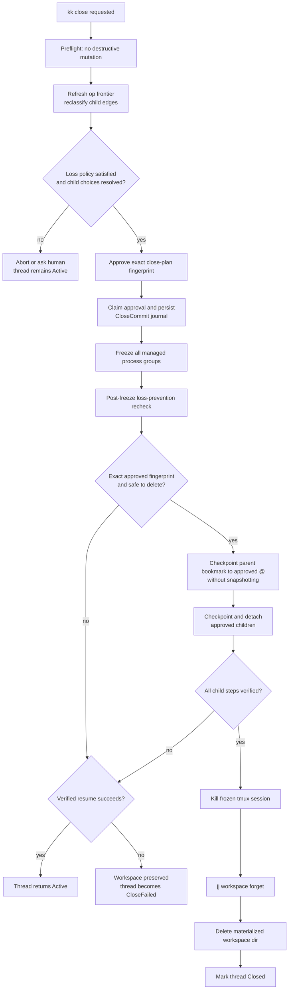
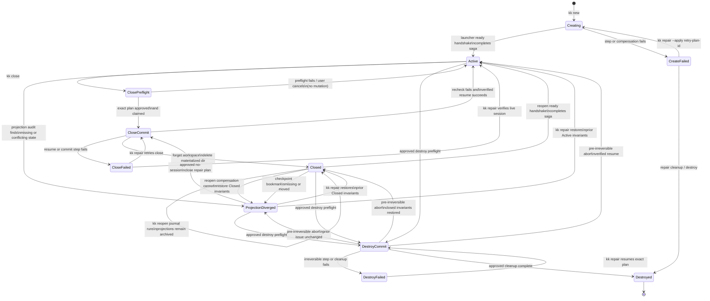

# Threads

The thread is kiki's unit of work. Bookmarks, workspaces, tmux sessions, and agent processes hang off that unit.

## Thread identity

Each thread has a stable sqlite `thread_id`. The thread id is the join key for credentials, audit rows, transcript rows, PR links, lifecycle state, and follows links.

Mutable projections include:

- jj workspace path
- jj bookmark name
- tmux session name
- harness session id

The live head of an active thread is the managed workspace's exact `@` commit. Kiki persists the last observed value as `thread_head_commit_id`; it is a cache of that workspace-local fact, not a second source of truth. Every watcher or lifecycle transaction that observes a new `@` updates the cache with the exact jj operation view from which it was read.

The thread bookmark has a different job. It is the durable checkpoint used for publication and for recreating a workspace after close; it is not an automatically advancing alias for `@` and it is never a follows synchronization target. Kiki moves it only at an explicit checkpoint:

- successful creation, after the initial working-copy commit is known;
- publish, immediately before pushing;
- close, before forgetting the workspace;
- detach, so the newly independent thread has a reopenable checkpoint;
- an explicit repair resolution that adopts the current live head.

At a checkpoint, kiki pins the operation view, reads the exact workspace `@`, stores it as both `thread_head_commit_id` and `checkpoint_commit_id`, and moves the bookmark to that exact commit in one journaled lifecycle action. The bookmark mutation runs from a repository context that cannot snapshot the managed working copy (for the CLI backend, `--ignore-working-copy` or an equivalent exact-op invocation is mandatory), then verifies the resulting bookmark target and operation. It never resolves `@` again inside the mutating command. Ordinary `jj new`, `split`, `squash`, `describe`, and snapshot operations may therefore leave the bookmark behind. Status must show that condition; kiki must not "helpfully" move the bookmark after each jj operation.

## Creation

`kk new` is a durable creation saga. It creates:

- sqlite thread row
- jj workspace
- an initial jj working-copy change and a bookmark checkpoint at its exact commit
- tmux session rooted in the workspace
- agent pane hosting the harness process
- v1.x shell pane in the same tmux window when that UI feature is enabled
- v1.x persistent sidebar pane when that UI feature is enabled
- per-thread hook credential and hook configuration, installed before the harness can run

The saga starts by inserting a `Creating` thread row and a step journal. Every external step and compensation is idempotent. On daemon restart, kiki resumes the journal or compensates completed steps in reverse order. A failure becomes `CreateFailed` with the journal and diagnostic retained; it is never reported as an absent thread merely because best-effort cleanup ran.

The normative order is:

1. Allocate stable thread, workspace, bookmark, and session identities; persist the exact chosen base and any follows anchors.
2. Create the jj workspace at that exact base.
3. In the new workspace, create the initial working-copy change, read its exact `@`, and persist `thread_head_commit_id`.
4. Create or move the thread bookmark to that exact commit and persist the checkpoint. The bookmark is deliberately created **after** the initial working-copy change; kiki does not rely on jj bookmarks following a later `jj new`.
5. Issue the thread-scoped credential and install the launch-scoped harness configuration.
6. Create the tmux session and any shell or sidebar panes, without starting the harness.
7. Start a harness launcher as the last external step. The launcher cannot exec until a transaction records the process incarnation and activates its one-shot database-backed readiness gate; the thread remains `Creating`. The launcher then execs with the already validated settings and reports a ready handshake. A second transaction records `harness_started_at`, completes the saga, and promotes the thread to `Active`. Exec or handshake failure becomes `CreateFailed`. A crash while the authorized process exists but before the handshake leaves enough process identity for restart recovery to adopt or terminate it; it never infers success from an activated gate alone.

If a step fails, kiki records the error before attempting reverse-order compensation. `kk repair` may retry or finish cleanup from the recorded step; it never infers completion from the mere presence or absence of one projection.

When invoked inside an existing thread, `kk new` follows the current thread by default. `--no-follow` suppresses that default. `--follows <parent>` selects an explicit parent.

Successful creation leaves all required v1 projections and an `Active` row. Unsuccessful creation leaves a recoverable `CreateFailed` row even when compensation removed every external projection. This is a saga guarantee, not cross-system atomicity.

`kk new` without a name may derive a placeholder from the initial prompt. The placeholder is kiki-owned metadata and follows the metadata ownership rules.

`kk new --harness <name>` selects the harness for the thread. v1 accepts only `claude-code`; unsupported harness names error clearly.

The follows graph is a DAG. kiki rejects a follows edge that would introduce a cycle.

Creating a thread records its exact owned-stack base; creating a follows edge additionally records the parent's exact `thread_head_commit_id` used as the child's initial synchronized base. The owned-stack base remains on the thread when a follows edge is detached and advances only when a completed reconciliation records a new synchronized base. Those anchors let later op-view classification distinguish jj-native successor evolution, a new live parent head requiring explicit advance, and out-of-band topology divergence. Bookmark names remain handles, not synchronization targets: every reconciliation pins exact commit and operation ids before it starts.

### V1 owned-stack contract

An owned stack is strictly the single-parent linear chain after the exact synchronized base through the thread's exact live head. Immediately before an explicit parent advance, kiki proves that:

- the recorded base is an ancestor of the live head;
- there is exactly one child of that base on the path to the head;
- every revision on the path has exactly one parent and one successor on the path, except at the two ends;
- every descendant outside the path is accounted for by a valid registered follows child and its own linear chain.

Merge commits, multiple candidate roots, conflicts, or descendants outside the registered follows graph make the topology ambiguous. Kiki records `TopologyDiverged` and does not synthesize an owned revset or attempt a rebase. The rebase source is the exact validated chain, never an open-ended descendants revset.

V1 ownership is deliberately structural: every revision on that exact validated chain is part of the thread's owned stack. Kiki does not persist or infer a separate “root change” identity, and an external linear insertion on the path is therefore included. A user who does not want later follows reconciliation to move that chain must detach before introducing such topology. Split, squash, and abandon need no root-membership update; they either leave one valid chain or make validation stop loud.

Users may spawn any number of sibling threads. v1 does not rate-limit human-created threads.

## Workspace layout

Each thread's jj workspace is materialized as a sibling of the registered repo. The default path is `<parent>/<repo>-kiki-<slug>/`, where `<parent>` is the directory containing the repo, `<repo>` is the repo's directory name, and `<slug>` is the thread's bookmark slug. So a thread `cascade-recovery` in `~/code/kiki` materializes at `~/code/kiki-kiki-cascade-recovery/`.

This default is overridable via `[paths] workspaces_root` (see [Configuration](13-configuration.md)). When set, kiki uses `<workspaces_root>/<repo>-kiki-<slug>/`.

Sibling-of-repo is the default for two reasons: it matches jj's natural `jj workspace add ../<name>` ergonomics, and it leaves the workspace discoverable next to the repo without nesting another working copy inside the parent's working copy.

The per-thread hook credential lives at `~/.kiki/repos/<repo_id>/credentials/<thread_id>` (mode `0600`), and preferred launch-scoped harness settings live under `~/.kiki/repos/<repo_id>/harness/<thread_id>/`. If the adapter cannot use isolated launch settings, it may merge a hash-owned fragment into `<workspace>/.claude/settings.local.json` with prior bytes and restoration metadata stored outside the workspace. It never writes tracked `<workspace>/.claude/settings.json`. Per-thread client error logs live at `~/.kiki/repos/<repo_id>/errors/<thread_id>.log`.

## Workspace isolation

Per-thread workspaces prevent accidental file interference during normal cooperative use. They do not prevent a same-UID process from reading or writing sibling workspaces, `~/.kiki`, or shared jj repository state.

Because all workspaces share jj repository state, an ancestor rewrite in one workspace may evolve another thread's recorded working-copy commit immediately while leaving that other workspace's files stale. This is expected. Kiki surfaces the thread as cascade-pending and, after probing for unsnapshotted edits, materializes its current evolved jj state at the managed agent's next safe boundary; see [Cascade](07-cascade.md).

## Detach checkpoint

`kk thread detach` is a journaled checkpoint operation, not a bare edge deletion. Under the thread's reconciliation lock it:

1. synchronously advances the repository watcher to the complete current operation-head frontier and pins the resulting view;
2. compares the parent's exact head in that view with the edge's last synchronized base and creates any missing reconciliation intent;
3. requires every resulting or already-pending transition to be reconciled or explicitly discarded with the required one-shot approval;
4. reads the child's exact live head from the pinned view, validates its linear owned stack, and checkpoints its bookmark to that commit without snapshotting the working copy;
5. deletes the follows edge only after the checkpoint is verified, while retaining the child's exact owned-stack base anchor for later status, reopen, and destroy safety.

The checkpoint and edge deletion are separate external/database effects, so the lifecycle journal makes both idempotent. A crash after the bookmark move but before edge deletion retries the exact same checkpoint and then removes the edge; it never assumes that absence of a pending intent proves the watcher had caught up.

## Close

`kk close` archives a thread without deleting tracked jj work.

Close is two-phase and journaled:

1. Preflight performs no destructive mutation. It synchronously advances the op-watcher frontier to the repo's current operation heads, reclassifies every follows child from that pinned view, waits for selected reconciliations to complete or records explicit discard choices in the proposed plan, inventories loss-sensitive files, and produces the exact close-plan fingerprint presented for one-shot approval.
2. Commit freezes the managed tmux process trees, repeats the frontier refresh and loss-prevention checks against the frozen workspace, checkpoints the parent bookmark to the exact approved head, and performs every approved child checkpoint/detach. It kills the parent session only after the final proof and all child work succeed, then forgets the jj workspace, deletes the materialized workspace directory, and marks the thread closed.

Entering `CloseCommit` atomically claims the approval and creates a durable lifecycle-operation record containing the approved plan fingerprint before any process is frozen. That fingerprint covers the exact thread head, operation evidence relevant to this thread and its child edges, workspace inventory and byte fingerprint, expected projections, child-edge decisions, checkpoint target, and security-relevant flags. Unrelated operations elsewhere in the repo do not invalidate it merely because the global frontier changed; the synchronous refresh determines whether they changed any plan input.

Freezing covers every process in the tmux session, not merely the agent pane's foreground process group. The tmux backend records every pane leader plus the `(pid, start_time, session_id, process_group_id, prior_stop_state)` of its descendant closure, stops the roots, and repeatedly discovers and stops new members until two consecutive samples are identical and every member is observed stopped. Once all known parents are stopped they cannot fork. Kiki then enumerates same-UID processes whose cwd, root, mapped file, or open file descriptor refers to the workspace; any holder outside the proven-frozen set makes quiescence `Unknown`. A filesystem watch remains armed through checkpoint and child work, and any event or final fingerprint drift takes the verified-resume path. A process that daemonizes and acquires the workspace only after those proofs is outside the documented cooperative, non-security guarantee. A backend that cannot enumerate identities and open holders, reach a fixed point, or prove stopped state returns `Unknown` and may not delete the workspace.

The post-freeze recheck binds its decision to the exact approved fingerprint. “Still safe, but different” is approval drift, not permission to improvise: kiki resumes the processes that were running before the freeze, leaves processes that were already stopped untouched, verifies the original session is usable, returns to `Active`, and presents a fresh plan for a new approval. An unsafe or indeterminate recheck follows the same verified-resume path. If resume fails or kiki cannot prove restoration, the workspace remains present and the lifecycle becomes `CloseFailed`; a dead or partially resumed session must never be labeled `Active`. A later `kk repair` can retry resume, restart the session with explicit approval, or retry close from the journal.

After an exact recheck succeeds, kiki records the proof and checkpoints the parent bookmark to the approved live head with the non-snapshotting exact-commit mechanism. While the parent remains frozen, each automatic child checkpoint/detach applies the approved result of the synchronous protocol in [Detach checkpoint](#detach-checkpoint) and verifies the edge deletion. Kiki then rechecks the armed filesystem generation, workspace fingerprint, and external-holder set. Only after every child step and that final proof succeed does it kill the frozen parent session.

A child checkpoint/detach failure occurs before that kill. Kiki compensates already-deleted edges only when their exact pre-detach topology is still restorable, resumes the parent's prior process states, and returns `Active` only after proving both restoration and session usability. If an edge cannot be restored exactly or resume cannot be proved, the parent remains frozen with its workspace present and becomes `CloseFailed`; it is never left dead. A failure after the session kill while forgetting or deleting likewise becomes `CloseFailed`, with completed steps recorded and remaining data preserved where possible. On daemon restart, `CloseCommit` recovery consults the journal: before a valid final proof it attempts a verified resume; after a valid proof it revalidates the frozen process set, approved fingerprint, and child-step journal or stops in `CloseFailed`; after the session-killed step it completes the idempotent forget/delete sequence. It never guesses `Active` from a leftover directory.

Launch-scoped harness settings live outside the workspace and cannot self-block close. If the adapter had to merge kiki's fragment into `<workspace>/.claude/settings.local.json`, close may remove or restore only that hash-owned fragment; a file changed since installation is user territory and stops for repair. Kiki never writes or allowlists tracked `<workspace>/.claude/settings.json`. The hook credential and per-thread error log live under `~/.kiki/repos/<repo_id>/` and are revoked or removed independently. User-created untracked or ignored files that would be deleted still require explicit handling.

Plain `kk close` leaves any open PR untouched. `kk close --discard-pr` is the explicit PR-closing path.

Children of a closed thread auto-detach with notification. Close may not rely on the current intent table alone: preflight and the post-freeze recheck synchronously process the complete current op frontier, compare the parent's exact live head with every edge's last synchronized base, and create any missing intent before deciding that an edge has no pending transition. Every resulting transition must be reconciled or explicitly discarded as part of the approved plan. Auto-detach must not silently erase a parent change merely because watcher delivery lag had not recorded it yet.

Close is intentionally boring. It should be possible to close a thread with confidence that tracked work survives and that local junk is not silently swept away.

After the frozen-workspace proof succeeds, close kills the entire tmux session, which means every pane in it goes with the session — the agent pane, the shell pane, the optional persistent sidebar pane, and any additional panes the user split into the session. Any process running in the shell pane (a long test, a `tail -f`, a debugger) is killed alongside the agent. Long-running work that needs to outlive `kk close` belongs outside the thread's tmux session.

After close, the tmux client switches to the parent thread if that session exists. Otherwise it returns to the previously focused thread if possible, or detaches.

## Lifecycle states

## Projection divergence and repair

`ProjectionDiverged` is the repair-required lifecycle state for a thread whose durable identity disagrees with one or more external projections. Projection audits run at daemon boot, at every `kk ls`, before `kk switch` or a lifecycle operation, and after relevant jj, filesystem, or tmux events. V1 records at least these reasons with expected and observed values:

| Reason                      | Default treatment                                                                                                            |
| --------------------------- | ---------------------------------------------------------------------------------------------------------------------------- |
| `WorkspaceDirectoryMissing` | require `kk repair` to recreate from the checkpoint, adopt a moved directory, or destroy                                     |
| `WorkspaceRecordMissing`    | require a choice to recreate the jj workspace record or adopt the external removal                                           |
| `WorkspacePathMismatch`     | auto-correct only when the stable jj workspace id uniquely identifies the same filesystem object; otherwise require a choice |
| `BookmarkMissing`           | require a choice to recreate it at the recorded checkpoint or adopt another exact commit                                     |
| `BookmarkMoved`             | require a choice to restore the recorded checkpoint or adopt the observed target                                             |
| `SessionMissing`            | require a choice to restart the harness/session, complete a safe close, or destroy; never silently claim an agent is live    |

Automatic repair is limited to identity-preserving normalization for which there is exactly one possible result, such as replacing a stale lexical path with the canonical path of the same uniquely identified workspace. Kiki does not recreate, move, or adopt revisions merely because one outcome looks likely. Every human resolution is written to the projection-issue row and lifecycle journal before the thread returns to `Active`.

Projection health gates only operations that depend on the broken projection; it does not erase still-provable facts. When the stable jj workspace id and canonical path still identify exactly one workspace, kiki continues observing its `@`, updating `thread_head_commit_id`, and classifying that thread as a follows parent even if its bookmark is missing/moved or its tmux session is missing. A session-missing thread cannot admit agent boundaries or materialize files, but its unambiguous repository head remains observable. A missing workspace directory or record, or an ambiguous path mismatch, disables head observation and all workspace mutation until repair. This per-issue capability rule prevents an unrelated bookmark problem from silently freezing the follows graph.

The issue preserves whether the coherent prior lifecycle was `Active` or `Closed`; a repair returns to that state only after proving its invariants. Repair adoption is constrained:

- For an active thread, an observed bookmark target may be adopted as the checkpoint only when it is the live head or an ancestor on the validated owned chain. A sideways or ahead target is topology repair, not projection normalization, and requires a separately approved revision plan.
- For a closed thread, adopting an observed bookmark target must validate the retained linear owned chain and every follows child, then update both `checkpoint_commit_id` and the archived `thread_head_commit_id` to that exact commit. An unrelated target is not adoptable through the simple bookmark plan.
- `SessionMissing` may use an approved `close-without-session` repair that transitions directly from `ProjectionDiverged` to `CloseCommit` only after proving no managed tmux process survives and completing the same workspace loss check and exact checkpoint plan as ordinary close. Otherwise repair must restart and verify the session before returning `Active`.

Lifecycle sagas own their expected temporary projection differences. An unexpected mismatch during `Creating`, `CloseCommit`, or an in-progress reopen is first attached to and fails that lifecycle journal; it does not invent a `projection_resume_lifecycle` for a transitional state. If compensation restores coherent `Active` or `Closed` projections, the lifecycle returns there. If compensation cannot do so, kiki records the unresolved projection issue with that stable resume target and enters `ProjectionDiverged`. The former missing-directory-only `Orphaned` case is represented by `ProjectionDiverged { reason: WorkspaceDirectoryMissing }`.

A projection-diverged active thread cannot enter ordinary close until repair establishes a coherent workspace and process state; the approved no-session close plan above is the explicit exception. Destroy remains available only when its stricter preflight below succeeds.

## Reopen

`kk reopen <thread>` is a durable saga that restores a closed thread without claiming cross-system atomicity. The thread remains `Closed` while its `Reopen` lifecycle operation is in progress, and operational listings surface that in-progress journal even though ordinary closed rows are hidden. The approved plan pins the exact checkpoint commit, bookmark target, workspace identity/path, harness, settings strategy, and initial catch-up choice.

The normative order is:

1. Refresh the complete operation frontier, verify the bookmark still names the exact recorded checkpoint, and create the claimed `Reopen` journal while the thread remains `Closed`.
2. Recreate the jj workspace at the exact checkpoint and persist the observed workspace `@` as the candidate live head.
3. Reissue the thread-scoped credential and reinstall isolated per-thread hook configuration.
4. Recreate the tmux session and enabled panes without starting the harness.
5. Start the blocked harness launcher, activate its database-backed gate while the thread remains `Closed`, and require the same settings-bound ready handshake as creation.
6. In the ready-handshake transaction, record the new runtime incarnation and exact live head, complete the reopen journal, and transition `Closed → Active`.

Every step is idempotent and records the stable external identity needed to recognize or compensate it after restart. A daemon restart resumes the exact journal. If a step or handshake fails, reverse compensation removes only reopen-created projections and revokes the new credential. The thread remains `Closed` only if compensation proves the original closed invariants: no workspace or live session, and the original bookmark/checkpoint unchanged. If that proof fails, the journal records the mismatch and the thread becomes `ProjectionDiverged` with `Closed` as its repair target; it is never mislabeled as an ordinary archive or a live thread.

When the v1.x transcript feature ships, `kk reopen --catch-up` may preview and compose a short message from non-synthesized rows after the user has opted into provider egress. The catch-up is recorded as kiki-authored synthesized content; it is locally stored but may be sent to the configured model provider and must not be described as local-only execution.

## Destroy

`kk thread destroy <thread>` is an approved, journaled destruction of kiki's thread record and local projections. By default it preserves every jj revision. Deleting the local bookmark, workspace, transcript, and thread identity is still consequential, but “destroy thread” is not implicit permission to abandon history.

Before this deferred command ships, the lifecycle schema and shared vocabulary must include `DestroyCommit` and `DestroyFailed` as shown above. Claiming an approved plan enters `DestroyCommit`. A drift or failure before bookmark deletion may cancel only after restoring and verifying the prior `Active`, `Closed`, or `ProjectionDiverged` invariants. Any failure after the first irreversible step enters `DestroyFailed`, from which repair may only finish that exact plan or use explicit jj operation recovery where applicable; it may not relabel the thread `Active` or `Closed`. This required migration prevents a partially destroyed thread from hiding behind an unrelated existing lifecycle state.

Preflight first refreshes the complete operation frontier and pins the thread's retained owned-stack base, exact head, checkpoint, bookmark, workspace/session projections, follows edges, descendants, PR link, unresolved recovery data, and whether revision abandonment was requested into the approval digest. Destroy always refuses while the thread has a follows child or unresolved sync/recovery intent; the user must reconcile and detach children first. Transitional `Creating` or failed-creation cleanup uses its lifecycle compensation plan instead of pretending a complete owned stack exists.

`--abandon-revisions` is a separate destructive mode with a separately approved exact-chain plan. It is available only when every revision after the retained owned-stack base through the pinned head forms the validated single-parent chain and no registered or foreign descendant exists outside that set. The flag never expands to descendants dynamically. Without it, non-linear or shared revision topology does not authorize history rewriting and all revisions remain in jj.

Active destroy uses the same proven process quiescence and workspace inventory machinery as close. The approval explicitly authorizes deletion of the named workspace paths; an omitted untracked path remains protected. When `--abandon-revisions` is present, it additionally names every tracked revision authorized for abandonment. Kiki then, in journaled order:

1. freezes and revalidates an active session against the approved digest, if present;
2. deletes the local thread bookmark by name—bookmarks are deleted, not “abandoned”;
3. only with `--abandon-revisions`, abandons exactly the separately approved revision ids without a descendants selector and verifies the resulting operation;
4. terminates the proven-frozen session, forgets/deletes the workspace projections, and revokes credentials;
5. tombstones the thread row and deletes transcript rows unless `--keep-log` was approved.

Any digest drift resumes the original active session when possible and requires a fresh approval. A failure after bookmark deletion or an optional destructive jj step becomes a repairable failed lifecycle operation; it never returns to `Active` or `Closed` by inference. Remote bookmarks and PRs are untouched—changing them is a separate externally visible plan. Loss-safety bundles under the repo's centralized `recovery/` directory are not deleted automatically; destroy prints their paths for manual disposition.

`--keep-log` retains transcript rows for explicit destroyed-thread views.
