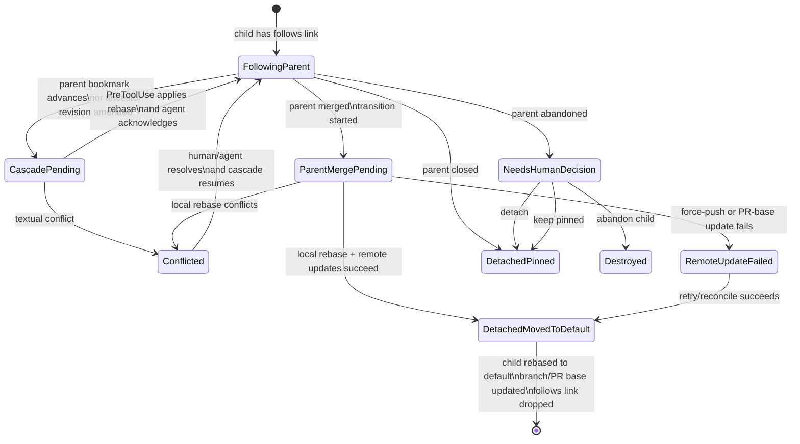

# Cascade

Cascade is the v1 safety-critical feature. A child following a parent must pick up ancestor changes without letting the agent operate on stale disk state, provided `kkd` is reachable to apply the rebase. When `kkd` is unreachable, the cascade trigger remains durable — in `pending_cascade_seq` and `context_queue` if the watcher recorded it before the outage, or in jj's op log otherwise (reconstructed by op-log catch-up at restart) — and `kk-hook` degrades to pass-through so a daemon hiccup does not wedge the agent. Cascade delivery is deferred, never silently lost. See [Hook degradation](15-architecture/harness-adapter.md) for the precondition's failure mode.

## Invariant

A thread's working copy is rebased onto live ancestor state at an agent boundary or quiescence, never while the agent is mid-edit.

The implementation may delay a cascade to preserve this invariant. It must not violate the invariant to appear responsive. A delay caused by `kkd` being unreachable is a deferral of delivery, not a violation: the working copy is left untouched until `kkd` returns and the next PreToolUse round-trip succeeds.

## Trigger

For a child with a follows link, kiki enqueues a cascade when:

- the parent bookmark advances, or
- a revision the child directly follows through its parent thread is amended.

The two enqueue routes are:

- **External op route** — the op-log watcher sees an external jj op (no `kk:` prefix, `op_id` not in `op_attribution`), evaluates ancestry impact, and bumps `pending_cascade_seq` on each affected **direct** descendant in the follows DAG.
- **Internal propagation route** — when the cascade orchestrator applies a rebase to thread B inside `PreToolUseDecision`, it synchronously bumps `pending_cascade_seq` on each thread that directly follows B, in the same transaction that persists the `cascade_outbox` row.

Both routes feed the same `pending_cascade_seq` counter. Kiki's own jj operations carry a `kk:` prefix and are recorded in `op_attribution`; the watcher must skip them. The internal-propagation route exists precisely so cascades reach grandchildren without requiring the watcher to react to kkd's own ops.

Rapid jj op storms should coalesce so a burst of ancestor changes produces one cascade per affected child where possible.

Cascades propagate one hop at a time along the follows DAG. When a transitive ancestor (e.g., A in A→B→C) advances, the watcher enqueues a cascade on B (A's direct descendant). When B's PreToolUseDecision applies the rebase, the orchestrator synchronously enqueues a cascade on C (B's direct descendant). C does not rebase until C's own next PreToolUse boundary, so each child still rebases onto a settled parent.

## State counters

Each thread tracks:

- `pending_cascade_seq`: bumped when cascade work is enqueued.
- `applied_cascade_seq`: bumped after the protected rebase is applied.
- `acknowledged_cascade_seq`: bumped only after the agent has integrated the synthetic result and made a subsequent tool call.

Each agent session tracks:

- `delivered_in_flight_seq`: set only after synthetic cascade content has been emitted to the agent.

## Cascade lock

Each thread has an in-memory cascade lock owned by `kkd`'s `CascadeOrchestrator`. Concretely it is a `tokio::sync::Mutex` keyed by `thread_id`, kept in process memory.

The lock is acquired at the start of `PreToolUseDecision` after authentication and authorization, held through outbox lookup, rebase application, payload composition, the `cascade_outbox` row persist, and the synchronous bump of `pending_cascade_seq` on the rebased thread's direct descendants in the follows DAG. The lock is released **before** the synthetic payload is returned to `kk-hook` over stdout. `MarkDelivered` does not need the lock — it operates on a specific `(thread_id, applied_cascade_seq)` row already pinned in the outbox and is idempotent under concurrent retries.

The op-log watcher does not take the cascade lock when bumping `pending_cascade_seq`. The lock serializes only concurrent `PreToolUseDecision` handlers for the same thread, which can occur if a reopen race produces two live agent sessions before one exits.

The `cascades` sqlite table is a crash-recovery breadcrumb, not the lock itself. On daemon restart, `kkd` reconstructs in-flight state from `cascade_outbox` rows where `applied_cascade_seq > acknowledged_cascade_seq`; the in-memory lock is rebuilt fresh.

## Delivery protocol

On each PreToolUse call:

1. Acknowledge any prior delivery for this session by promoting `delivered_in_flight_seq` into `acknowledged_cascade_seq`, draining the context queue up to that point, and clearing the session marker.
2. Check `cascade_outbox` for an unacknowledged payload where `applied_cascade_seq > acknowledged_cascade_seq`, regardless of `delivered_at`.
3. If an outbox row exists, re-emit it byte-identically.
4. Otherwise, if pending work exists, apply the rebase, advance `applied_cascade_seq`, compose the synthetic payload, persist it to `cascade_outbox`, and emit it.
5. If no cascade is pending, pass through to the tool.

After stdout delivery, `kk-hook` calls `MarkDelivered`. That handler atomically writes the visible transcript row, marks the outbox row delivered, and sets `delivered_in_flight_seq`.

This ordering is required. It prevents false acknowledgement and phantom transcript rows. Crash recovery may duplicate delivery; it must not silently drop delivery.

Delivery and visibility are separate states. A transcript row that says kiki told the agent something must be written only after the hook has actually emitted that content and called `MarkDelivered`.

## Worked scenarios

These scenarios are illustrative, but they are part of the implementer's checklist. They name the cases that shaped the delivery protocol above.

### Scenario 1: ancestor amend with active descendant

Thread A and child thread B both have active agents. A amends revision X, which is in B's ancestry. kiki detects the jj op, bumps B's `pending_cascade_seq`, and enqueues a `ContextMessage`; it does not rebase B immediately. On B's next PreToolUse call, `kk-hook` invokes `PreToolUseDecision`. The handler claims B's cascade lock, finds no covering `cascade_outbox` row, applies the rebase, advances `applied_cascade_seq`, reads the queue without draining it, composes the payload, pins that payload and the post-rebase anchor in `cascade_outbox`, releases the lock, and returns the payload to `kk-hook`. The hook writes to stdout, then calls `MarkDelivered`. The handler writes the visible transcript row, marks the outbox delivered, and sets `delivered_in_flight_seq`. B's following PreToolUse call acknowledges and drains the queue.

### Scenario 2: parent advances by adding a revision

Thread `foo` follows parent `bar`. `bar` advances from X to X+b1; `foo` is at X+f1. kiki detects the parent bookmark advance and follows the same hook-boundary path: `foo` rebases to X+b1+f1, receives a synthetic context message, and acknowledges it on the next tool call. The agent sees the new base before its tool runs.

### Scenario 3: textual conflict

If the protected rebase conflicts, kiki marks the child `Conflicted`, sends a loud notification, interrupts the agent, and resumes it with conflict framing such as "Cascade rebase produced a conflict on c. Resolve before continuing." The thread does not continue cascade work until the conflict is resolved.

### Scenario 4: external jj operation

If the human runs `jj describe`, `jj squash`, or another jj operation directly, kiki treats the resulting op like any other external op after op-attribution dedupe. If the op affects descendant ancestry, cascade fires for those descendants. The thread where the op originated is not disturbed unless its own ancestry actually changed.

### Scenario 5: agent crash after delivery

If an agent receives cascade payload N and crashes before acknowledging it, `acknowledged_cascade_seq` remains behind `applied_cascade_seq`. A resumed session starts with its own `delivered_in_flight_seq=0`. The next PreToolUse finds the existing outbox row because lookup is keyed by `applied_cascade_seq > acknowledged_cascade_seq`, regardless of `delivered_at`; it re-emits the same payload byte-for-byte, and `MarkDelivered` idempotently reuses the `cascade:N` transcript row. The agent may see the same cascade twice across sessions; the log records it once.

## Conflicts and escalation

If rebase produces textual conflicts, the thread becomes `Conflicted`, a notification fires, and the agent is restarted with conflict framing.

Hard escalation is allowed when:

- a textual conflict cannot auto-resolve,
- the agent is in long tool-less reasoning with no upcoming hook boundary, or
- the human invokes `kk thread interrupt`.

Escalation is a correctness mechanism. Its job is to put the agent back into a context where filesystem changes are safe to resume.

## Parent merged

When a parent merges, kiki rebases the child onto the repo default branch, force-pushes with `--force-with-lease` if needed, updates the child PR base if needed, then drops the follows link.

The follows link is dropped only after local and remote updates succeed.

## Parent abandoned

If an externally initiated `jj abandon` removes a parent bookmark, kiki marks affected children as requiring human attention. It does not silently choose a new parent.

## State transitions

## Detach and graph surgery

`kk thread detach` is the v1 escape hatch for breaking a live follows link if it ships with the CLI surface. Broader graph surgery, including attach and reparent, is deferred beyond v1 unless promoted by a later spec change.
