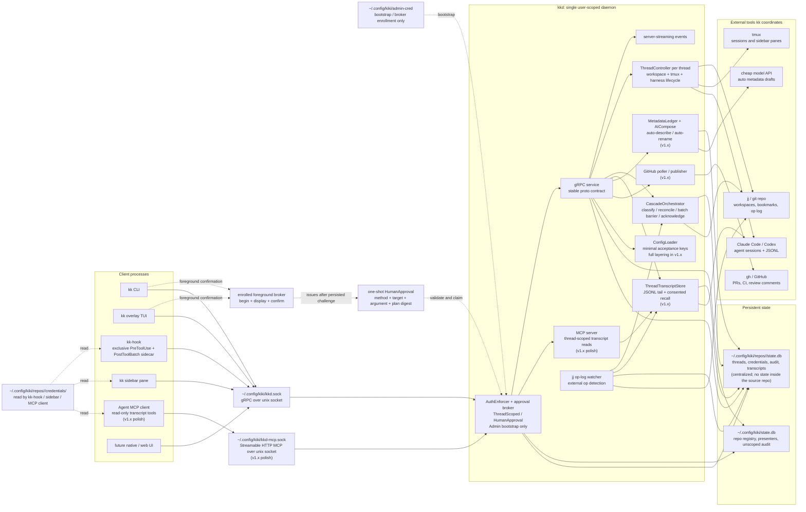

# Architecture

This chapter explains the shape of the implementation. Behavioral truth lives in the earlier chapters; architecture exists to make that behavior implementable without smuggling privileged paths through the side door.

Read in this order:

1. [Crate layout](crates.md)
2. [Daemon](daemon.md)
3. [gRPC service](grpc.md)
4. [State schema](schema.md)
5. [Op-log watcher](op-log-watcher.md)
6. [Harness adapter](harness-adapter.md)

The architectural rule is simple: `kkd` owns behavior; clients observe and request. `kk`, `kk-hook`, the overlay, the sidebar, and future UIs all use the same service contract.

## System shape

